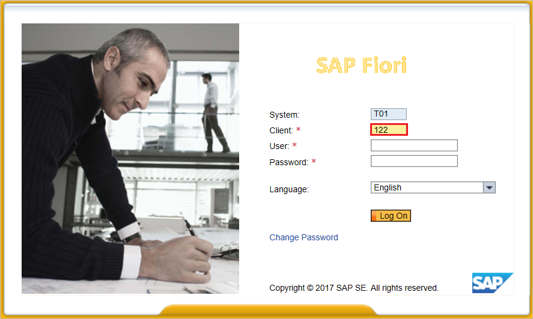
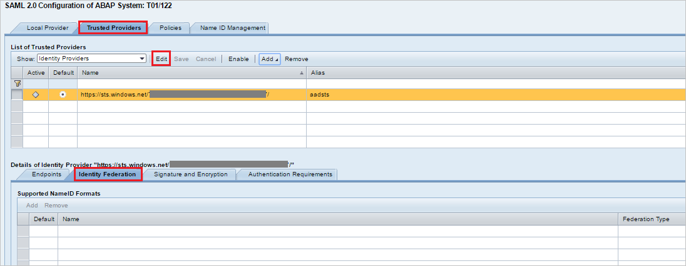
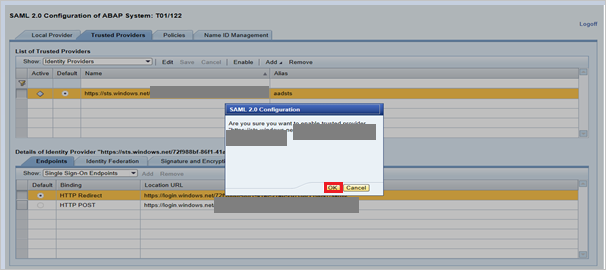

# Tutorial: Azure Active Directory single sign-on (SSO) integration with SAP Fiori

In this tutorial, you'll learn how to integrate SAP Fiori with Azure Active Directory (Azure AD). When you integrate SAP Fiori with Azure AD, you can:

* Control in Azure AD who has access to SAP Fiori.
* Enable your users to be automatically signed-in to SAP Fiori with their Azure AD accounts.
* Manage your accounts in one central location - the Azure portal.

To learn more about SaaS app integration with Azure AD, see [What is application access and single sign-on with Azure Active Directory](https://docs.microsoft.com/azure/active-directory/active-directory-appssoaccess-whatis).

## Prerequisites

To get started, you need the following items:

* An Azure AD subscription. If you don't have a subscription, you can get a [free account](https://azure.microsoft.com/free/).
* SAP Fiori single sign-on (SSO) enabled subscription.

## Scenario description

In this tutorial, you configure and test Azure AD SSO in a test environment.

* SAP Fiori supports **SP** initiated SSO

> [!NOTE]
> For SAP Fiori initiated iFrame Authentication, we recommend using the **IsPassive** parameter in the SAML AuthnRequest for silent authentication. For more details of the **IsPassive** parameter refer to [Azure AD SAML single sign-on](https://docs.microsoft.com/en-gb/azure/active-directory/develop/single-sign-on-saml-protocol) information

## Adding SAP Fiori from the gallery

To configure the integration of SAP Fiori into Azure AD, you need to add SAP Fiori from the gallery to your list of managed SaaS apps.

1. Sign in to the [Azure portal](https://portal.azure.com) using either a work or school account, or a personal Microsoft account.
1. On the left navigation pane, select the **Azure Active Directory** service.
1. Navigate to **Enterprise Applications** and then select **All Applications**.
1. To add new application, select **New application**.
1. In the **Add from the gallery** section, type **SAP Fiori** in the search box.
1. Select **SAP Fiori** from results panel and then add the app. Wait a few seconds while the app is added to your tenant.

## Configure and test Azure AD single sign-on for SAP Fiori

Configure and test Azure AD SSO with SAP Fiori using a test user called **B.Simon**. For SSO to work, you need to establish a link relationship between an Azure AD user and the related user in SAP Fiori.

To configure and test Azure AD SSO with SAP Fiori, complete the following building blocks:

1. **[Configure Azure AD SSO](#configure-azure-ad-sso)** - to enable your users to use this feature.
    1. **[Create an Azure AD test user](#create-an-azure-ad-test-user)** - to test Azure AD single sign-on with B.Simon.
    1. **[Assign the Azure AD test user](#assign-the-azure-ad-test-user)** - to enable B.Simon to use Azure AD single sign-on.
1. **[Configure SAP Fiori SSO](#configure-sap-fiori-sso)** - to configure the single sign-on settings on application side.
    1. **[Create SAP Fiori test user](#create-sap-fiori-test-user)** - to have a counterpart of B.Simon in SAP Fiori that is linked to the Azure AD representation of user.
1. **[Test SSO](#test-sso)** - to verify whether the configuration works.

## Configure Azure AD SSO

Follow these steps to enable Azure AD SSO in the Azure portal.

1. Open a new web browser window and sign in to your SAP Fiori company site as an administrator.

1. Make sure that **http** and **https** services are active and that the relevant ports are assigned to transaction code **SMICM**.

1. Sign in to SAP Business Client for SAP system **T01**, where single sign-on is required. Then, activate HTTP Security Session Management.

	1. Go to transaction code **SICF_SESSIONS**. All relevant profile parameters with current values are shown. They look like the following example:

		```
		login/create_sso2_ticket = 2
		login/accept_sso2_ticket = 1
		login/ticketcache_entries_max = 1000
		login/ticketcache_off = 0  login/ticket_only_by_https = 0 
		icf/set_HTTPonly_flag_on_cookies = 3
		icf/user_recheck = 0  http/security_session_timeout = 1800
		http/security_context_cache_size = 2500
		rdisp/plugin_auto_logout = 1800
		rdisp/autothtime = 60
		```

		>[!NOTE]
		> Adjust the parameters based on your organization requirements. The preceding parameters are given only as an example.

	1. If necessary, adjust parameters in the instance (default) profile of the SAP system and restart the SAP system.

	1. Double-click the relevant client to enable an HTTP security session.

	    

	1. Activate the following SICF services:

		```
		/sap/public/bc/sec/saml2
		/sap/public/bc/sec/cdc_ext_service
		/sap/bc/webdynpro/sap/saml2
		/sap/bc/webdynpro/sap/sec_diag_tool (This is only to enable / disable trace)
		```

1. Go to transaction code **SAML2** in Business Client for SAP system [**T01/122**]. The configuration UI opens in a new browser window. In this example, we use Business Client for SAP system 122.

	

1. Enter your username and password, and then select **Log on**.

	

1. In the **Provider Name** box, replace **T01122** with **http:\//T01122**, and then select **Save**.

	> [!NOTE]
	> By default, the provider name is in the format \<sid>\<client>. Azure AD expects the name in the format \<protocol>://\<name>. We recommend that you maintain the provider name as https\://\<sid>\<client> so you can configure multiple SAP Fiori ABAP engines in Azure AD.

	

1. Select **Local Provider tab** > **Metadata**.

1. In the **SAML 2.0 Metadata** dialog box, download the generated metadata XML file and save it on your computer.

	

1. In the [Azure portal](https://portal.azure.com/), on the **SAP Fiori** application integration page, find the **Manage** section and select **single sign-on**.
1. On the **Select a single sign-on method** page, select **SAML**.
1. On the **Set up single sign-on with SAML** page, click the edit/pen icon for **Basic SAML Configuration** to edit the settings.

   

1. On the **Basic SAML Configuration** section, if you have **Service Provider metadata file**, perform the following steps:

	a. Click **Upload metadata file**.

    

	b. Click on **folder logo** to select the metadata file and click **Upload**.

    

	c. When the metadata file is successfully uploaded, the **Identifier** and **Reply URL** values are automatically populated in the **Basic SAML Configuration** pane. In the **Sign on URL** box, enter a URL that has the following pattern: `https:\//\<your company instance of SAP Fiori\>`.

	> [!NOTE]
	> A few customers report errors related to incorrectly configured **Reply URL** values. If you see this error, you can use the following PowerShell script to set the correct Reply URL for your instance:
    >
	> ```
	> Set-AzureADServicePrincipal -ObjectId $ServicePrincipalObjectId -ReplyUrls "<Your Correct Reply URL(s)>"
	> ``` 
	> 
	> You can set the `ServicePrincipal` object ID yourself before running the script, or you can pass it here.

1. The SAP Fiori application expects the SAML assertions to be in a specific format. Configure the following claims for this application. To manage these attribute values, in the **Set up Single Sign-On with SAML** pane, select **Edit**.

	

1. In the **User Attributes & Claims** pane, configure the SAML token attributes as shown in the preceding image. Then, complete the following steps:

	1. Select **Edit** to open the **Manage user claims** pane.

	1. In the **Transformation** list, select **ExtractMailPrefix()**.

	1. In the **Parameter 1** list, select **user.userprinicipalname**.

	1. Select **Save**.

	   

	   
    
1. On the **Set up single sign-on with SAML** page, in the **SAML Signing Certificate** section,  find **Federation Metadata XML** and select **Download** to download the certificate and save it on your computer.

	

1. On the **Set up SAP Fiori** section, copy the appropriate URL(s) based on your requirement.

	

### Create an Azure AD test user

In this section, you'll create a test user in the Azure portal called B.Simon.

1. From the left pane in the Azure portal, select **Azure Active Directory**, select **Users**, and then select **All users**.
1. Select **New user** at the top of the screen.
1. In the **User** properties, follow these steps:
   1. In the **Name** field, enter `B.Simon`.  
   1. In the **User name** field, enter the username@companydomain.extension. For example, `B.Simon@contoso.com`.
   1. Select the **Show password** check box, and then write down the value that's displayed in the **Password** box.
   1. Click **Create**.

### Assign the Azure AD test user

In this section, you'll enable B.Simon to use Azure single sign-on by granting access to SAP Fiori.

1. In the Azure portal, select **Enterprise Applications**, and then select **All applications**.
1. In the applications list, select **SAP Fiori**.
1. In the app's overview page, find the **Manage** section and select **Users and groups**.

   

1. Select **Add user**, then select **Users and groups** in the **Add Assignment** dialog.

	

1. In the **Users and groups** dialog, select **B.Simon** from the Users list, then click the **Select** button at the bottom of the screen.
1. If you're expecting any role value in the SAML assertion, in the **Select Role** dialog, select the appropriate role for the user from the list and then click the **Select** button at the bottom of the screen.
1. In the **Add Assignment** dialog, click the **Assign** button.

## Configure SAP Fiori SSO

1. Sign in to the SAP system and go to transaction code **SAML2**. A new browser window opens with the SAML configuration page.

1. To configure endpoints for a trusted identity provider (Azure AD), select the **Trusted Providers** tab.

	

1. Select **Add**, and then select **Upload Metadata File** from the context menu.

	

1. Upload the metadata file that you downloaded in the Azure portal. Select **Next**.

	

1. On the next page, in the **Alias** box, enter the alias name. For example, **aadsts**. Select **Next**.

	

1. Make sure that the value in the **Digest Algorithm** box is **SHA-256**. Select **Next**.

	

1. Under **Single Sign-On Endpoints**, select **HTTP POST**, and then select **Next**.

	

1. Under **Single Logout Endpoints**, select **HTTP Redirect**, and then select **Next**.

	

1. Under **Artifact Endpoints**, select **Next** to continue.

	

1. Under **Authentication Requirements**, select **Finish**.

	

1. Select **Trusted Provider** > **Identity Federation** (at the bottom of the page). Select **Edit**.

	

1. Select **Add**.

	

1. In the **Supported NameID Formats** dialog box, select **Unspecified**. Select **OK**.

	

	The values for **User ID Source** and **User ID Mapping Mode** determine the link between the SAP user and the Azure AD claim.  

    **Scenario 1**: SAP user to Azure AD user mapping

	1. In SAP, under **Details of NameID Format "Unspecified"**, note the details:

		

	1. In the Azure portal, under **User Attributes & Claims**, note the required claims from Azure AD.

		

    **Scenario 2**: Select the SAP user ID based on the configured email address in SU01. In this case, the email ID should be configured in SU01 for each user who requires SSO.

	1.  In SAP, under **Details of NameID Format "Unspecified"**, note the details:

	    

	1. In the Azure portal, under **User Attributes & Claims**, note the required claims from Azure AD.

	   

1. Select **Save**, and then select **Enable** to enable the identity provider.

	

1. Select **OK** when prompted.

	

### Create SAP Fiori test user

In this section, you create a user named Britta Simon in SAP Fiori. Work with your in-house SAP team of experts or your organization SAP partner to add the user in the SAP Fiori platform.

## Test SSO

1. After the identity provider Azure AD is activated in SAP Fiori, try to access one of the following URLs to test single sign-on (you shouldn't be prompted for a username and password):

	* https:\//\<sapurl\>/sap/bc/bsp/sap/it00/default.htm
	* https:\//\<sapurl\>/sap/bc/bsp/sap/it00/default.htm

	> [!NOTE]
	> Replace *sapurl* with the actual SAP host name.

1. The test URL should take you to the following test application page in SAP. If the page opens, Azure AD single sign-on is successfully set up.

	

1. If you are prompted for a username and password, enable trace to help diagnose the issue. Use the following URL for the trace: https:\//\<sapurl\>/sap/bc/webdynpro/sap/sec_diag_tool?sap-client=122&sap-language=EN#.

## Additional resources

- [ List of Tutorials on How to Integrate SaaS Apps with Azure Active Directory ](https://docs.microsoft.com/azure/active-directory/active-directory-saas-tutorial-list)

- [What is application access and single sign-on with Azure Active Directory? ](https://docs.microsoft.com/azure/active-directory/active-directory-appssoaccess-whatis)

- [What is conditional access in Azure Active Directory?](https://docs.microsoft.com/azure/active-directory/conditional-access/overview)

- [Try SAP Fiori with Azure AD](https://aad.portal.azure.com/)