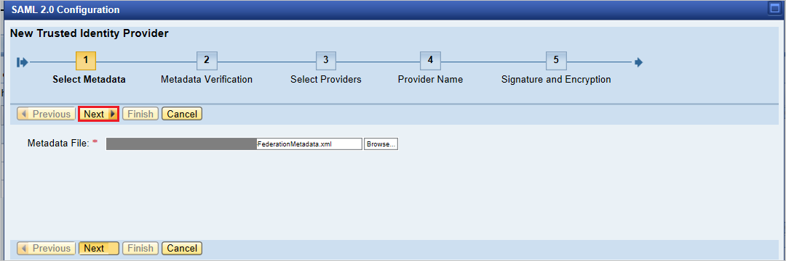
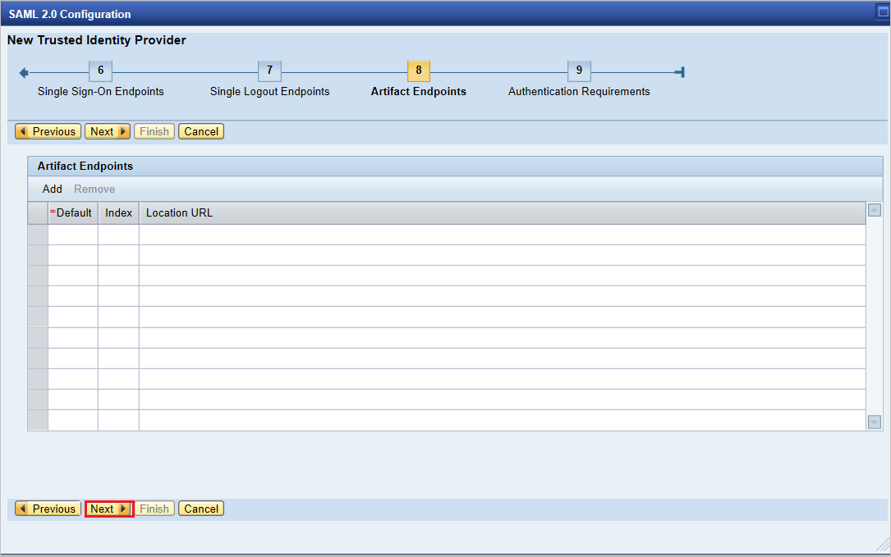
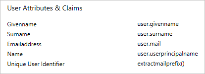

# Tutorial: Microsoft Entra single sign-on (SSO) integration with SAP Fiori

In this tutorial, you'll learn how to integrate SAP Fiori with Microsoft Entra ID. When you integrate SAP Fiori with Microsoft Entra ID, you can:

* Control in Microsoft Entra ID who has access to SAP Fiori.
* Enable your users to be automatically signed-in to SAP Fiori with their Microsoft Entra accounts.
* Manage your accounts in one central location.


## Prerequisites

To get started, you need the following items:

* A Microsoft Entra subscription. If you don't have a subscription, you can get a [free account](https://azure.microsoft.com/free/).
* SAP Fiori single sign-on (SSO) enabled subscription.

## Scenario description

In this tutorial, you configure and test Microsoft Entra SSO in a test environment.

* SAP Fiori supports **SP** initiated SSO

> [!NOTE]
> For SAP Fiori initiated iFrame Authentication, we recommend using the **IsPassive** parameter in the SAML AuthnRequest for silent authentication. For more details of the **IsPassive** parameter refer to [Microsoft Entra SAML single sign-on](~/identity-platform/single-sign-on-saml-protocol.md) information.

## Adding SAP Fiori from the gallery

To configure the integration of SAP Fiori into Microsoft Entra ID, you need to add SAP Fiori from the gallery to your list of managed SaaS apps.

1. Sign in to the [Microsoft Entra admin center](https://entra.microsoft.com) as at least a [Cloud Application Administrator](~/identity/role-based-access-control/permissions-reference.md#cloud-application-administrator).
1. Browse to **Identity** > **Applications** > **Enterprise applications** > **New application**.
1. In the **Add from the gallery** section, type **SAP Fiori** in the search box.
1. Select **SAP Fiori** from results panel and then add the app. Wait a few seconds while the app is added to your tenant.

 Alternatively, you can also use the [Enterprise App Configuration Wizard](https://portal.office.com/AdminPortal/home?Q=Docs#/azureadappintegration). In this wizard, you can add an application to your tenant, add users/groups to the app, assign roles, as well as walk through the SSO configuration as well. [Learn more about Microsoft 365 wizards.](/microsoft-365/admin/misc/azure-ad-setup-guides)

<a name='configure-and-test-azure-ad-sso-for-sap-fiori'></a>

## Configure and test Microsoft Entra SSO for SAP Fiori

Configure and test Microsoft Entra SSO with SAP Fiori using a test user called **B.Simon**. For SSO to work, you need to establish a link relationship between a Microsoft Entra user and the related user in SAP Fiori.

To configure and test Microsoft Entra SSO with SAP Fiori, perform the following steps:

1. **[Configure Microsoft Entra SSO](#configure-azure-ad-sso)** - to enable your users to use this feature.
    1. **[Create a Microsoft Entra test user](#create-an-azure-ad-test-user)** - to test Microsoft Entra single sign-on with B.Simon.
    1. **[Assign the Microsoft Entra test user](#assign-the-azure-ad-test-user)** - to enable B.Simon to use Microsoft Entra single sign-on.
1. **[Configure SAP Fiori SSO](#configure-sap-fiori-sso)** - to configure the single sign-on settings on application side.
    1. **[Create SAP Fiori test user](#create-sap-fiori-test-user)** - to have a counterpart of B.Simon in SAP Fiori that is linked to the Microsoft Entra representation of user.
1. **[Test SSO](#test-sso)** - to verify whether the configuration works.

<a name='configure-azure-ad-sso'></a>

## Configure Microsoft Entra SSO

Follow these steps to enable Microsoft Entra SSO.

1. Open a new web browser window and sign in to your SAP Fiori company site as an administrator.

1. Make sure that **http** and **https** services are active and that the relevant ports are assigned to transaction code **SMICM**.

1. Sign in to SAP Business Client for SAP system **T01**, where single sign-on is required. Then, activate HTTP Security Session Management.

    1. Go to transaction code **SICF_SESSIONS**. All relevant profile parameters with current values are shown. They look like the following example:

        ```
        login/create_sso2_ticket = 2
        login/accept_sso2_ticket = 1
        login/ticketcache_entries_max = 1000
        login/ticketcache_off = 0  login/ticket_only_by_https = 0
        icf/set_HTTPonly_flag_on_cookies = 3
        icf/user_recheck = 0  http/security_session_timeout = 1800
        http/security_context_cache_size = 2500
        rdisp/plugin_auto_logout = 1800
        rdisp/autothtime = 60
        ```

        >[!NOTE]
        > Adjust the parameters based on your organization requirements. The preceding parameters are given only as an example.

    1. If necessary, adjust parameters in the instance (default) profile of the SAP system and restart the SAP system.

    1. Double-click the relevant client to enable an HTTP security session.

        

    1. Activate the following SICF services:

        ```
        /sap/public/bc/sec/saml2
        /sap/public/bc/sec/cdc_ext_service
        /sap/bc/webdynpro/sap/saml2
        /sap/bc/webdynpro/sap/sec_diag_tool (This is only to enable / disable trace)
        ```

1. Go to transaction code **SAML2** in Business Client for SAP system [**T01/122**]. The configuration UI opens in a new browser window. In this example, we use Business Client for SAP system 122.

    

1. Enter your username and password, and then select **Log on**.

    

1. In the **Provider Name** box, replace **T01122** with **http:\//T01122**, and then select **Save**.

    > [!NOTE]
    > By default, the provider name is in the format \<sid>\<client>. Microsoft Entra ID expects the name in the format \<protocol>://\<name>. We recommend that you maintain the provider name as https\://\<sid>\<client> so you can configure multiple SAP Fiori ABAP engines in Microsoft Entra ID.

    

1. Select **Local Provider tab** > **Metadata**.

1. In the **SAML 2.0 Metadata** dialog box, download the generated metadata XML file and save it on your computer.

    

1. Sign in to the [Microsoft Entra admin center](https://entra.microsoft.com) as at least a [Cloud Application Administrator](~/identity/role-based-access-control/permissions-reference.md#cloud-application-administrator).
1. Browse to **Identity** > **Applications** > **Enterprise applications** > **SAP Fiori** > **Single sign-on**.
1. On the **Select a single sign-on method** page, select **SAML**.
1. On the **Set up single sign-on with SAML** page, click the pencil icon for **Basic SAML Configuration** to edit the settings.

   

1. On the **Basic SAML Configuration** section, if you have **Service Provider metadata file**, perform the following steps:

    1. Click **Upload metadata file**.

        

    1. Click on **folder logo** to select the metadata file and click **Upload**.

        

    1. When the metadata file is successfully uploaded, the **Identifier** and **Reply URL** values are automatically populated in the **Basic SAML Configuration** pane. In the **Sign on URL** box, enter a URL that has the following pattern: `https://<your company instance of SAP Fiori>`.

       > [!NOTE]
       > Some customers have encountered an error of an incorrect Reply URL configured for their instance. If you receive any such error, use these PowerShell commands. First update the Reply URLs in the application object with the Reply URL, then update the service principal. Use the [Get-MgServicePrincipal](/powershell/module/microsoft.graph.applications/get-mgserviceprincipal) to get the Service Principal ID value.
       >
       > ```powershell
       > $params = @{
       >    web = @{
       >       redirectUris = "<Your Correct Reply URL>"
       >    }
       > }
       > Update-MgApplication -ApplicationId "<Application ID>" -BodyParameter $params
       > Update-MgServicePrincipal -ServicePrincipalId "<Service Principal ID>" -ReplyUrls "<Your Correct Reply URL>"
       > ```
       >

1. The SAP Fiori application expects the SAML assertions to be in a specific format. Configure the following claims for this application. To manage these attribute values, in the **Set up Single Sign-On with SAML** pane, select **Edit**.

    

1. In the **User Attributes & Claims** pane, configure the SAML token attributes as shown in the preceding image. Then, complete the following steps:

    1. Select **Edit** to open the **Manage user claims** pane.

    1. In the **Transformation** list, select **ExtractMailPrefix()**.

    1. In the **Parameter 1** list, select **user.userprincipalname**.

    1. Select **Save**.

        

        

1. On the **Set up single sign-on with SAML** page, in the **SAML Signing Certificate** section,  find **Federation Metadata XML** and select **Download** to download the certificate and save it on your computer.

    

1. On the **Set up SAP Fiori** section, copy the appropriate URL(s) based on your requirement.

    

<a name='create-an-azure-ad-test-user'></a>

### Create a Microsoft Entra test user

In this section, you'll create a test user called B.Simon.

1. Sign in to the [Microsoft Entra admin center](https://entra.microsoft.com) as at least a [User Administrator](~/identity/role-based-access-control/permissions-reference.md#user-administrator).
1. Browse to **Identity** > **Users** > **All users**.
1. Select **New user** > **Create new user**, at the top of the screen.
1. In the **User** properties, follow these steps:
   1. In the **Display name** field, enter `B.Simon`.  
   1. In the **User principal name** field, enter the username@companydomain.extension. For example, `B.Simon@contoso.com`.
   1. Select the **Show password** check box, and then write down the value that's displayed in the **Password** box.
   1. Select **Review + create**.
1. Select **Create**.

<a name='assign-the-azure-ad-test-user'></a>

### Assign the Microsoft Entra test user

In this section, you'll enable B.Simon to use single sign-on by granting access to SAP Fiori.

1. Sign in to the [Microsoft Entra admin center](https://entra.microsoft.com) as at least a [Cloud Application Administrator](~/identity/role-based-access-control/permissions-reference.md#cloud-application-administrator).
1. Browse to **Identity** > **Applications** > **Enterprise applications** > **SAP Fiori**.
1. In the app's overview page, select **Users and groups**.
1. Select **Add user/group**, then select **Users and groups** in the **Add Assignment** dialog.
   1. In the **Users and groups** dialog, select **B.Simon** from the Users list, then click the **Select** button at the bottom of the screen.
   1. If you are expecting a role to be assigned to the users, you can select it from the **Select a role** dropdown. If no role has been set up for this app, you see "Default Access" role selected.
   1. In the **Add Assignment** dialog, click the **Assign** button.

## Configure SAP Fiori SSO

1. Sign in to the SAP system and go to transaction code **SAML2**. A new browser window opens with the SAML configuration page.

1. To configure endpoints for a trusted identity provider (Microsoft Entra ID), select the **Trusted Providers** tab.

    

1. Select **Add**, and then select **Upload Metadata File** from the context menu.

    

1. Upload the metadata file that you downloaded. Select **Next**.

    

1. On the next page, in the **Alias** box, enter the alias name. For example, **aadsts**. Select **Next**.

    

1. Make sure that the value in the **Digest Algorithm** box is **SHA-256**. Select **Next**.

    

1. Under **Single Sign-On Endpoints**, select **HTTP POST**, and then select **Next**.

    

1. Under **Single Logout Endpoints**, select **HTTP Redirect**, and then select **Next**.

    

1. Under **Artifact Endpoints**, select **Next** to continue.

    

1. Under **Authentication Requirements**, select **Finish**.

    

1. Select **Trusted Provider** > **Identity Federation** (at the bottom of the page). Select **Edit**.

    

1. Select **Add**.

    

1. In the **Supported NameID Formats** dialog box, select **Unspecified**. Select **OK**.

    

    The values for **User ID Source** and **User ID Mapping Mode** determine the link between the SAP user and the Microsoft Entra claim.  

    **Scenario 1**: SAP user to Microsoft Entra user mapping

    1. In SAP, under **Details of NameID Format "Unspecified"**, note the details:

        

    1. In the Azure portal, under **User Attributes & Claims**, note the required claims from Microsoft Entra ID.

        

    **Scenario 2**: Select the SAP user ID based on the configured email address in SU01. In this case, the email ID should be configured in SU01 for each user who requires SSO.

    1. In SAP, under **Details of NameID Format "Unspecified"**, note the details:

        

    1. In the Azure portal, under **User Attributes & Claims**, note the required claims from Microsoft Entra ID.

        

1. Select **Save**, and then select **Enable** to enable the identity provider.

    

1. Select **OK** when prompted.

    

### Create SAP Fiori test user

In this section, you create a user named Britta Simon in SAP Fiori. Work with your in-house SAP team of experts or your organization SAP partner to add the user in the SAP Fiori platform.

## Test SSO

1. After the identity provider Microsoft Entra ID is activated in SAP Fiori, try to access one of the following URLs to test single sign-on (you shouldn't be prompted for a username and password):

    * `https://<sap-url>/sap/bc/bsp/sap/it00/default.htm`
    * `https://<sap-url>/sap/bc/bsp/sap/it00/default.htm`

    > [!NOTE]
    > Replace `<sap-url>` with the actual SAP host name.

1. The test URL should take you to the following test application page in SAP. If the page opens, Microsoft Entra single sign-on is successfully set up.

    

1. If you are prompted for a username and password, enable trace to help diagnose the issue. Use the following URL for the trace:

    `https://<sap-url>/sap/bc/webdynpro/sap/sec_diag_tool?sap-client=122&sap-language=EN#`.

## Next steps

Once you configure SAP Fiori you can enforce session control, which protects exfiltration and infiltration of your organization’s sensitive data in real time. Session control extends from Conditional Access. [Learn how to enforce session control with Microsoft Defender for Cloud Apps](/cloud-app-security/proxy-deployment-any-app).
