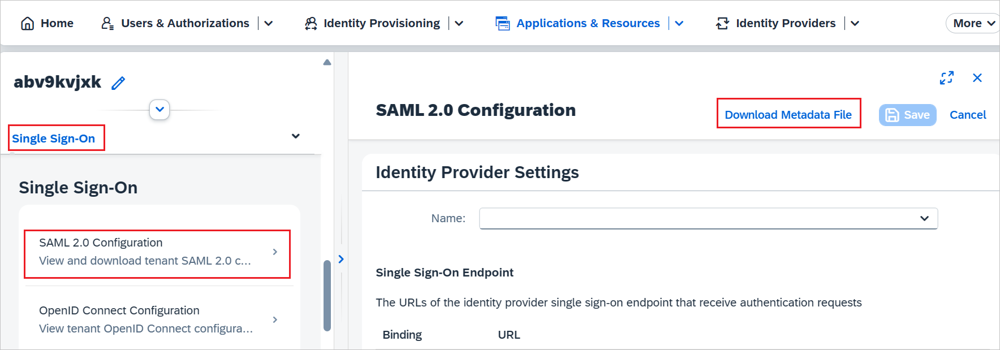
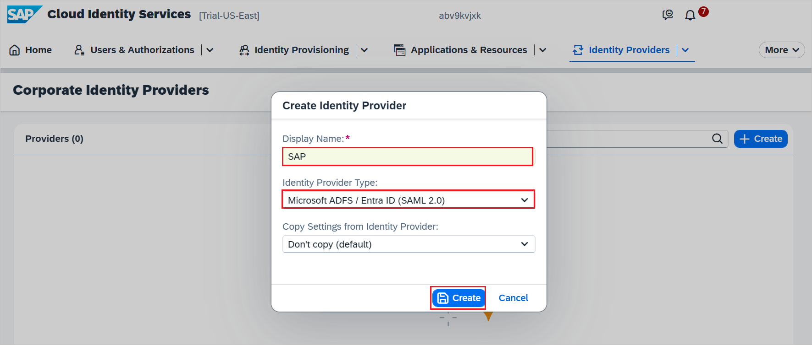
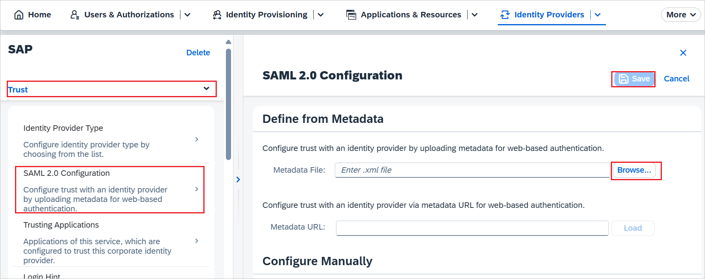

# Tutorial: Microsoft Entra single sign-on (SSO) integration with SAP Cloud Identity Services

In this tutorial, you'll learn how to integrate SAP Cloud Identity Services with Microsoft Entra ID. When you integrate SAP Cloud Identity Services with Microsoft Entra ID, you can:

* Control in Microsoft Entra ID who has access to SAP Cloud Identity Services.
* Enable your users to be automatically signed-in to SAP Cloud Identity Services with their Microsoft Entra accounts.
* Manage your accounts in one central location.

> [!TIP]
> Follow the recommendations and best-practice guide "[Using Microsoft Entra ID to secure access to SAP platforms and applications](~/fundamentals/scenario-azure-first-sap-identity-integration.md)" to operationalize the setup.

## Prerequisites

To get started, you need the following items:

* A Microsoft Entra subscription. If you don't have a subscription, you can get a [free account](https://azure.microsoft.com/free/).
* SAP Cloud Identity Services single sign-on (SSO) enabled subscription.

## Scenario description

In this tutorial, you configure and test Microsoft Entra single sign-on in a test environment.

* SAP Cloud Identity Services supports **SP** and **IDP** initiated SSO.
* SAP Cloud Identity Services supports [Automated user provisioning](sap-cloud-platform-identity-authentication-provisioning-tutorial.md).

Before you dive into the technical details, it's vital to understand the concepts you're going to look at. The SAP Cloud Identity Services and Active Directory Federation Services enable you to implement SSO across applications or services that are protected by Microsoft Entra ID (as an IdP) with SAP applications and services that are protected by SAP Cloud Identity Services.

Currently, SAP Cloud Identity Services acts as a Proxy Identity Provider to SAP applications. Microsoft Entra ID in turn acts as the leading Identity Provider in this setup. 

The following diagram illustrates this relationship:

With this setup, your SAP Cloud Identity Services tenant is configured as a trusted application in Microsoft Entra ID.

All SAP applications and services that you want to protect this way are subsequently configured in the SAP Cloud Identity Services management console.

Therefore, the authorization for granting access to SAP applications and services needs to take place in SAP Cloud Identity Services (as opposed to Microsoft Entra ID).

By configuring SAP Cloud Identity Services as an application through the Microsoft Entra Marketplace, you don't need to configure individual claims or SAML assertions.

> [!NOTE]
> Currently only Web SSO has been tested by both parties. The flows that are necessary for App-to-API or API-to-API communication should work but have not been tested yet. They will be tested during subsequent activities.

## Adding SAP Cloud Identity Services from the gallery

To configure the integration of SAP Cloud Identity Services into Microsoft Entra ID, you need to add SAP Cloud Identity Services from the gallery to your list of managed SaaS apps.

1. Sign in to the [Microsoft Entra admin center](https://entra.microsoft.com) as at least a [Cloud Application Administrator](~/identity/role-based-access-control/permissions-reference.md#cloud-application-administrator).
1. Browse to **Identity** > **Applications** > **Enterprise applications** > **New application**.
1. In the **Add from the gallery** section, type **SAP Cloud Identity Services** in the search box.
1. Select **SAP Cloud Identity Services** from results panel and then add the app. Wait a few seconds while the app is added to your tenant.

 Alternatively, you can also use the [Enterprise App Configuration Wizard](https://portal.office.com/AdminPortal/home?Q=Docs#/azureadappintegration). In this wizard, you can add an application to your tenant, add users/groups to the app, assign roles, as well as walk through the SSO configuration as well. [Learn more about Microsoft 365 wizards.](/microsoft-365/admin/misc/azure-ad-setup-guides)

## Configure and test Microsoft Entra SSO for SAP Cloud Identity Services

Configure and test Microsoft Entra SSO with SAP Cloud Identity Services using a test user called **B.Simon**. For SSO to work, you need to establish a link relationship between a Microsoft Entra user and the related user in SAP Cloud Identity Services.

To configure and test Microsoft Entra SSO with SAP Cloud Identity Services, perform the following steps:

1. **[Configure Microsoft Entra SSO](#configure-azure-ad-sso)** - to enable your users to use this feature.
    1. **[Create a Microsoft Entra test user](#create-an-azure-ad-test-user)** - to test Microsoft Entra single sign-on with B.Simon.
    1. **[Assign the Microsoft Entra test user](#assign-the-azure-ad-test-user)** - to enable B.Simon to use Microsoft Entra single sign-on.
1. **[Configure SAP Cloud Identity Services SSO](#configure-sap-cloud-identity-services-sso)** - to configure the single sign-on settings on application side.
    1. **[Create SAP Cloud Identity Services test user](#create-sap-cloud-identity-services-test-user)** - to have a counterpart of B.Simon in SAP Cloud Identity Services that is linked to the Microsoft Entra representation of user.
1. **[Test SSO](#test-sso)** - to verify whether the configuration works.

## Configure Microsoft Entra SSO

Follow these steps to enable Microsoft Entra SSO.

1. Sign in to the [Microsoft Entra admin center](https://entra.microsoft.com) as at least a [Cloud Application Administrator](~/identity/role-based-access-control/permissions-reference.md#cloud-application-administrator).
1. Browse to **Identity** > **Applications** > **Enterprise applications** > **SAP Cloud Identity Services** > **Single sign-on**.
1. On the **Select a single sign-on method** page, select **SAML**.
1. On the **Set up single sign-on with SAML** page, click the pencil icon for **Basic SAML Configuration** to edit the settings.

   

1. On the **Basic SAML Configuration** section, if you have **Service Provider metadata file** and wish to configure in **IDP** initiated mode, perform the following steps:

	a. Click **Upload metadata file**.

	b. Click on **folder logo** to select the metadata file which you have downloaded from SAP and click **Upload**.

	

	c. After the metadata file is successfully uploaded, the **Identifier** and **Reply URL** values get auto populated in Basic SAML Configuration section.

	

	> [!Note]
	> If the **Identifier** and **Reply URL** values do not get auto polulated, then fill in the values manually according to your requirement.

1. If you wish to configure the application in **SP** initiated mode:

	In the **Sign on URL (Optional)** text box, type a URL using the following pattern:
    `{YOUR BUSINESS APPLICATION URL}`

	> [!NOTE]
	> This value is not real. Update this value with the actual sign-on URL. Please use your specific business application Sign-on URL. Contact the [SAP Cloud Identity Services Client support team](https://cloudplatform.sap.com/capabilities/security/trustcenter.html) if you have any doubt.

1. SAP Cloud Identity Services application expects the SAML assertions in a specific format, which requires you to add custom attribute mappings to your SAML token attributes configuration. The following screenshot shows the list of default attributes.

	

1. In addition to above, SAP Cloud Identity Services application expects few more attributes to be passed back in SAML response, which are shown below. These attributes are also pre populated but you can review them as per your requirements.

    | Name | Source Attribute|
	| ---------------| --------------- |
    | firstName | user.givenname |

8. On the **Set up Single Sign-On with SAML** page, in the **SAML Signing Certificate** section, click **Download** to download the **Metadata XML** from the given options as per your requirement and save it on your computer.

	

9. On the **Set up SAP Cloud Identity Services** section, copy the appropriate URL(s) as per your requirement.

	

### Create a Microsoft Entra test user

In this section, you'll create a test user called B.Simon.

1. Sign in to the [Microsoft Entra admin center](https://entra.microsoft.com) as at least a [User Administrator](~/identity/role-based-access-control/permissions-reference.md#user-administrator).
1. Browse to **Identity** > **Users** > **All users**.
1. Select **New user** > **Create new user**, at the top of the screen.
1. In the **User** properties, follow these steps:
   1. In the **Display name** field, enter `B.Simon`.  
   1. In the **User principal name** field, enter the username@companydomain.extension. For example, `B.Simon@contoso.com`.
   1. Select the **Show password** check box, and then write down the value that's displayed in the **Password** box.
   1. Select **Review + create**.
1. Select **Create**.

### Assign the Microsoft Entra test user

In this section, you'll enable B.Simon to use single sign-on by granting access to SAP Cloud Identity Services.

1. Sign in to the [Microsoft Entra admin center](https://entra.microsoft.com) as at least a [Cloud Application Administrator](~/identity/role-based-access-control/permissions-reference.md#cloud-application-administrator).
1. Browse to **Identity** > **Applications** > **Enterprise applications** > **SAP Cloud Identity Services**.
1. In the app's overview page, find the **Manage** section and select **Users and groups**.

1. Select **Add user**, then select **Users and groups** in the **Add Assignment** dialog.

1. In the **Users and groups** dialog, select **B.Simon** from the Users list, then click the **Select** button at the bottom of the screen.
1. If you are expecting a role to be assigned to the users, you can select it from the **Select a role** dropdown. If no role has been set up for this app, you see "Default Access" role selected.

1. In the **Add Assignment** dialog, click the **Assign** button.

## Configure SAP Cloud Identity Services SSO
1. Sign in to the SAP Cloud Identity Services administration console. The URL has the following pattern: `https://<tenant-id>.accounts.ondemand.com/admin`.

1. Under **Applications and Resources**, choose the **Tenant Settings** tile.

    

1. In the **Single Sign-On** tab, go to **SAML 2.0 Configuration**, click **Download Metadata File** button to download the metadata and use it later in the Entra side configuration.

    

1. Under **Identity Providers**, choose the **Corporate Identity Providers** tile.

1. Click **+ Create** to create  identity provider.

    

1. Perform the following steps on **Create Identity Provider** dialog box.

    

    a. Give a valid name in **Display Name**.

    b. Select **Microsoft ADFS/Entra ID (SAML 2.0)** from the dropdown.

    c. Click **Create**.

1. Go to **Trust -> SAML 2.0 Configuration** and click on **Browse** to upload the **Metadata XML** file which you have downloaded from the Entra configuration.

    

1. Click **Save**.

3. Continue with the following only if you want to add and enable SSO for another SAP application. Repeat the steps under the section **Adding SAP Cloud Identity Services from the gallery**.

4. In the Entra side, on the **SAP Cloud Identity Services** application integration page, select **Linked Sign-on**.

	

5. Save the configuration.
6. For more information, please read the documentation about SAP Cloud Identity Services at [Integration with Microsoft Entra ID](https://developers.sap.com/tutorials/cp-ias-azure-ad.html).

> [!NOTE]
> The new application leverages the single sign-on configuration of the previous SAP application. Make sure you use the same Corporate Identity Providers in the SAP Cloud Identity Services administration console.

### Create SAP Cloud Identity Services test user

You don't need to create a user in SAP Cloud Identity Services. Users who are in the Microsoft Entra user store can use the SSO functionality.

SAP Cloud Identity Services supports the Identity Federation option. This option allows the application to check whether users who are authenticated by the corporate identity provider exist in the user store of SAP Cloud Identity Services.

The Identity Federation option is disabled by default. If Identity Federation is enabled, only the users that are imported in SAP Cloud Identity Services can access the application.

For more information about how to enable or disable Identity Federation with SAP Cloud Identity Services, see "Enable Identity Federation with SAP Cloud Identity Services" in [Configure Identity Federation with the User Store of SAP Cloud Identity Services](https://help.sap.com/viewer/6d6d63354d1242d185ab4830fc04feb1/Cloud/c029bbbaefbf4350af15115396ba14e2.html).

> [!NOTE]
> SAP Cloud Identity Services also supports automatic user provisioning, you can find more details [here](./sap-cloud-platform-identity-authentication-provisioning-tutorial.md) on how to configure automatic user provisioning.

## Test SSO 

In this section, you test your Microsoft Entra single sign-on configuration with following options.

#### SP initiated:

* Click on **Test this application**, this will redirect to SAP Cloud Identity Services Sign on URL where you can initiate the login flow.

* Go to SAP Cloud Identity Services Sign on URL directly and initiate the login flow from there.

#### IDP initiated:

* Click on **Test this application**, and you should be automatically signed in to the SAP Cloud Identity Services for which you set up the SSO

You can also use Microsoft My Apps to test the application in any mode. When you click the SAP Cloud Identity Services tile in the My Apps, if configured in SP mode you would be redirected to the application sign-on page for initiating the login flow and if configured in IDP mode, you should be automatically signed in to the SAP Cloud Identity Services for which you set up the SSO. For more information about the My Apps, see [Introduction to the My Apps](https://support.microsoft.com/account-billing/sign-in-and-start-apps-from-the-my-apps-portal-2f3b1bae-0e5a-4a86-a33e-876fbd2a4510).

## Next steps

Once you configure the SAP Cloud Identity Services you can enforce session controls, which protect exfiltration and infiltration of your organization’s sensitive data in real time. Session controls extend from Conditional Access. [Learn how to enforce session control with Microsoft Defender for Cloud Apps](/cloud-app-security/proxy-deployment-aad).

Consult the [recommendations and best-practice guide](~/fundamentals/scenario-azure-first-sap-identity-integration.md) to operationalize the setup.
