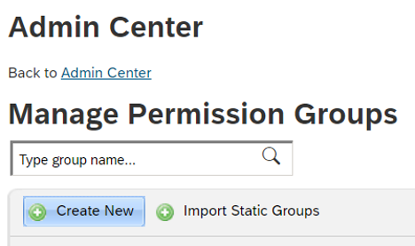
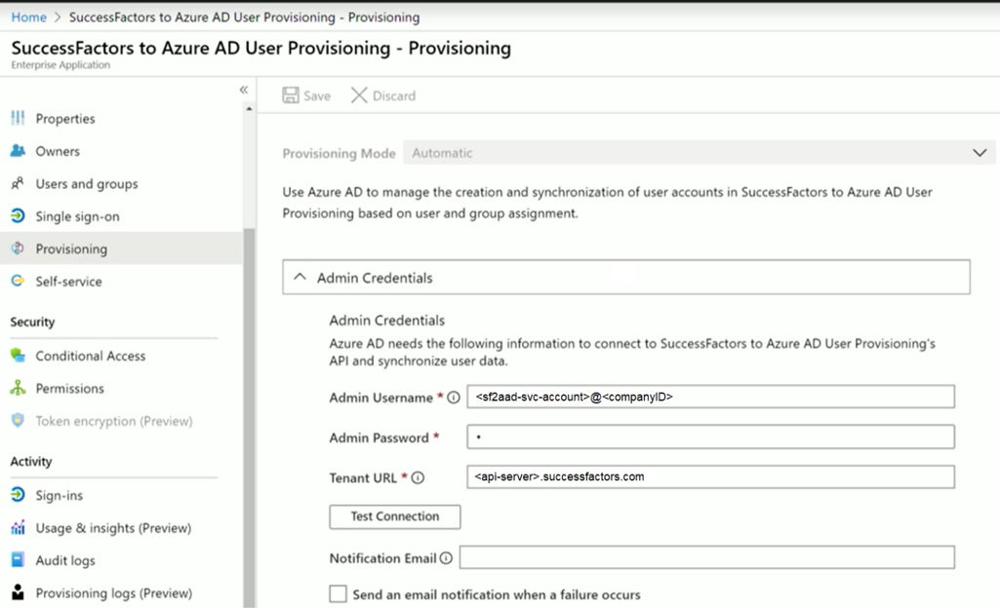
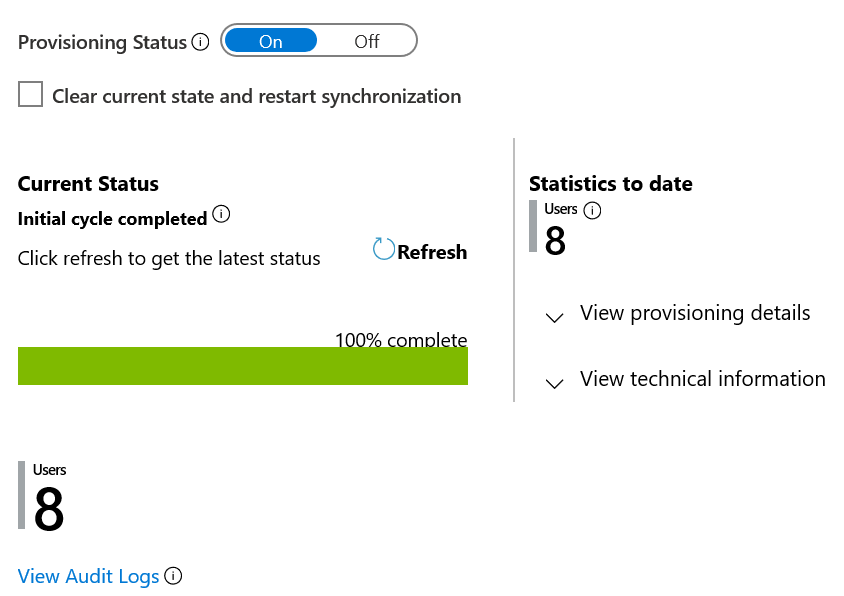

# Tutorial: Configure SAP SuccessFactors to Azure AD user provisioning (Preview)
The objective of this tutorial is to show the steps you need to perform to provision worker data from SuccessFactors Employee Central into Azure Active Directory, with optional write-back of email address to SuccessFactors. This integration is in public preview and supports retrieving more than [70+ user attributes](../manage-apps/sap-successfactors-attribute-reference.md) from SuccessFactors Employee Central. 

>[!NOTE]
>Use this tutorial if the users you want to provision from SuccessFactors are cloud-only users who don't need an on-premises AD account. If the users require only on-premises AD account or both AD and Azure AD account, then please refer to the tutorial on [configure SAP SuccessFactors to Active Directory](sap-successfactors-inbound-provisioning-tutorial.md#overview) user provisioning. 

## Overview

The [Azure Active Directory user provisioning service](../manage-apps/user-provisioning.md) integrates with the [SuccessFactors Employee Central](https://www.successfactors.com/products-services/core-hr-payroll/employee-central.html) in order to manage the identity life cycle of users. 

The SuccessFactors user provisioning workflows supported by the Azure AD user provisioning service enable automation of the following human resources and identity lifecycle management scenarios:

* **Hiring new employees** - When a new employee is added to SuccessFactors, a user account is automatically created in Azure Active Directory and optionally Office 365 and [other SaaS applications supported by Azure AD](../manage-apps/user-provisioning.md), with write-back of the email address to SuccessFactors.

* **Employee attribute and profile updates** - When an employee record is updated in SuccessFactors (such as their name, title, or manager), their user account will be automatically updated Azure Active Directory and optionally Office 365 and [other SaaS applications supported by Azure AD](../manage-apps/user-provisioning.md).

* **Employee terminations** - When an employee is terminated in SuccessFactors, their user account is automatically disabled in Azure Active Directory and optionally Office 365 and [other SaaS applications supported by Azure AD](../manage-apps/user-provisioning.md).

* **Employee rehires** - When an employee is rehired in SuccessFactors, their old account can be automatically reactivated or re-provisioned (depending on your preference) to Azure Active Directory and optionally Office 365 and [other SaaS applications supported by Azure AD](../manage-apps/user-provisioning.md).

### Who is this user provisioning solution best suited for?

This SuccessFactors to Azure Active Directory user provisioning solution is ideally suited for:

* Organizations that desire a pre-built, cloud-based solution for SuccessFactors user provisioning

* Organizations that require direct user provisioning from SuccessFactors to Azure Active Directory

* Organizations that require users to be provisioned using data obtained from the [SuccessFactors Employee Central (EC)](https://www.successfactors.com/products-services/core-hr-payroll/employee-central.html)

* Organizations using Office 365 for email

## Solution Architecture

This section describes the end-to-end user provisioning solution architecture for cloud-only users. There are two related flows:

* **Authoritative HR Data Flow – from SuccessFactors to Azure Active Directory:** In this flow worker events (such as New Hires, Transfers, Terminations) first occur in the cloud SuccessFactors Employee Central and then the event data flows into Azure Active Directory. Depending on the event, it may lead to create/update/enable/disable operations in Azure AD.
* **Email Writeback Flow – from on-premises Active Directory to SuccessFactors:** Once the account creation is complete in Azure Active Directory, the email attribute value or UPN generated in Azure AD can be written back to SuccessFactors.

  

### End-to-end user data flow

1. The HR team performs worker transactions (Joiners/Movers/Leavers or New Hires/Transfers/Terminations) in SuccessFactors Employee Central
2. The Azure AD Provisioning Service runs scheduled synchronizations of identities from SuccessFactors EC and identifies changes that need to be processed for sync with on-premises Active Directory.
3. The Azure AD Provisioning Service determines the change and invokes create/update/enable/disable operation for the user in Azure AD.
4. If the [SuccessFactors Writeback app](sap-successfactors-writeback-tutorial.md) is configured, then the user's email address is retrieved from Azure AD. 
5. Azure AD provisioning service writes back email attribute to SuccessFactors, based on the matching attribute used.

## Planning your deployment

Configuring Cloud HR driven user provisioning from SuccessFactors to Azure AD requires considerable planning covering different aspects such as:

* Determining the Matching ID 
* Attribute mapping
* Attribute transformation 
* Scoping filters

Please refer to the [cloud HR deployment plan](../manage-apps/plan-cloud-hr-provision.md) for comprehensive guidelines around these topics. 

## Configuring SuccessFactors for the integration

A common requirement of all the SuccessFactors provisioning connectors is that they require credentials of a SuccessFactors account with the right permissions to invoke the SuccessFactors OData APIs. This section describes steps to create the service account in SuccessFactors and grant appropriate permissions. 

* [Create/identify API user account in SuccessFactors](#createidentify-api-user-account-in-successfactors)
* [Create an API permissions role](#create-an-api-permissions-role)
* [Create a Permission Group for the API user](#create-a-permission-group-for-the-api-user)
* [Grant Permission Role to the Permission Group](#grant-permission-role-to-the-permission-group)

### Create/identify API user account in SuccessFactors
Work with your SuccessFactors admin team or implementation partner to create or identify a user account in SuccessFactors that will be used to invoke the OData APIs. The username and password credentials of this account will be required when configuring the provisioning apps in Azure AD. 

### Create an API permissions role

* Log in to SAP SuccessFactors with a user account that has access to the Admin Center.
* Search for *Manage Permission Roles*, then select **Manage Permission Roles** from the search results.
  
* From the Permission Role List, click **Create New**.
  > [!div class="mx-imgBorder"]
  > 
* Add a **Role Name** and **Description** for the new permission role. The name and description should indicate that the role is for API usage permissions.
  > [!div class="mx-imgBorder"]
  > 
* Under Permission settings, click **Permission...**, then scroll down the permission list and click **Manage Integration Tools**. Check the box for **Allow Admin to Access to OData API through Basic Authentication**.
  > [!div class="mx-imgBorder"]
  > 
* Scroll down in the same box and select **Employee Central API**. Add permissions as shown below to read using ODATA API and edit using ODATA API. Select the edit option if you plan to use the same account for the Writeback to SuccessFactors scenario. 
  > [!div class="mx-imgBorder"]
  > 
* Click on **Done**. Click **Save Changes**.

### Create a Permission Group for the API user

* In the SuccessFactors Admin Center, search for *Manage Permission Groups*, then select **Manage Permission Groups** from the search results.
  > [!div class="mx-imgBorder"]
  > 
* From the Manage Permission Groups window, click **Create New**.
  > [!div class="mx-imgBorder"]
  > 
* Add a Group Name for the new group. The group name should indicate that the group is for API users.
  > [!div class="mx-imgBorder"]
  > 
* Add members to the group. For example, you could select **Username** from the People Pool drop-down menu and then enter the username of the API account that will be used for the integration. 
  > [!div class="mx-imgBorder"]
  > 
* Click **Done** to finish creating the Permission Group.

### Grant Permission Role to the Permission Group

* In SuccessFactors Admin Center, search for *Manage Permission Roles*, then select **Manage Permission Roles** from the search results.
* From the **Permission Role List**, select the role that you created for API usage permissions.
* Under **Grant this role to...**, click **Add...** button.
* Select **Permission Group...** from the drop-down menu, then click **Select...** to open the Groups window to search and select the group created above. 
  > [!div class="mx-imgBorder"]
  > 
* Review the Permission Role grant to the Permission Group. 
  > [!div class="mx-imgBorder"]
  > 
* Click **Save Changes**.

## Configuring user provisioning from SuccessFactors to Azure AD

This section provides steps for user account provisioning from SuccessFactors to Azure AD.

* [Add the provisioning connector app and configure connectivity to SuccessFactors](#part-1-add-the-provisioning-connector-app-and-configure-connectivity-to-successfactors)
* [Configure attribute mappings](#part-2-configure-attribute-mappings)
* [Enable and launch user provisioning](#enable-and-launch-user-provisioning)

### Part 1: Add the provisioning connector app and configure connectivity to SuccessFactors

**To configure SuccessFactors to Azure AD provisioning:**

1. Go to <https://portal.azure.com>

2. In the left navigation bar, select **Azure Active Directory**

3. Select **Enterprise Applications**, then **All Applications**.

4. Select **Add an application**, and select the **All** category.

5. Search for **SuccessFactors to Azure Active Directory User Provisioning**, and add that app from the gallery.

6. After the app is added and the app details screen is shown, select **Provisioning**

7. Change the **Provisioning** **Mode** to **Automatic**

8. Complete the **Admin Credentials** section as follows:

   * **Admin Username** – Enter the username of the SuccessFactors API user account, with the company ID appended. It has the format: **username\@companyID**

   * **Admin password –** Enter the password of the SuccessFactors API user account. 

   * **Tenant URL –** Enter the name of the SuccessFactors OData API services endpoint. Only enter the host name of server without http or https. This value should look like: **api-server-name.successfactors.com**.

   * **Notification Email –** Enter your email address, and check the “send email if failure occurs” checkbox.
    > [!NOTE]
    > The Azure AD Provisioning Service sends email notification if the provisioning job goes into a [quarantine](/azure/active-directory/manage-apps/application-provisioning-quarantine-status) state.

   * Click the **Test Connection** button. If the connection test succeeds, click the **Save** button at  the top. If it fails, double-check that the SuccessFactors credentials and URL are valid.
    >[!div class="mx-imgBorder"]
    >

   * Once the credentials are saved successfully, the **Mappings** section will display the default mapping **Synchronize SuccessFactors Users to Azure Active Directory**

### Part 2: Configure attribute mappings

In this section, you will configure how user data flows from SuccessFactors to Active Directory.

1. On the Provisioning tab under **Mappings**, click **Synchronize SuccessFactors Users to Azure Active Directory**.

1. In the **Source Object Scope** field, you can select which sets of  users in SuccessFactors should be in scope for provisioning to Azure AD, by defining a set of attribute-based filters. The default scope is “all users in SuccessFactors”. Example filters:

   * Example: Scope to users with personIdExternal between 1000000 and
        2000000 (excluding 2000000)

      * Attribute: personIdExternal

      * Operator: REGEX Match

      * Value: (1[0-9][0-9][0-9][0-9][0-9][0-9])

   * Example: Only employees and not contingent workers

      * Attribute: EmployeeID

      * Operator: IS NOT NULL

   > [!TIP]
   > When you are configuring the provisioning app for the first time, you will need to test and verify your attribute mappings and expressions to make sure that it is giving you the desired result. Microsoft recommends using the scoping filters under **Source Object Scope** to test your mappings with a few test users from SuccessFactors. Once you have verified that the mappings work, then you can either remove the filter or gradually expand it to include more users.

   > [!CAUTION] 
   > The default behavior of the provisioning engine is to disable/delete users that go out of scope. This may not be desirable in your SuccessFactors to Azure AD integration. To override this default behavior refer to the article [Skip deletion of user accounts that go out of scope](../manage-apps/skip-out-of-scope-deletions.md)
  
1. In the **Target Object Actions** field, you can globally filter what actions are performed on Active Directory. **Create** and **Update** are most common.

1. In the **Attribute mappings** section, you can define how individual SuccessFactors attributes map to Active Directory attributes.

  >[!NOTE]
  >For the complete list of SuccessFactors attribute supported by the application, please refer to [SuccessFactors Attribute Reference](../manage-apps/sap-successfactors-attribute-reference.md)

1. Click on an existing attribute mapping to update it, or click **Add new mapping** at the bottom of the screen to add new
        mappings. An individual attribute mapping supports these properties:

      * **Mapping Type**

         * **Direct** – Writes the value of the SuccessFactors attribute to the AD attribute, with no changes

         * **Constant** - Write a static, constant string value to the AD attribute

         * **Expression** – Allows you to write a custom value to the AD attribute, based on one or more SuccessFactors attributes. [For more info, see this article on expressions](../app-provisioning/functions-for-customizing-application-data.md).

      * **Source attribute** - The user attribute from SuccessFactors

      * **Default value** – Optional. If the source attribute has an empty value, the mapping will write this value instead.
            Most common configuration is to leave this blank.

      * **Target attribute** – The user attribute in Active  Directory.

      * **Match objects using this attribute** – Whether or not this mapping should be used to uniquely identify users between
            SuccessFactors and Active Directory. This value is typically set on the  Worker ID field for SuccessFactors, which is typically mapped to one of the Employee ID attributes in Active Directory.

      * **Matching precedence** – Multiple matching attributes can be set. When there are multiple, they are evaluated in the
            order defined by this field. As soon as a match is found, no  further matching attributes are evaluated.

      * **Apply this mapping**

         * **Always** – Apply this mapping on both user creation and update actions

         * **Only during creation** - Apply this mapping only on user creation actions

1. To save your mappings, click **Save** at the top of the  Attribute-Mapping section.

Once your attribute mapping configuration is complete, you can now [enable and launch the user provisioning service](#enable-and-launch-user-provisioning).

## Enable and launch user provisioning

Once the SuccessFactors provisioning app configurations have been completed, you can turn on the provisioning service in the Azure portal.

> [!TIP]
> By default when you turn on the provisioning service, it will initiate provisioning operations for all users in scope. If there are errors in the mapping or Workday data issues, then the provisioning job might fail and go into the quarantine state. To avoid this, as a best practice, we recommend configuring **Source Object Scope** filter and testing  your attribute mappings with a few test users before launching the full sync for all users. Once you have verified that the mappings work and are giving you the desired results, then you can either remove the filter or gradually expand it to include more users.

1. In the **Provisioning** tab, set the **Provisioning Status** to **On**.

2. Click **Save**.

3. This operation will start the initial sync, which can take a variable number of hours depending on how many users are in the SuccessFactors tenant. You can check the progress bar to the track the progress of the sync cycle. 

4. At any time, check the **Audit logs** tab in the Azure portal to see what actions the provisioning service has performed. The audit logs lists all individual sync events performed by the provisioning service, such as which users are being read out of Workday and then subsequently added or updated to Active Directory. 

5. Once the initial sync is completed, it will write an audit summary report in the **Provisioning** tab, as shown below.

   > [!div class="mx-imgBorder"]
   > 

## Next steps

* [Learn more about supported SuccessFactors Attributes for inbound provisioning](../manage-apps/sap-successfactors-attribute-reference.md)
* [Learn how to configure email writeback to SuccessFactors](sap-successfactors-writeback-tutorial.md)
* [Learn how to review logs and get reports on provisioning activity](../app-provisioning/check-status-user-account-provisioning.md)
* [Learn how to configure single sign-on between SuccessFactors and Azure Active Directory](successfactors-tutorial.md)
* [Learn how to integrate other SaaS applications with Azure Active Directory](tutorial-list.md)
* [Learn how to export and import your provisioning configurations](../app-provisioning/export-import-provisioning-configuration.md)

