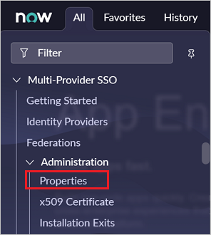
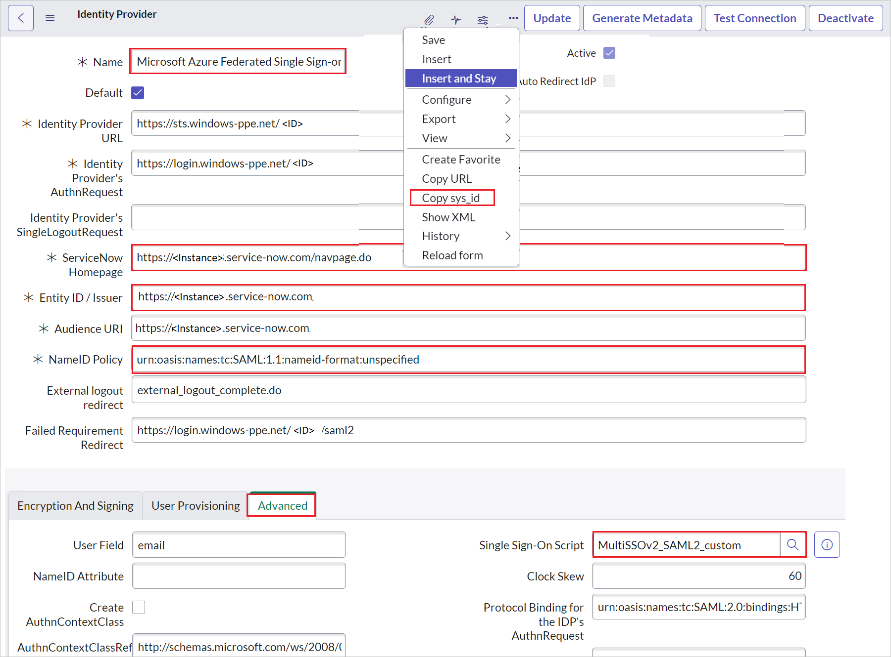
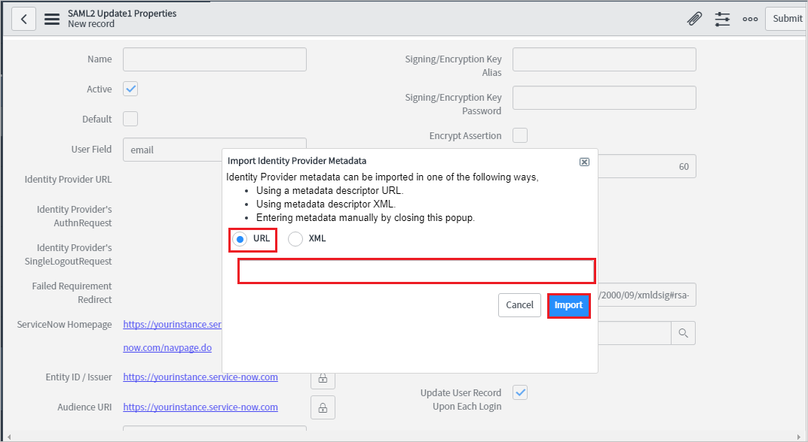
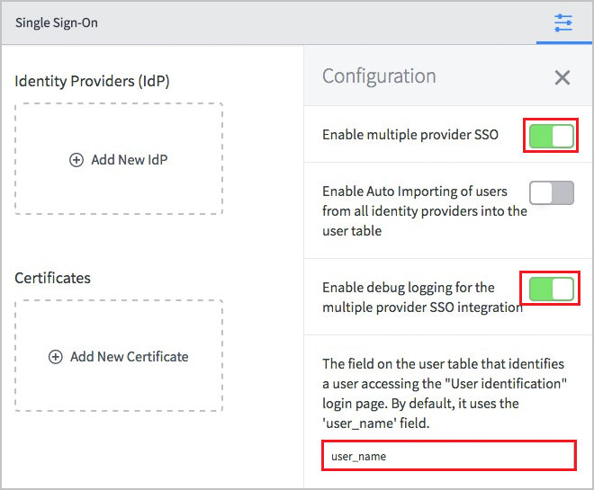

# Tutorial: Azure Active Directory single sign-on (SSO) integration with ServiceNow

In this tutorial, you'll learn how to integrate ServiceNow with Azure Active Directory (Azure AD). When you integrate ServiceNow with Azure AD, you can:

* Control in Azure AD who has access to ServiceNow.
* Enable your users to be automatically signed-in to ServiceNow with their Azure AD accounts.
* Manage your accounts in one central location: the Azure portal.

## Prerequisites

To get started, you need the following items:

* An Azure AD subscription. If you don't have a subscription, you can get a [free account](https://azure.microsoft.com/free/).
* A ServiceNow single sign-on (SSO) enabled subscription.
* For ServiceNow, an instance or tenant of ServiceNow supports Calgary, Kingston, London, Madrid, New York, Orlando and Paris versions or later.
* For ServiceNow Express, an instance of ServiceNow Express, Helsinki version or later.
* The ServiceNow tenant must have the [Multiple Provider Single Sign On Plugin](https://wiki.servicenow.com/index.php?title=Multiple_Provider_Single_Sign-On#gsc.tab=0) enabled.
* For automatic configuration, enable the multi-provider plugin for ServiceNow.
* To install the ServiceNow Classic (Mobile) application, go to the appropriate store, and search for the ServiceNow Classic application. Then download it.

> [!NOTE]
> This integration is also available to use from Azure AD US Government Cloud environment. You can find this application in the Azure AD US Government Cloud Application Gallery and configure it in the same way as you do from public cloud.

## Scenario description

In this tutorial, you configure and test Azure AD SSO in a test environment. 

* ServiceNow supports **SP** initiated SSO.

* ServiceNow supports [Automated user provisioning](servicenow-provisioning-tutorial.md).

* You can configure the ServiceNow Classic (Mobile) application with Azure AD for enabling SSO. It supports both Android and iOS users. In this tutorial, you configure and test Azure AD SSO in a test environment.

## Add ServiceNow from the gallery

To configure the integration of ServiceNow into Azure AD, you need to add ServiceNow from the gallery to your list of managed SaaS apps.

1. Sign in to the Azure portal by using either a work or school account, or by using a personal Microsoft account.
1. In the left pane, select the **Azure Active Directory** service.
1. Go to **Enterprise Applications**, and select **All Applications**.
1. To add new application, select **New application**.
1. In the **Add from the gallery** section, enter **ServiceNow** in the search box.
1. Select **ServiceNow** from results panel, and then add the app. Wait a few seconds while the app is added to your tenant.

## Configure and test Azure AD SSO for ServiceNow

Configure and test Azure AD SSO with ServiceNow by using a test user called **B.Simon**. For SSO to work, you need to establish a link relationship between an Azure AD user and the related user in ServiceNow.

To configure and test Azure AD SSO with ServiceNow, perform the following steps:

1. [Configure Azure AD SSO](#configure-azure-ad-sso) to enable your users to use this feature.
	1. [Create an Azure AD test user](#create-an-azure-ad-test-user) to test Azure AD single sign-on with B.Simon.
	1. [Assign the Azure AD test user](#assign-the-azure-ad-test-user) to enable B.Simon to use Azure AD single sign-on.
	1. [Configure Azure AD SSO for ServiceNow Express](#configure-azure-ad-sso-for-servicenow-express) to enable your users to use this feature.
2. [Configure ServiceNow](#configure-servicenow) to configure the SSO settings on the application side.
	1. [Create a ServiceNow test user](#create-servicenow-test-user) to have a counterpart of B.Simon in ServiceNow, linked to the Azure AD representation of the user.
	1. [Configure ServiceNow Express SSO](#configure-servicenow-express-sso) to configure the single sign-on settings on the application side.	
3. [Test SSO](#test-sso) to verify whether the configuration works.
4. [Test SSO for ServiceNow Classic (Mobile)](#test-sso-for-servicenow-classic-mobile) to verify whether the configuration works.

## Configure Azure AD SSO

Follow these steps to enable Azure AD SSO in the Azure portal.

1. In the Azure portal, on the **ServiceNow** application integration page, find the **Manage** section. Select **single sign-on**.
1. On the **Select a single sign-on method** page, select **SAML**.
1. On the **Set up single sign-on with SAML** page, select the pen icon for **Basic SAML Configuration** to edit the settings.

   

1. In the **Basic SAML Configuration** section, perform the following steps:

	a. In **Sign on URL**, enter a URL that uses the following pattern:
    `https://<instancename>.service-now.com/navpage.do`

    b. In **Identifier (Entity ID)**, enter a URL that uses the following pattern:
    `https://<instance-name>.service-now.com`

	c. For **Reply URL**, enter one of the following URL patterns:

	| Reply URL|
	|----------|
	| `https://<instancename>.service-now.com/navpage.do` |
	| `https://<instancename>.service-now.com/customer.do` | 

	d. In **Logout URL**, enter a URL that uses the following pattern:
	`https://<instancename>.service-now.com/navpage.do`

	> [!NOTE]
	> If "/ " is added in the Identifier value , please remove that manually.

	> [!NOTE]
	> These values aren't real. You need to update these values with the actual sign-on URL, Reply URL, Logout URL and identifier, which is explained later in the tutorial. You can also refer to the patterns shown in the **Basic SAML Configuration** section in the Azure portal.

1. On the **Set up single sign-on with SAML** page, in the **SAML Signing Certificate** section, find **Certificate (Base64)**. 

   

   a. Select the copy button to copy **App Federation Metadata Url**, and paste it into Notepad. This URL will be used later in the tutorial.

	b. Select **Download** to download **Certificate(Base64)**, and then save the certificate file on your computer.

1. In the **Set up ServiceNow** section, copy the appropriate URLs, based on your requirement.

   

### Create an Azure AD test user

In this section, you'll create a test user, called B.Simon, in the Azure portal.

1. From the left pane in the Azure portal, select **Azure Active Directory** > **Users** > **All users**.
1. Select **New user** at the top of the screen.
1. In the **User** properties, follow these steps:
   1. For **Name**, enter `B.Simon`.  
   1. For **User name**, enter the username@companydomain.extension. For example, `B.Simon@contoso.com`.
   1. Select **Show password**, and then write down the value that's shown in the **Password** box.
   1. Select **Create**.

### Assign the Azure AD test user

In this section, you'll enable B.Simon to use Azure single sign-on by granting access to ServiceNow.

1. In the Azure portal, select **Enterprise Applications** > **All applications**.
1. In the applications list, select **ServiceNow**.
1. In the app's overview page, find the **Manage** section, and select **Users and groups**.
1. Select **Add user**. In the **Add Assignment** dialog box, select **Users and groups**.
1. In the **Users and groups** dialog box, select **B.Simon** from the users list, and then choose **Select**.
1. If you are expecting a role to be assigned to the users, you can select it from the **Select a role** dropdown. If no role has been set up for this app, you see "Default Access" role selected.
1. In the **Add Assignment** dialog box, select **Assign**.

### Configure Azure AD SSO for ServiceNow Express

1. In the [Azure portal](https://portal.azure.com/), on the **ServiceNow** application integration page, select **single sign-on**.

    

2. In the **Select a single sign-on method** dialog box, select **SAML/WS-Fed** mode to enable single sign-on.

    

3. On the **Set up single sign-on with SAML** page, select the pen icon to open the **Basic SAML Configuration** dialog box.

	

4. In the **Basic SAML Configuration** section, perform the following steps:

	a. For **Sign on URL**, enter a URL that uses the following pattern:
    `https://<instancename>.service-now.com/navpage.do`

    b. For **Identifier (Entity ID)**, enter a URL that uses the following pattern:
    `https://<instance-name>.service-now.com`

	c. For **Reply URL**, enter one of the following URL:

	| Reply URL |
	|-----------|
	| `https://<instancename>.service-now.com/navpage.do` |
	| `https://<instancename>.service-now.com/customer.do` |

	d. In **Logout URL**, enter a URL that uses the following pattern:
	`https://<instancename>.service-now.com/navpage.do`
	
	> [!NOTE]
	> If "/ " is added in the Identifier value , please remove that manually.

	> [!NOTE]
	> These values aren't real. You need to update these values with the actual sign-on URL, Reply URL, Logout URL and identifier, which is explained later in the tutorial. You can also refer to the patterns shown in the **Basic SAML Configuration** section in the Azure portal.

5. On the **Set up single sign-on with SAML** page, in the **SAML Signing Certificate** section, select **Download** to download the **Certificate (Base64)** from the specified options, as per your requirement. Save it on your computer.

	

6. You can have Azure AD automatically configure ServiceNow for SAML-based authentication. To enable this service, go to the **Set up ServiceNow** section, and select **View step-by-step instructions** to open the **Configure sign-on** window.

	

7. In the **Configure sign-on** form, enter your ServiceNow instance name, admin username, and admin password. Select **Configure Now**. The admin username provided must have the **security_admin** role assigned in ServiceNow for this to work. Otherwise, to manually configure ServiceNow to use Azure AD as a SAML Identity Provider, select **Manually configure single sign-on**. Copy the **Logout URL, Azure AD Identifier, and Login URL** from the Quick Reference section.

	

## Configure ServiceNow

1. Sign on to your ServiceNow application as an administrator.

1. Activate the **Integration - Multiple Provider single sign-on Installer** plug-in by following these steps:

	a. In the left pane, search for the **System Definition** section from the search box, and then select **Plugins**.

	

	b. Search for **Integration - Multiple Provider single sign-on Installer**.

	 

	c. Select the plug-in. Right-click, and select **Activate/Upgrade**.

	 

	d. Select **Activate**.

	 

1. In the left pane, search for the **Multi-Provider SSO** section from the search bar, and then select **Properties**.

	

1. In the **Multiple Provider SSO Properties** dialog box, perform the following steps:

	

	* For **Enable multiple provider SSO**, select **Yes**.
  
	* For **Enable Auto Importing of users from all identity providers into the user table**, select **Yes**.

	* For **Enable debug logging for the multiple provider SSO integration**, select **Yes**.

	* For **The field on the user table that...**, enter **email**.
  
	* Select **Save**.

1. You can configure ServiceNow automatically or manually. To configure ServiceNow automatically, follow these steps:

	1. Return to the **ServiceNow** single sign-on page in the Azure portal.

	1. One-click configure service is provided for ServiceNow. To enable this service, go to the **ServiceNow Configuration** section, and select **Configure ServiceNow** to open the **Configure sign-on** window.

		

	1. In the **Configure sign-on** form, enter your ServiceNow instance name, admin username, and admin password. Select **Configure Now**. The admin username provided must have the **security-admin** role assigned in ServiceNow for this to work. Otherwise, to manually configure ServiceNow to use Azure AD as a SAML Identity Provider, select **Manually configure single sign-on**. Copy the **Sign-Out URL, SAML Entity ID, and SAML single sign-on Service URL** from the Quick Reference section.

		

	1. Sign on to your ServiceNow application as an administrator.

	   * In the automatic configuration, all the necessary settings are configured on the **ServiceNow** side, but the **X.509 Certificate** isn't enabled by default and give the **Single Sign-On Script** value as **MultiSSOv2_SAML2_custom**. You have to map it manually to your identity provider in ServiceNow. Follow these steps:

	     1. In the left pane, search for the **Multi-Provider SSO** section from the search box, and select **Identity Providers**.

		    

	     1. Select the automatically generated identity provider.

		    

	     1.  On the **Identity Provider** section, perform the following steps:

		     

		       a. For **Name**, enter a name for your configuration (for example, **Microsoft Azure Federated single sign-on**).

		       b. Copy the **ServiceNow Homepage** value, and paste it in **Sign-on URL** in the **ServiceNow Basic SAML Configuration** section of the Azure portal.

			    > [!NOTE]
			    > The ServiceNow instance homepage is a concatenation of your **ServiceNow tenant URL** and **/navpage.do** (for example:`https://fabrikam.service-now.com/navpage.do`).

		      c. Copy the **Entity ID / Issuer** value, and paste it in **Identifier** in the **ServiceNow Basic SAML Configuration** section of the Azure portal.

		      d. Confirm that **NameID Policy** is set to `urn:oasis:names:tc:SAML:1.1:nameid-format:unspecified` value. 

			  e. Click on **Advanced** and give the **Single Sign-On Script** value as **MultiSSOv2_SAML2_custom**.

	     1. Scroll down to the **X.509 Certificate** section, and select **Edit**.

		     

	     1. Select the certificate, and select the right arrow icon to add the certificate

		    

	      1. Select **Save**.

	      1. At the upper-right corner of the page, select **Test Connection**.

		     

		     > [!NOTE]
		     > If the Test Connection is failing and you are not able to activate this connection then ServiceNow does offer the override switch. You have to enter **Sys_properties.LIST** in the **Search Navigation** and it will open the new page of System Properties. Here you have to create a new property with the name as **glide.authenticate.multisso.test.connection.mandatory** with **datatype** as **True/False** and then set the **value** as **False**.

		     > 
		
	      1. When asked for your credentials, enter them. You'll see the following page. The **SSO Logout Test Results** error is expected. Ignore the error and select  **Activate**.

		     
  
1. To configure **ServiceNow** manually, follow these steps:

	1. Sign on to your ServiceNow application as an administrator.

	1. In the left pane, select **Identity Providers**.

		

	1. In the **Identity Providers** dialog box, select **New**.

		

	1. In the **Identity Providers** dialog box, select **SAML**.

		

	1. In **Import Identity Provider Metadata**, perform the following steps:

		

		1. Enter the **App Federation Metadata Url** that you've copied from the Azure portal.

		1. Select **Import**.

	1. It reads the IdP metadata URL, and populates all the fields information.

		

		a. For **Name**, enter a name for your configuration (for example, **Microsoft Azure Federated single sign-on**).

		b. Copy the **ServiceNow Homepage** value. Paste it in **Sign-on URL** in the **ServiceNow Basic SAML Configuration** section of the Azure portal.

		> [!NOTE]
		> The ServiceNow instance homepage is a concatenation of your **ServiceNow tenant URL** and **/navpage.do** (for example:`https://fabrikam.service-now.com/navpage.do`).

		c. Copy the **Entity ID / Issuer** value. Paste it in **Identifier** in **ServiceNow Basic SAML Configuration** section of the Azure portal.

		d. Confirm that **NameID Policy** is set to `urn:oasis:names:tc:SAML:1.1:nameid-format:unspecified` value.

		e. Select **Advanced**. In **User Field**, enter **email**.

		> [!NOTE]
		> You can configure Azure AD to emit either the Azure AD user ID (user principal name) or the email address as the unique identifier in the SAML token. Do this by going to the **ServiceNow** > **Attributes** > **Single sign-on** section of the Azure portal, and mapping the desired field to the **nameidentifier** attribute. The value stored for the selected attribute in Azure AD (for example, user principal name) must match the value stored in ServiceNow for the entered field (for example, user_name).

		g. Select **Test Connection** at the upper-right corner of the page.

		> [!NOTE]
		> If the Test Connection is failing and you are not able to activate this connection then ServiceNow does offer the override switch. You have to enter **Sys_properties.LIST** in the **Search Navigation** and it will open the new page of System Properties. Here you have to create a new property with the name as **glide.authenticate.multisso.test.connection.mandatory** with **datatype** as **True/False** and then set the **value** as **False**.

		  > 

		h. When asked for your credentials, enter them. You'll see the following page. The **SSO Logout Test Results** error is expected. Ignore the error and select  **Activate**.

		  

### Create ServiceNow test user

The objective of this section is to create a user called B.Simon in ServiceNow. ServiceNow supports automatic user provisioning, which is enabled by default.

> [!NOTE]
> If you need to create a user manually, contact the [ServiceNow Client support team](https://www.servicenow.com/support/contact-support.html).

### Configure ServiceNow Express SSO

1. Sign on to your ServiceNow Express application as an administrator.

2. In the left pane, select **Single Sign-On**.

	

3. In the **Single Sign-On** dialog box, select the configuration icon on the upper right, and set the following properties:

	

	a. Toggle **Enable multiple provider SSO** to the right.

	b. Toggle **Enable debug logging for the multiple provider SSO integration** to the right.

	c. In **The field on the user table that...**, enter **user_name**.

4. In the **Single Sign-On** dialog box, select **Add New Certificate**.

	

5. In the **X.509 Certificates** dialog box, perform the following steps:

	

	a. For **Name**, enter a name for your configuration (for example: **TestSAML2.0**).

	b. Select **Active**.

	c. For **Format**, select **PEM**.

	d. For **Type**, select **Trust Store Cert**.

	e. Open your Base64 encoded certificate downloaded from Azure portal in Notepad. Copy the content of it into your clipboard, and then paste it to the **PEM Certificate** text box.

	f. Select **Update**

6. In the **Single Sign-On** dialog box, select **Add New IdP**.

	

7. In the **Add New Identity Provider** dialog box, under **Configure Identity Provider**, perform the following steps:

	

	a. For **Name**, enter a name for your configuration (for example: **SAML 2.0**).

	b. For **Identity Provider URL**, paste the value of the identity provider ID that you copied from the Azure portal.

	c. For **Identity Provider's AuthnRequest**, paste the value of the authentication request URL that you copied from the Azure portal.

	d. For **Identity Provider's SingleLogoutRequest**, paste the value of the logout URL that you copied from the Azure portal.

	e. For **Identity Provider Certificate**, select the certificate you created in the previous step.

8. Select **Advanced Settings**. Under **Additional Identity Provider Properties**, perform the following steps:

	

	a. For **Protocol Binding for the IDP's SingleLogoutRequest**, enter **urn:oasis:names:tc:SAML:2.0:bindings:HTTP-Redirect**.

	b. For **NameID Policy**, enter **urn:oasis:names:tc:SAML:1.1:nameid-format:unspecified**.

	c. For **AuthnContextClassRef Method**, enter `http://schemas.microsoft.com/ws/2008/06/identity/authenticationmethod/password`.

	d. For **Create an AuthnContextClass**, toggle it to off (unselected).

9. Under **Additional Service Provider Properties**, perform the following steps:

	

	a. For **ServiceNow Homepage**, enter the URL of your ServiceNow instance homepage.

	> [!NOTE]
	> The ServiceNow instance homepage is a concatenation of your **ServiceNow tenant URL** and **/navpage.do** (for example: `https://fabrikam.service-now.com/navpage.do`).

	b. For **Entity ID / Issuer**, enter the URL of your ServiceNow tenant.

	c. For **Audience URI**, enter the URL of your ServiceNow tenant.

	d. For **Clock Skew**, enter **60**.

	e. For **User Field**, enter **email**.

	> [!NOTE]
	> You can configure Azure AD to emit either the Azure AD user ID (user principal name) or the email address as the unique identifier in the SAML token. Do this by going to the **ServiceNow** > **Attributes** > **Single sign-on** section of the Azure portal, and mapping the desired field to the **nameidentifier** attribute. The value stored for the selected attribute in Azure AD (for example, user principal name) must match the value stored in ServiceNow for the entered field (for example, user_name).

	f. Select **Save**.

## Test SSO

When you select the ServiceNow tile in the Access Panel, you should be automatically signed in to the ServiceNow for which you set up SSO. For more information about the Access Panel, see [Introduction to the Access Panel](https://docs.microsoft.com/azure/active-directory/active-directory-saas-access-panel-introduction).

## Test SSO for ServiceNow Classic (Mobile)

1. Open your **ServiceNow Classic (Mobile)** application, and perform the following steps:

	a. Select the plus sign in the lower-right corner.

	

	b. Enter your ServiceNow instance name, and select **Continue**.

	

	c. On the **Log in** page, perform the following steps:

	

	*  Enter **Username**, like B.simon@contoso.com.

	*  Select **USE EXTERNAL LOGIN**. You're redirected to the Azure AD page for sign-in.

	*  Enter your credentials. If there is any third-party authentication, or any other security feature enabled, the user must respond accordingly. The application **Home page** appears.

		

## Next Steps

Once you configure the ServiceNow you can enforce session controls, which protects exfiltration and infiltration of your organization’s sensitive data in real time. Session controls extends from Conditional Access. [Learn how to enforce session control with Microsoft Cloud App Security](https://docs.microsoft.com/cloud-app-security/proxy-deployment-aad)
