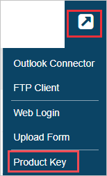
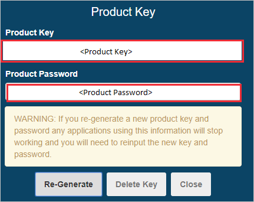

# Tutorial: Configure SmartFile for automatic user provisioning

The objective of this tutorial is to demonstrate the steps to be performed in SmartFile and Microsoft Entra ID to configure Microsoft Entra ID to automatically provision and de-provision users and/or groups to SmartFile.

> [!NOTE]
> This tutorial describes a connector built on top of the Microsoft Entra user Provisioning Service. For important details on what this service does, how it works, and frequently asked questions, see [Automate user provisioning and deprovisioning to SaaS applications with Microsoft Entra ID](~/identity/app-provisioning/user-provisioning.md).
>

## Prerequisites

The scenario outlined in this tutorial assumes that you already have the following prerequisites:

* A Microsoft Entra tenant.
* [A SmartFile tenant](https://www.SmartFile.com/pricing/).
* A user account in SmartFile with Admin permissions.

> [!NOTE]
> This integration is also available to use from Microsoft Entra US Government Cloud environment. You can find this application in the Microsoft Entra US Government Cloud Application Gallery and configure it in the same way as you do from public cloud.

## Assigning users to SmartFile

Microsoft Entra ID uses a concept called *assignments* to determine which users should receive access to selected apps. In the context of automatic user provisioning, only the users and/or groups that have been assigned to an application in Microsoft Entra ID are synchronized.

Before configuring and enabling automatic user provisioning, you should decide which users and/or groups in Microsoft Entra ID need access to SmartFile. Once decided, you can assign these users and/or groups to SmartFile by following the instructions here:
* [Assign a user or group to an enterprise app](~/identity/enterprise-apps/assign-user-or-group-access-portal.md)

## Important tips for assigning users to SmartFile

* It is recommended that a single Microsoft Entra user is assigned to SmartFile to test the automatic user provisioning configuration. Additional users and/or groups may be assigned later.

* When assigning a user to SmartFile, you must select any valid application-specific role (if available) in the assignment dialog. Users with the **Default Access** role are excluded from provisioning.

## Setup SmartFile for provisioning

Before configuring SmartFile for automatic user provisioning with Microsoft Entra ID, you will need to enable SCIM provisioning on SmartFile and collect additional details needed.

1. Sign into your SmartFile Admin Console. Navigate to the top-right hand corner of the SmartFile Admin Console. Select **Product Key**.

	

2. To generate a bearer token, copy the **Product Key** and **Product Password**. Paste them in a notepad with a colon in between them.
 	
	 

	

## Add SmartFile from the gallery

To configure SmartFile for automatic user provisioning with Microsoft Entra ID, you need to add SmartFile from the Microsoft Entra application gallery to your list of managed SaaS applications.

**To add SmartFile from the Microsoft Entra application gallery, perform the following steps:**

1. Sign in to the [Microsoft Entra admin center](https://entra.microsoft.com) as at least a [Cloud Application Administrator](~/identity/role-based-access-control/permissions-reference.md#cloud-application-administrator).
1. Browse to **Identity** > **Applications** > **Enterprise applications** > **New application**.
1. In the **Add from the gallery** section, type **SmartFile**, select **SmartFile** in the search box.
1. Select **SmartFile** from results panel and then add the app. Wait a few seconds while the app is added to your tenant.
	

## Configuring automatic user provisioning to SmartFile 

This section guides you through the steps to configure the Microsoft Entra provisioning service to create, update, and disable users and/or groups in SmartFile based on user and/or group assignments in Microsoft Entra ID.

> [!TIP]
> You may also choose to enable SAML-based single sign-on for SmartFile, following the instructions provided in the [SmartFile Single sign-on tutorial](SmartFile-tutorial.md). Single sign-on can be configured independently of automatic user provisioning, though these two features compliment each other

### To configure automatic user provisioning for SmartFile in Microsoft Entra ID:

1. Sign in to the [Microsoft Entra admin center](https://entra.microsoft.com) as at least a [Cloud Application Administrator](~/identity/role-based-access-control/permissions-reference.md#cloud-application-administrator).
1. Browse to **Identity** > **Applications** > **Enterprise applications**

	

1. In the applications list, select **SmartFile**.

	

3. Select the **Provisioning** tab.

	

4. Set the **Provisioning Mode** to **Automatic**.

	

5.  Under the **Admin Credentials** section, input `https://<SmartFile sitename>.smartfile.com/ftp/scim` in **Tenant URL**. An example would look like `https://demo1test.smartfile.com/ftp/scim`. Enter the **Bearer token** value (ProductKey:ProductPassword) that you retrieved earlier in **Secret Token**. Click **Test Connection** to ensure Microsoft Entra ID can connect to SmartFile. If the connection fails, ensure your SmartFile account has Admin permissions and try again.

	

6. In the **Notification Email** field, enter the email address of a person or group who should receive the provisioning error notifications and check the checkbox - **Send an email notification when a failure occurs**.

	

7. Click **Save**.

8. Under the **Mappings** section, select **Synchronize Microsoft Entra users to SmartFile**.

	

9. Review the user attributes that are synchronized from Microsoft Entra ID to SmartFile in the **Attribute Mapping** section. The attributes selected as **Matching** properties are used to match the user accounts in SmartFile for update operations. Select the **Save** button to commit any changes.

	

10. Under the **Mappings** section, select **Synchronize Microsoft Entra groups to SmartFile**.

	

11. Review the group attributes that are synchronized from Microsoft Entra ID to SmartFile in the **Attribute Mapping** section. The attributes selected as **Matching** properties are used to match the groups in SmartFile for update operations. Select the **Save** button to commit any changes.

	

12. To configure scoping filters, refer to the following instructions provided in the [Scoping filter tutorial](~/identity/app-provisioning/define-conditional-rules-for-provisioning-user-accounts.md).

13. To enable the Microsoft Entra provisioning service for SmartFile, change the **Provisioning Status** to **On** in the **Settings** section.

	

14. Define the users and/or groups that you would like to provision to SmartFile by choosing the desired values in **Scope** in the **Settings** section.

	

15. When you are ready to provision, click **Save**.

	

	This operation starts the initial synchronization of all users and/or groups defined in **Scope** in the **Settings** section. The initial sync takes longer to perform than subsequent syncs, which occur approximately every 40 minutes as long as the Microsoft Entra provisioning service is running. You can use the **Synchronization Details** section to monitor progress and follow links to provisioning activity report, which describes all actions performed by the Microsoft Entra provisioning service on SmartFile.

	For more information on how to read the Microsoft Entra provisioning logs, see [Reporting on automatic user account provisioning](~/identity/app-provisioning/check-status-user-account-provisioning.md)
	
## Connector limitations

* SmartFile only supports hard deletes. 

## Additional resources

* [Managing user account provisioning for Enterprise Apps](~/identity/app-provisioning/configure-automatic-user-provisioning-portal.md)
* [What is application access and single sign-on with Microsoft Entra ID?](~/identity/enterprise-apps/what-is-single-sign-on.md)

## Next steps

 [Learn how to review logs and get reports on provisioning activity](~/identity/app-provisioning/check-status-user-account-provisioning.md)
