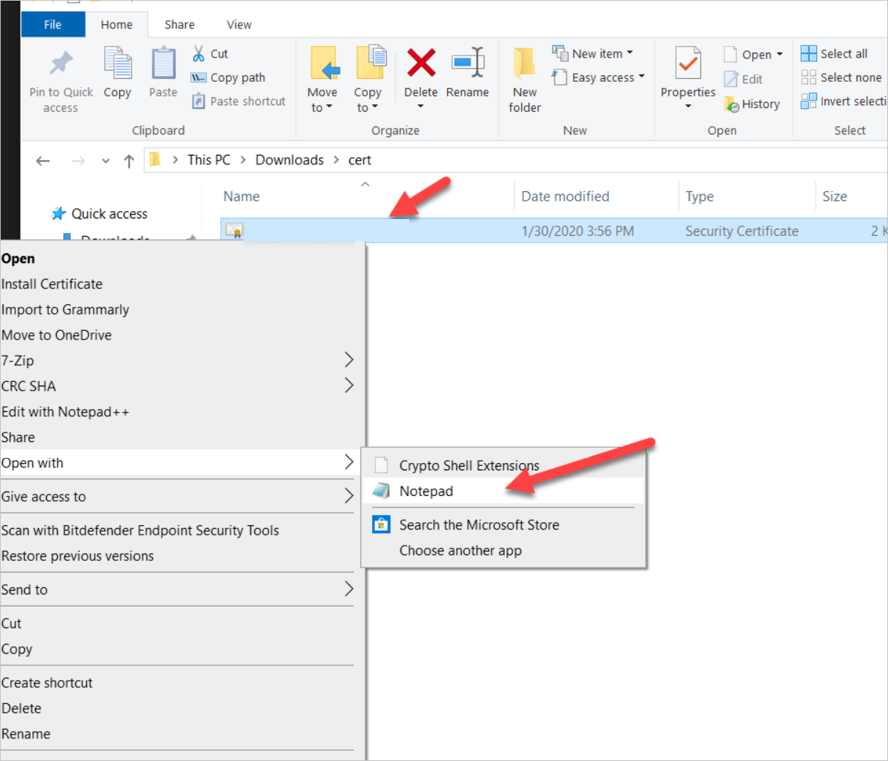
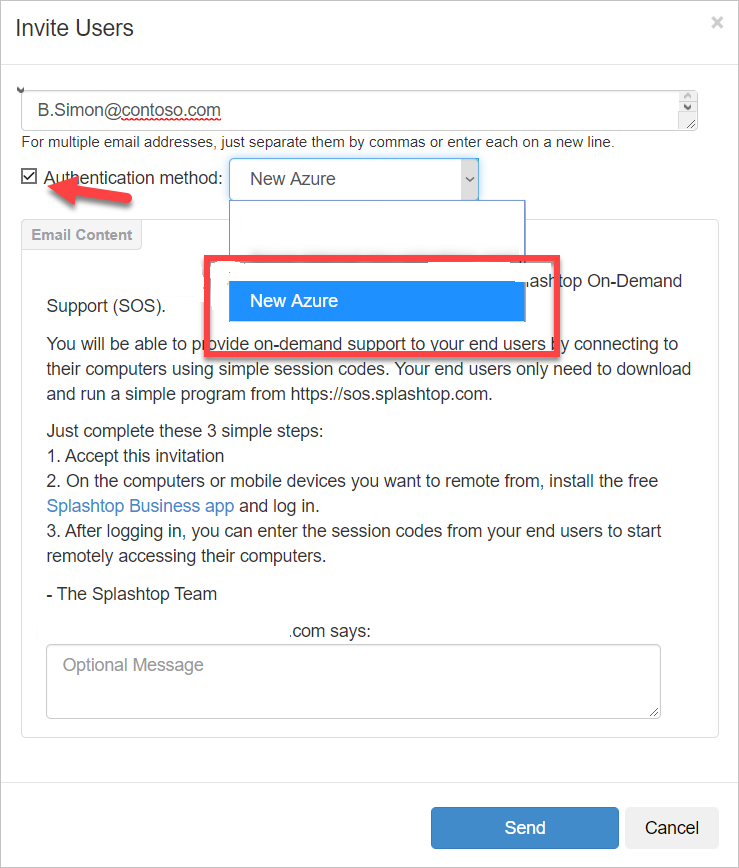

# Tutorial: Microsoft Entra single sign-on (SSO) integration with Splashtop

In this tutorial, you'll learn how to integrate Splashtop with Microsoft Entra ID. When you integrate Splashtop with Microsoft Entra ID, you can:

* Control in Microsoft Entra ID who has access to Splashtop.
* Enable your users to be automatically signed-in to Splashtop with their Microsoft Entra accounts.
* Manage your accounts in one central location.

## Prerequisites

To get started, you need the following items:

* A Microsoft Entra subscription. If you don't have a subscription, you can get a [free account](https://azure.microsoft.com/free/).
* Splashtop single sign-on (SSO) enabled subscription.

## Scenario description

In this tutorial, you configure and test Microsoft Entra SSO in a test environment.

* Splashtop supports **SP** initiated SSO.
* Splashtop supports [**automated** user provisioning and deprovisioning](splashtop-provisioning-tutorial.md) (recommended).

> [!NOTE]
> Identifier of this application is a fixed string value so only one instance can be configured in one tenant.

## Add Splashtop from the gallery

To configure the integration of Splashtop into Microsoft Entra ID, you need to add Splashtop from the gallery to your list of managed SaaS apps.

1. Sign in to the [Microsoft Entra admin center](https://entra.microsoft.com) as at least a [Cloud Application Administrator](~/identity/role-based-access-control/permissions-reference.md#cloud-application-administrator).
1. Browse to **Identity** > **Applications** > **Enterprise applications** > **New application**.
1. In the **Add from the gallery** section, type **Splashtop** in the search box.
1. Select **Splashtop** from results panel and then add the app. Wait a few seconds while the app is added to your tenant.

 Alternatively, you can also use the [Enterprise App Configuration Wizard](https://portal.office.com/AdminPortal/home?Q=Docs#/azureadappintegration). In this wizard, you can add an application to your tenant, add users/groups to the app, assign roles, as well as walk through the SSO configuration as well. [Learn more about Microsoft 365 wizards.](/microsoft-365/admin/misc/azure-ad-setup-guides)

## Configure and test Microsoft Entra SSO for Splashtop

Configure and test Microsoft Entra SSO with Splashtop using a test user called **B.Simon**. For SSO to work, you need to establish a link relationship between a Microsoft Entra user and the related user in Splashtop.

To configure and test Microsoft Entra SSO with Splashtop, perform the following steps:

1. **[Configure Microsoft Entra SSO](#configure-azure-ad-sso)** - to enable your users to use this feature.
    1. **[Create a Microsoft Entra test user](#create-an-azure-ad-test-user)** - to test Microsoft Entra single sign-on with B.Simon.
    1. **[Assign the Microsoft Entra test user](#assign-the-azure-ad-test-user)** - to enable B.Simon to use Microsoft Entra single sign-on.
1. **[Configure Splashtop SSO](#configure-splashtop-sso)** - to configure the single sign-on settings on application side.
    1. **[Create Splashtop test user](#create-splashtop-test-user)** - to have a counterpart of B.Simon in Splashtop that is linked to the Microsoft Entra representation of user.
1. **[Test SSO](#test-sso)** - to verify whether the configuration works.

## Configure Microsoft Entra SSO

Follow these steps to enable Microsoft Entra SSO.

1. Sign in to the [Microsoft Entra admin center](https://entra.microsoft.com) as at least a [Cloud Application Administrator](~/identity/role-based-access-control/permissions-reference.md#cloud-application-administrator).
1. Browse to **Identity** > **Applications** > **Enterprise applications** > **Splashtop** > **Single sign-on**.
1. On the **Select a single sign-on method** page, select **SAML**.
1. On the **Set-up single sign-on with SAML** page, click the pencil icon for **Basic SAML Configuration** to edit the settings.

   

1. On the **Basic SAML Configuration** section, perform the following step:

    In the **Sign-on URL** text box, type the URL:
    `https://my.splashtop.com/login/sso`

1. Splashtop application expects the SAML assertions in a specific format, which requires you to add custom attribute mappings to your SAML token attributes configuration. The following screenshot shows the list of default attributes, whereas **nameidentifier** is mapped with **user.userprincipalname**. TicketManager application expects **nameidentifier** to be mapped with **user.mail**, so you need to edit the attribute mapping by clicking on **Edit** icon and change the attribute mapping.

	

1. On the **Set-up single sign-on with SAML** page, in the **SAML Signing Certificate** section,  find **Certificate (Base64)** and select **Download** to download the certificate and save it on your computer.

	

1. On the **Set-up Splashtop** section, copy the appropriate URL(s) based on your requirement.

	

### Create a Microsoft Entra test user

In this section, you'll create a test user called B.Simon.

1. Sign in to the [Microsoft Entra admin center](https://entra.microsoft.com) as at least a [User Administrator](~/identity/role-based-access-control/permissions-reference.md#user-administrator).
1. Browse to **Identity** > **Users** > **All users**.
1. Select **New user** > **Create new user**, at the top of the screen.
1. In the **User** properties, follow these steps:
   1. In the **Display name** field, enter `B.Simon`.  
   1. In the **User principal name** field, enter the username@companydomain.extension. For example, `B.Simon@contoso.com`.
   1. Select the **Show password** check box, and then write down the value that's displayed in the **Password** box.
   1. Select **Review + create**.
1. Select **Create**.

### Assign the Microsoft Entra test user

In this section, you'll enable B.Simon to use single sign-on by granting access to Splashtop.

1. Sign in to the [Microsoft Entra admin center](https://entra.microsoft.com) as at least a [Cloud Application Administrator](~/identity/role-based-access-control/permissions-reference.md#cloud-application-administrator).
1. Browse to **Identity** > **Applications** > **Enterprise applications** > **Splashtop**.
1. In the app's overview page, select **Users and groups**.
1. Select **Add user/group**, then select **Users and groups** in the **Add Assignment** dialog.
   1. In the **Users and groups** dialog, select **B.Simon** from the Users list, then click the **Select** button at the bottom of the screen.
   1. If you are expecting a role to be assigned to the users, you can select it from the **Select a role** dropdown. If no role has been set up for this app, you see "Default Access" role selected.
   1. In the **Add Assignment** dialog, click the **Assign** button.

## Configure Splashtop SSO

In this section, you will need to apply for a new SSO method from [Splashtop web portal](https://my.splashtop.com/login).
1. In the Splashtop web portal, go to **Account info** / **Team** tab, scroll down to find **Single Sign On** section. Then click **Apply for new SSO method**.

	

1. On the applying window, give an **SSO name**. For example, New Azure, then select **Azure** as the IDP type, and insert **Login URL** and **Microsoft Entra Identifier** copied from Splashtop application on Azure portal.

	

1. For certificate info, right-click on the cert file downloaded from Splashtop application on Azure portal, edit it with Notepad, then copy the contents, paste it in **Download Certificate (Base64)** field.

	
	
	

1. That's it! Click **Save** and Splashtop SSO validation team will contact you for the verification info, then activate the SSO method.

### Create Splashtop test user

1. After SSO method activated, please check the newly created SSO method to enable it in the **Single Sign On** section.

	

1. Invite the test user, for example, `B.Simon@contoso.com` to your Splashtop team with the newly created SSO method.

	

1. You can also change an existing Splashtop account to an SSO account, see [instructions](https://support-splashtopbusiness.splashtop.com/hc/en-us/articles/360038685691-How-to-associate-SSO-method-to-existing-team-admin-member-).

1. That's it! You can use the SSO account to log in Splashtop web portal or Splashtop Business app.

## Test SSO 

In this section, you test your Microsoft Entra single sign-on configuration with following options. 

* Click on **Test this application**, this will redirect to Splashtop Sign-on URL where you can initiate the login flow. 

* Go to Splashtop Sign-on URL directly and initiate the login flow from there.

* You can use Microsoft My Apps. When you click the Splashtop tile in the My Apps, this will redirect to Splashtop Sign-on URL. For more information about the My Apps, see [Introduction to the My Apps](https://support.microsoft.com/account-billing/sign-in-and-start-apps-from-the-my-apps-portal-2f3b1bae-0e5a-4a86-a33e-876fbd2a4510).

## Next steps

Once you configure Splashtop you can enforce session control, which protects exfiltration and infiltration of your organization’s sensitive data in real time. Session control extends from Conditional Access. [Learn how to enforce session control with Microsoft Defender for Cloud Apps](/cloud-app-security/proxy-deployment-aad).
