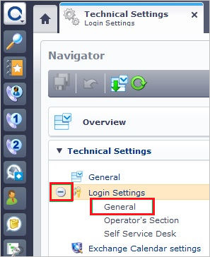
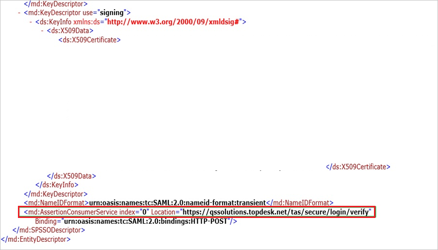
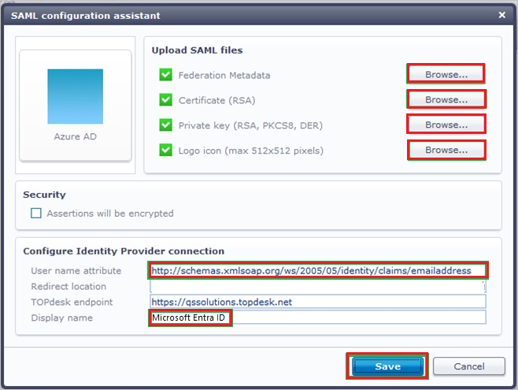

# Tutorial: Microsoft Entra SSO integration with TOPdesk - Secure

In this tutorial, you'll learn how to integrate TOPdesk - Secure with Microsoft Entra ID. When you integrate TOPdesk - Secure with Microsoft Entra ID, you can:

* Control in Microsoft Entra ID who has access to TOPdesk - Secure.
* Enable your users to be automatically signed-in to TOPdesk - Secure (Single Sign-On) with their Microsoft Entra accounts.
* Manage your accounts in one central location.

## Prerequisites

To get started, you need the following items:
 
 * A Microsoft Entra subscription. If you don't have a subscription, you can get a [free account](https://azure.microsoft.com/free/).
* A TOPdesk - Secure single sign-on (SSO)-enabled subscription.

## Scenario description

In this tutorial, you configure and test Microsoft Entra single sign-on in a test environment.

* TOPdesk - Secure supports **SP** initiated SSO.

## Add TOPdesk - Secure from the gallery

To configure the integration of TOPdesk - Secure into Microsoft Entra ID, you need to add TOPdesk - Secure from the gallery to your list of managed SaaS apps.

1. Sign in to the [Microsoft Entra admin center](https://entra.microsoft.com) as at least a [Cloud Application Administrator](~/identity/role-based-access-control/permissions-reference.md#cloud-application-administrator).
1. Browse to **Identity** > **Applications** > **Enterprise applications** > **New application**.
1. In the **Add from the gallery** section, type **TOPdesk - Secure** in the search box.
1. Select **TOPdesk - Secure** from results panel and then add the app. Wait a few seconds while the app is added to your tenant.

 Alternatively, you can also use the [Enterprise App Configuration Wizard](https://portal.office.com/AdminPortal/home?Q=Docs#/azureadappintegration). In this wizard, you can add an application to your tenant, add users/groups to the app, assign roles, as well as walk through the SSO configuration as well. [Learn more about Microsoft 365 wizards.](/microsoft-365/admin/misc/azure-ad-setup-guides)

## Configure and test Microsoft Entra SSO for TOPdesk - Secure

In this section, you configure and test Microsoft Entra single sign-on with TOPdesk - Secure based on a test user called **Britta Simon**.
For single sign-on to work, a link relationship between a Microsoft Entra user and the related user in TOPdesk - Secure needs to be established.

To configure and test Microsoft Entra single sign-on with TOPdesk - Secure, you need to perform the following steps:

1. **[Configure Microsoft Entra SSO](#configure-azure-ad-sso)** - to enable your users to use this feature.
    1. **[Create a Microsoft Entra test user](#create-an-azure-ad-test-user)** - to test Microsoft Entra single sign-on with Britta Simon.
    2. **[Assign the Microsoft Entra test user](#assign-the-azure-ad-test-user)** - to enable Britta Simon to use Microsoft Entra single sign-on.
2. **[Configure TOPdesk - Secure SSO](#configure-topdesk---secure-sso)** - to configure the Single Sign-On settings on application side.
    1. **[Create TOPdesk - Secure test user](#create-topdesk---secure-test-user)** - to have a counterpart of Britta Simon in TOPdesk - Secure that is linked to the Microsoft Entra representation of user.
1. **[Test SSO](#test-sso)** - to verify whether the configuration works.

## Configure Microsoft Entra SSO

In this section, you enable Microsoft Entra single sign-on.

To configure Microsoft Entra single sign-on with TOPdesk - Secure, perform the following steps:

1. Sign in to the [Microsoft Entra admin center](https://entra.microsoft.com) as at least a [Cloud Application Administrator](~/identity/role-based-access-control/permissions-reference.md#cloud-application-administrator).
1. Browse to **Identity** > **Applications** > **Enterprise applications** > **TOPdesk - Secure** application integration page, select **Single sign-on**.

1. On the **Select a Single sign-on method** dialog, select **SAML/WS-Fed** mode to enable single sign-on.

1. On the **Set up Single Sign-On with SAML** page, click pencil icon to open **Basic SAML Configuration** dialog.

	

1. On the **Basic SAML Configuration** section, perform the following steps:

    a. In the **Identifier URL** box, fill in the TOPdesk metadata URL that you can retrieve from the TOPdesk configuration. It should use the following pattern:
    `https://<companyname>.topdesk.net/saml-metadata/<identifier>`

    b. In the **Reply URL** text box, type a URL using the following pattern:
    `https://<companyname>.topdesk.net/tas/secure/login/verify`

    c. In the **Sign-on URL** text box, type a URL using the following pattern:
    `https://<companyname>.topdesk.net`

	> [!NOTE]
	> These values are not real. Update these values with the actual Identifier,Reply URL and Sign on URL. Contact [TOPdesk - Secure Client support team](https://www.topdesk.com/en/services/support/) to get these values. You can also refer to the patterns shown in the **Basic SAML Configuration** section.

1. On the **Set up Single Sign-On with SAML** page, in the **SAML Signing Certificate** section, click **Download** to download the **Federation Metadata XML** from the given options as per your requirement and save it on your computer.

	

6. On the **Set up TOPdesk - Secure** section, copy the appropriate URL(s) as per your requirement.

	

### Create a Microsoft Entra test user 

In this section, you'll create a test user called B.Simon.

1. Sign in to the [Microsoft Entra admin center](https://entra.microsoft.com) as at least a [User Administrator](~/identity/role-based-access-control/permissions-reference.md#user-administrator).
1. Browse to **Identity** > **Users** > **All users**.
1. Select **New user** > **Create new user**, at the top of the screen.
1. In the **User** properties, follow these steps:
   1. In the **Display name** field, enter `B.Simon`.  
   1. In the **User principal name** field, enter the username@companydomain.extension. For example, `B.Simon@contoso.com`.
   1. Select the **Show password** check box, and then write down the value that's displayed in the **Password** box.
   1. Select **Review + create**.
1. Select **Create**.

### Assign the Microsoft Entra test user

In this section, you'll enable B.Simon to use single sign-on by granting access to TOPdesk - Secure.

1. Sign in to the [Microsoft Entra admin center](https://entra.microsoft.com) as at least a [Cloud Application Administrator](~/identity/role-based-access-control/permissions-reference.md#cloud-application-administrator).
1. Browse to **Identity** > **Applications** > **Enterprise applications** > **TOPdesk - Secure**.
1. In the app's overview page, select **Users and groups**.
1. Select **Add user/group**, then select **Users and groups** in the **Add Assignment** dialog.
   1. In the **Users and groups** dialog, select **B.Simon** from the Users list, then click the **Select** button at the bottom of the screen.
   1. If you are expecting a role to be assigned to the users, you can select it from the **Select a role** dropdown. If no role has been set up for this app, you see "Default Access" role selected.
   1. In the **Add Assignment** dialog, click the **Assign** button.

## Configure TOPdesk - Secure SSO

1. Sign on to your **TOPdesk - Secure** company site as an administrator.

2. In the **TOPdesk** menu, click **Settings**.

	

3. Click **Login Settings**.

	

4. Expand the **Login Settings** menu, and then click **General**.

	

5. In the **Secure** section of the **SAML login** configuration section, perform the following steps:

	

    a. Click **Download** to download the public metadata file, and then save it locally on your computer.

    b. Open the metadata file, and then locate the **AssertionConsumerService** node.

    

    c. Copy the **AssertionConsumerService** value, paste this value in the Reply URL textbox in **TOPdesk - Secure Domain and URLs** section.

6. To create a certificate file, perform the following steps:

    

    a. Open the downloaded metadata file from Azure portal.

    b. Expand the **RoleDescriptor** node that has a **xsi:type** of **fed:ApplicationServiceType**.

    c. Copy the value of the **X509Certificate** node.

    d. Save the copied **X509Certificate** value locally on your computer in a file.

7. In the **Public** section, click **Add**.

    

8. On the **SAML configuration assistant** dialog page, perform the following steps:

    

    a. To upload your downloaded metadata file from Azure portal, under **Federation Metadata**, click **Browse**.

    b. To upload your certificate file, under **Certificate (RSA)**, click **Browse**.

    c. For **Private key(RSA, PKCS8, DER)**, you can upload your own private key or you can contact [TOPdesk - Secure Client support team](https://www.topdesk.com/en/services/support/) to get the private key.

    d. To upload the logo file you got from the TOPdesk support team, under **Logo icon**, click **Browse**.

    e. In the **User name attribute** textbox, type `http://schemas.xmlsoap.org/ws/2005/05/identity/claims/emailaddress`.

    f. In the **Display name** textbox, type a name for your configuration.

    g. Click **Save**.

### Create TOPdesk - Secure test user

In order to enable Microsoft Entra users to log into TOPdesk - Secure, they must be provisioned into TOPdesk - Secure.  
In the case of TOPdesk - Secure, provisioning is a manual task.

### To configure user provisioning, perform the following steps:

1. Sign on to your **TOPdesk - Secure** company site as administrator.

2. In the menu on the top, click **TOPdesk \> New \> Support Files \> Operator**.

    

3. On the **New Operator** dialog, perform the following steps:

    

    a. Click the **General** tab.

    b. In the **Surname** textbox, type Surname of the user like **Simon**.

    c. Select a **Site** for the account in the **Location** section.

    d. In the **Login Name** textbox of the **TOPdesk Login** section, type a login name for your user.

    e. Click **Save**.

> [!NOTE]
> You can use any other TOPdesk - Secure user account creation tools or APIs provided by TOPdesk - Secure to provision Microsoft Entra user accounts.

## Test SSO

In this section, you test your Microsoft Entra single sign-on configuration with following options. 

* Click on **Test this application**, this will redirect to TOPdesk - Secure Sign-on URL where you can initiate the login flow. 

* Go to TOPdesk - Secure Sign-on URL directly and initiate the login flow from there.

* You can use Microsoft My Apps. When you click the TOPdesk - Secure tile in the My Apps, you should be automatically signed in to the TOPdesk - Secure for which you set up the SSO. For more information about the My Apps, see [Introduction to the My Apps](https://support.microsoft.com/account-billing/sign-in-and-start-apps-from-the-my-apps-portal-2f3b1bae-0e5a-4a86-a33e-876fbd2a4510).

## Next steps

Once you configure TOPdesk - Secure you can enforce session control, which protects exfiltration and infiltration of your organization’s sensitive data in real time. Session control extends from Conditional Access. [Learn how to enforce session control with Microsoft Defender for Cloud Apps](/cloud-app-security/proxy-deployment-any-app).
