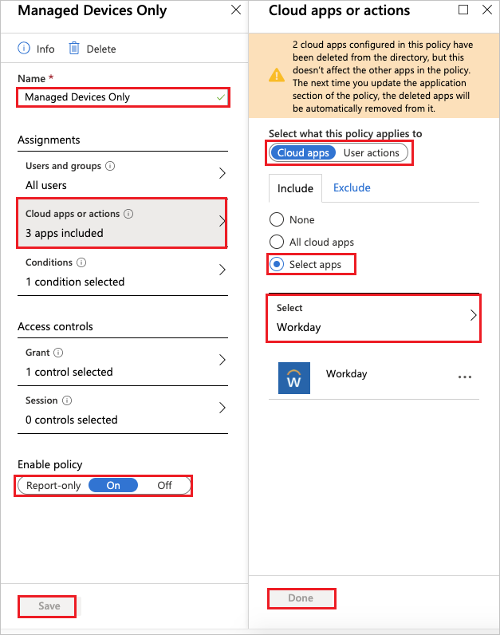
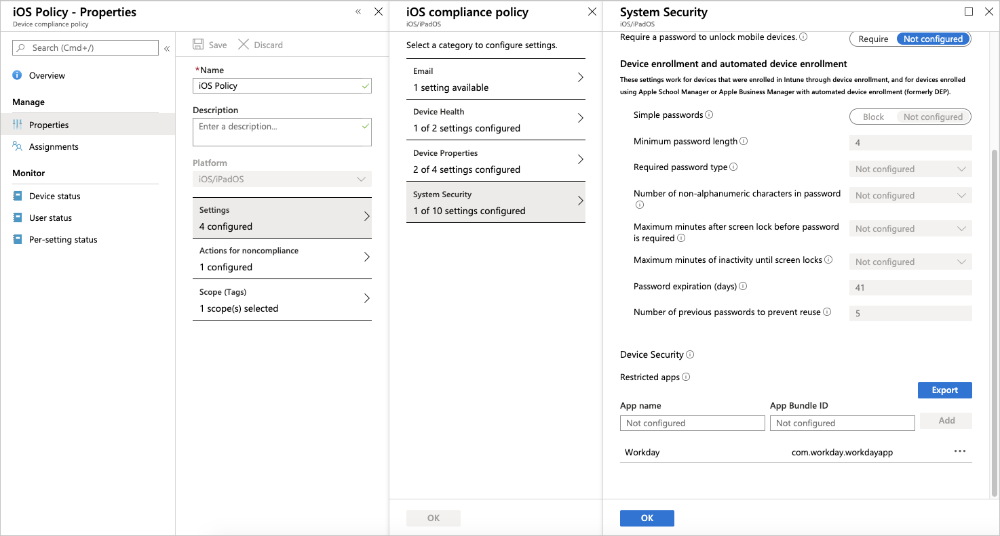

# Tutorial: Azure Active Directory single sign-on (SSO) integration with Workday Mobile Applications

In this tutorial, you’ll learn how to integrate Azure Active Directory (Azure AD), Conditional Access, and Intune with the Workday Mobile Apps. When you integrate Workday’s Mobile Apps with Microsoft, you can:

* Ensure that devices are compliant with your policies prior to sign in.
* Add controls to Workday’s App to ensure users are securely accessing corporate data. 
* Control in Azure AD who has access to Workday.
* Enable your users to be automatically signed-in to Workday with their Azure AD accounts.
* Manage your accounts in one central location - the Azure portal.

## Prerequisites

To get started, you need the following items:

* Integrate Workday with Azure AD
* Tutorial: [Azure Active Directory single sign-on (SSO) integration with Workday](https://docs.microsoft.com/azure/active-directory/saas-apps/workday-tutorial)

## Scenario description

In this tutorial, you configure and test Microsoft’s Conditional Access Policies and Intune with Workday’s Mobile Applications.

* Workday Federated application can now be configured with Azure AD for enabling SSO. For more details on how to configure, please follow the [link](workday-tutorial.md)

> [!NOTE] 
> Workday does not support Intune’s App Protection Policies. You must use Mobile Device Management to utilize Conditional Access.


### Ensure Users have Access to the Workday Mobile App:

Configure Workday to allow access to their Mobile App offerings. You will need to configure the following policies for Mobile:

You can configure these by following these instructions:

1. Access the Domain Security Policies for Functional Area report.
2. Select a security policy.
    * Mobile Usage - Android
    * Mobile Usage - iPad
    * Mobile Usage - iPhone
3. Click Edit Permissions.
4. Select the View or Modify check box to grant the security groups access to the report or task securable items.
5. Select the Get or Put check box to grant the security groups access to integration and report or task securable actions.

Activate pending security policy changes by running **Activate Pending Security Policy Changes** task.

### Open Workday Login Page in Mobile Browser:

To apply Conditional Access to Workday’s mobile app, it is required for the app to open in an external browser. This can be done by checking the box **Enable Mobile Browser SSO for Native Apps** in **Edit Tenant Setup - Security.** This will require an Intune approved browser to be installed on the device for iOS and in the Work Profile for Android

### Setup Conditional Access Policy:

This policy will only affect logging in on an iOS or Android device. If you would like to extend it to all platforms, simply select **Any Device.** This policy will require the device to be compliant with the policy and will verify this via Microsoft Intune. Due to Android having Work Profiles, this should block any users from logging into Workday (Web or App) unless they are logging in via their Work Profile and have installed the app via the Intune Company Portal. There is one additional step for iOS to make sure that the same situation will apply. Here are some screenshots of the Conditional Access setup.

Workday supports the following Access Controls:
* Require multi-factor authentication
* Require device to be marked as compliant

Workday App does not support the following:
* Require approved client app
* Require app protection policy (Preview)

Click on **Home > Microsoft Intune > condiional Access-Policies > Managed Devices Only > Cloud apps or actions.**



Click on **Home > Microsoft Intune > condiional Access-Policies > Managed Devices Only > Grant.**


### Set Up Device Compliance Policy:

To ensure that iOS devices are only able to log in via an MDM managed Workday App, you must block the App Store app by adding **com.workday.workdayapp** to the list of restricted apps. This will ensure that only devices that have the Workday app installed through the company portal can access Workday. For browser, they will only be able to access Workday if the device is managed by Intune and they are using a managed browser.



### Set Up Microsoft Intune App Configuration Policies:

| Scenario | Key Value Pairs                                                              	|   	|   	|   	|
|----------------------------------------------------------------------------------------	|------------------------------------------------------------------------------	|---	|---	|---	|
| Automatically populate the Tenant and Web Address fields for:<br>● Workday on Android when you enable Android for Work profiles.<br>●	Workday on iPad and iPhone.  	| Use these values to configure your Tenant: <br>● Configuration Key = UserGroupCode<br>●	Value Type = String <br>●	Configuration Value = Your tenant name. Example: gms<br>Use these values to configure your Web Address:<br>●	Configuration Key = AppServiceHost<br>●	Value Type = String<br>●	Configuration Value = The base URL for your tenant. Example: https://www.myworkday.com                            	|   	|   	|   	|
| Disable these actions for Workday on iPad and iPhone:<br>●	Cut, Copy, and Paste<br>●	Print                     	| Set the value (boolean) to False on these keys to disable the functionality:<br>●	AllowCutCopyPaste<br>●	AllowPrint 	|
| Disable screenshots for Workday on Android. |Set the value (boolean) to False on the AllowScreenshots key to disable functionality.|
| Disable suggested updates for your users.|Set the value (boolean) to False on the AllowSuggestedUpdates key to disable functionality.|
|Customize the app store URL to direct mobile users to the app store of your choice.|Use these values to change the app store URL:<br>●	Configuration Key = AppUpdateURL<br>●	Value Type = String<br> ●	Configuration Value = App store URL|
|   	|   	|

### iOS Configuration Policies:

1. Go to https://portal.azure.com/ and log in
2. Search for **Intune** or click the widget from the list.
3. Go to **Client Apps -> Apps -> App Configuration Policies -> + Add -> Managed Devices**
4. Enter a Name.
5. Under **Platform**, choose **iOS/iPadOS**
6. Under **Associated App**, choose the Workday for iOS app you added
7. Click **Configuration Settings** and under **Configuration settings format** choose **Enter XML Data**
8. Here is an example XML file. Add the configurations you would like to apply. Replace **STRING_VALUE** with the string you would like to use. Replace `<true />`or `<false />` with `<true />` or  `<false />`. If you do not add a configuration, it will function like it would set to True.

    ```
    <dict>
    <key>UserGroupCode</key>
    <string>STRING_VALUE</string>
    <key>AppServiceHost</key>
    <string>STRING_VALUE</string>
    <key>AllowCutCopyPaste</key>
    <true /> or <false />
    <key>AllowPrint</key>
    <true /> or <false />
    <key>AllowSuggestedUpdates</key>
    <true /> or <false />
    <key>AppUpdateURL</key>
    <string>STRING_VALUE</string>
    </dict>

    ```
9. Click Add
10. Refresh the page and click the newly created policy.
11. Click Assignments and choose who you want the app to apply to.
12. Click Save.

### Android Configuration Policies:

1. Go to `https://portal.azure.com/` and log in.
2. Search for **Intune** or click the widget from the list.
3. Go to **Client Apps -> Apps -> App Configuration Policies -> + Add -> Managed Devices**
5. Enter a Name. 
6. Under **Platform**, choose **Android**
7. Under **Associated App**, choose the Workday for Android app you added
8. Click **Configuration Settings** and under **Configuration settings format** choose **Enter JSON Data**

