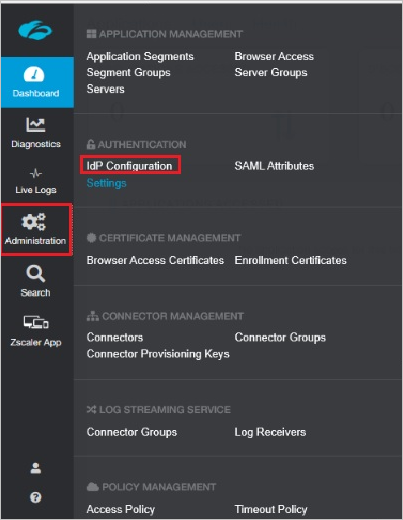
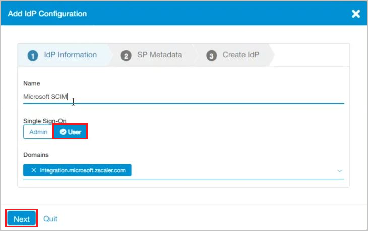
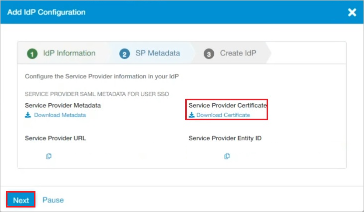
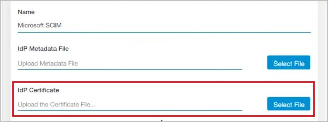
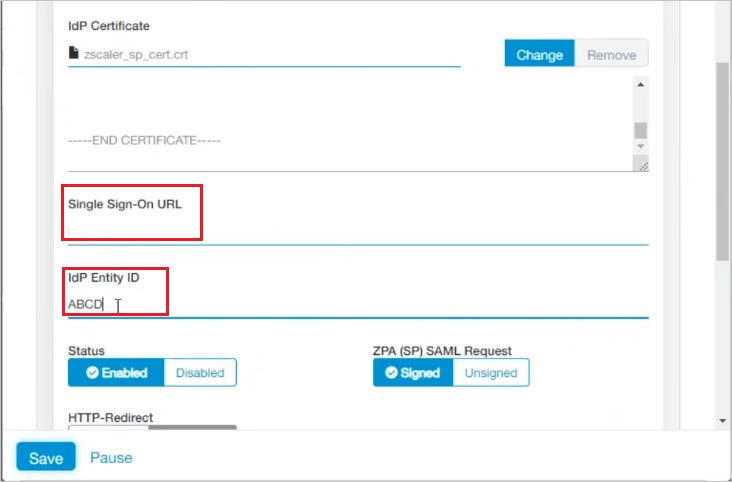
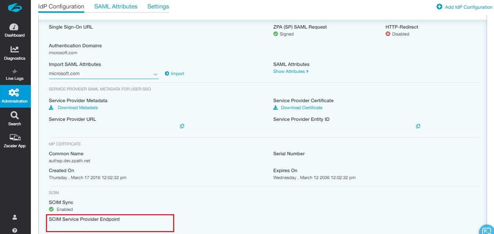

# Tutorial: Configure Zscaler Private Access (ZPA) for automatic user provisioning

The objective of this tutorial is to demonstrate the steps to be performed in Zscaler Private Access (ZPA) and Azure Active Directory (Azure AD) to configure Azure AD to automatically provision and de-provision users and/or groups to Zscaler Private Access (ZPA).

> [!NOTE]
> This tutorial describes a connector built on top of the Azure AD User Provisioning Service. For important details on what this service does, how it works, and frequently asked questions, see [Automate user provisioning and deprovisioning to SaaS applications with Azure Active Directory](../app-provisioning/user-provisioning.md).
>
> This connector is currently in Public Preview. For more information on the general Microsoft Azure terms of use for Preview features, see [Supplemental Terms of Use for Microsoft Azure Previews](https://azure.microsoft.com/support/legal/preview-supplemental-terms/).

## Prerequisites

The scenario outlined in this tutorial assumes that you already have the following prerequisites:

* An Azure AD tenant
* [A Zscaler Private Access (ZPA) tenant](https://www.zscaler.com/pricing-and-plans#contact-us)
* A user account in Zscaler Private Access (ZPA) with Admin permissions.

## Assigning users to Zscaler Private Access (ZPA)

Azure Active Directory uses a concept called *assignments* to determine which users should receive access to selected apps. In the context of automatic user provisioning, only the users and/or groups that have been assigned to an application in Azure AD are synchronized.

Before configuring and enabling automatic user provisioning, you should decide which users and/or groups in Azure AD need access to Zscaler Private Access (ZPA). Once decided, you can assign these users and/or groups to Zscaler Private Access (ZPA) by following the instructions here:
* [Assign a user or group to an enterprise app](../manage-apps/assign-user-or-group-access-portal.md)

## Important tips for assigning users to Zscaler Private Access (ZPA)

* It is recommended that a single Azure AD user is assigned to Zscaler Private Access (ZPA) to test the automatic user provisioning configuration. Additional users and/or groups may be assigned later.

* When assigning a user to Zscaler Private Access (ZPA), you must select any valid application-specific role (if available) in the assignment dialog. Users with the **Default Access** role are excluded from provisioning.

## Set up Zscaler Private Access (ZPA) for provisioning

1. Sign in to your [Zscaler Private Access (ZPA) Admin Console](https://admin.private.zscaler.com/). Navigate to **Administration > IdP Configuration**.

	

2.	Verify to make sure that an IdP for **Single sign-on** is configured. If no IdP is setup, then add one by clicking the plus icon at the top right corner of the screen.

	

3. Follow through the **Add IdP Configuration** wizard to add an IdP. Leave the **Single sign-on** field set to **User**. Provide a **Name** and select the **Domains** from the drop down list. Click on **Next** to navigate to the next window.

	

4. Download the **Service Provider Certificate**. Click on **Next** to navigate to the next window.

	

5. In the next window, upload the **Service Provider Certificate** downloaded previously.

	

6.	Scroll down to provide the **Single sign-On URL** and **IdP Entity ID**.

	

7.	Scroll down to **Enable SCIM Sync**. Click on **Generate New Token** button. Copy the **Bearer Token**. This value will be entered in the Secret Token field in the Provisioning tab of your Zscaler Private Access (ZPA) application in the Azure portal.

	

8.	To locate the **Tenant URL** , navigate to **Administration > IdP Configuration**. Click on the name of the newly added IdP configuration listed on the page.

	

9.	Scroll down to view the **SCIM Service Provider Endpoint** at the end of the page. Copy the **SCIM Service Provider Endpoint**. This value will be entered in the Tenant URL field in the Provisioning tab of your Zscaler Private Access (ZPA) application in the Azure portal.

	

## Add Zscaler Private Access (ZPA) from the gallery

Before configuring Zscaler Private Access (ZPA) for automatic user provisioning with Azure AD, you need to add Zscaler Private Access (ZPA) from the Azure AD application gallery to your list of managed SaaS applications.

**To add Zscaler Private Access (ZPA) from the Azure AD application gallery, perform the following steps:**

1. In the **[Azure portal](https://portal.azure.com)**, in the left navigation panel, select **Azure Active Directory**.

	

2. Go to **Enterprise applications**, and then select **All applications**.

	

3. To add a new application, select the **New application** button at the top of the pane.

	

4. In the search box, enter **Zscaler Private Access (ZPA)**, select **Zscaler Private Access (ZPA)** in the results panel, and then click the **Add** button to add the application.

	

## Configuring automatic user provisioning to Zscaler Private Access (ZPA) 

This section guides you through the steps to configure the Azure AD provisioning service to create, update, and disable users and/or groups in Zscaler Private Access (ZPA) based on user and/or group assignments in Azure AD.

> [!TIP]
> You may also choose to enable SAML-based single sign-on for Zscaler Private Access (ZPA) by following the instructions provided in the [Zscaler Private Access (ZPA) Single sign-on tutorial](https://docs.microsoft.com/azure/active-directory/saas-apps/zscalerprivateaccess-tutorial). Single sign-on can be configured independently of automatic user provisioning, although these two features complement each other.

> [!NOTE]
> To learn more about Zscaler Private Access's SCIM endpoint, refer [this](https://www.zscaler.com/partners/microsoft).

### To configure automatic user provisioning for Zscaler Private Access (ZPA) in Azure AD:

1. Sign in to the [Azure portal](https://portal.azure.com). Select **Enterprise Applications**, then select **All applications**.

	

2. In the applications list, select **Zscaler Private Access (ZPA)**.

	

3. Select the **Provisioning** tab.

	

4. Set the **Provisioning Mode** to **Automatic**.

	

5. Under the **Admin Credentials** section, input the **SCIM Service Provider Endpoint** value retrieved earlier in **Tenant URL**. Input the **Bearer Token** value retrieved earlier in **Secret Token**. Click **Test Connection** to ensure Azure AD can connect to Zscaler Private Access (ZPA). If the connection fails, ensure your Zscaler Private Access (ZPA) account has Admin permissions and try again.

	

6. In the **Notification Email** field, enter the email address of a person or group who should receive the provisioning error notifications and check the checkbox - **Send an email notification when a failure occurs**.

	

7. Click **Save**.

8. Under the **Mappings** section, select **Synchronize Azure Active Directory Users to Zscaler Private Access (ZPA)**.

	

9. Review the user attributes that are synchronized from Azure AD to Zscaler Private Access (ZPA) in the **Attribute Mapping** section. The attributes selected as **Matching** properties are used to match the user accounts in Zscaler Private Access (ZPA) for update operations. Select the **Save** button to commit any changes.

	

10. Under the **Mappings** section, select **Synchronize Azure Active Directory Groups to Zscaler Private Access (ZPA)**.

	

11. Review the group attributes that are synchronized from Azure AD to Zscaler Private Access (ZPA) in the **Attribute Mapping** section. The attributes selected as **Matching** properties are used to match the groups in Zscaler Private Access (ZPA) for update operations. Select the **Save** button to commit any changes.

	

12. To configure scoping filters, refer to the following instructions provided in the [Scoping filter tutorial](../manage-apps/define-conditional-rules-for-provisioning-user-accounts.md).

13. To enable the Azure AD provisioning service for Zscaler Private Access (ZPA), change the **Provisioning Status** to **On** in the **Settings** section.

	

14. Define the users and/or groups that you would like to provision to Zscaler Private Access (ZPA) by choosing the desired values in **Scope** in the **Settings** section.

	

15. When you are ready to provision, click **Save**.

	

This operation starts the initial synchronization of all users and/or groups defined in **Scope** in the **Settings** section. The initial sync takes longer to perform than subsequent syncs, which occur approximately every 40 minutes as long as the Azure AD provisioning service is running. You can use the **Synchronization Details** section to monitor progress and follow links to provisioning activity report, which describes all actions performed by the Azure AD provisioning service on Zscaler Private Access (ZPA).

For more information on how to read the Azure AD provisioning logs, see [Reporting on automatic user account provisioning](../app-provisioning/check-status-user-account-provisioning.md).

## Additional resources

* [Managing user account provisioning for Enterprise Apps](../app-provisioning/configure-automatic-user-provisioning-portal.md)
* [What is application access and single sign-on with Azure Active Directory?](../manage-apps/what-is-single-sign-on.md)

## Next steps

* [Learn how to review logs and get reports on provisioning activity](../app-provisioning/check-status-user-account-provisioning.md)

