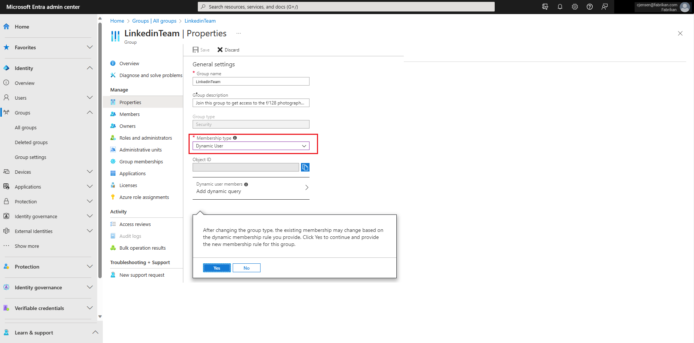
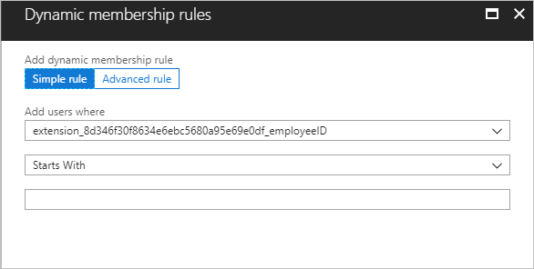

# Change static group membership to dynamic in Azure Active Directory

You can change a group's membership from static to dynamic (or vice-versa) In Azure Active Directory (Azure AD), part of Microsoft Entra. Azure AD keeps the same group name and ID in the system, so all existing references to the group are still valid. If you create a new group instead, you would need to update those references. Dynamic group membership eliminates management overhead adding and removing users. This article tells you how to convert existing groups from static to dynamic membership using either Azure AD Admin center or PowerShell cmdlets.

> [!WARNING]
> When changing an existing static group to a dynamic group, all existing members are removed from the group, and then the membership rule is processed to add new members. If the group is used to control access to apps or resources, be aware that the original members might lose access until the membership rule is fully processed.
>
> We recommend that you test the new membership rule beforehand to make sure that the new membership in the group is as expected.

## Change the membership type for a group

1. Sign in to the [Azure AD admin center](https://aad.portal.azure.com) with an account that is a global administrator, user administrator, or groups administrator in your Azure AD organization.
2. Select **Groups**.
3. From the **All groups** list, open the group that you want to change.
4. Select **Properties**.
5. On the **Properties** page for the group, select a **Membership type** of either Assigned (static), Dynamic User, or Dynamic Device, depending on your desired membership type. For dynamic membership, you can use the rule builder to select options for a simple rule or write a membership rule yourself. 

The following steps are an example of changing a group from static to dynamic membership for a group of users.

1. On the **Properties** page for your selected group, select a **Membership type** of **Dynamic User**, then select Yes on the dialog explaining the changes to the group membership to continue. 
  
   
  
2. Select **Add dynamic query**, and then provide the rule.
  
   
  
3. After creating the rule, select **Add query** at the bottom of the page.
4. Select **Save** on the **Properties** page for the group to save your changes. The **Membership type** of the group is immediately updated in the group list.

> [!TIP]
> Group conversion might fail if the membership rule you entered was incorrect. A notification is displayed in the upper-right hand corner of the portal that it contains an explanation of why the rule can't be accepted by the system. Read it carefully to understand how you can adjust the rule to make it valid. For examples of rule syntax and a complete list of the supported properties, operators, and values for a membership rule, see [Dynamic membership rules for groups in Azure Active Directory](groups-dynamic-membership.md).

## Change membership type for a group (PowerShell)

> [!NOTE]
> To change dynamic group properties you will need to use cmdlets from **the preview version of** [Azure AD PowerShell Version 2](/powershell/azure/active-directory/install-adv2). You can install the preview from the [PowerShell Gallery](https://www.powershellgallery.com/packages/AzureADPreview).

Here is an example of functions that switch membership management on an existing group. In this example, care is taken to correctly manipulate the GroupTypes property and preserve any values that are unrelated to dynamic membership.

```powershell
#The moniker for dynamic groups as used in the GroupTypes property of a group object
$dynamicGroupTypeString = "DynamicMembership"

function ConvertDynamicGroupToStatic
{
    Param([string]$groupId)

    #existing group types
    [System.Collections.ArrayList]$groupTypes = (Get-AzureAdMsGroup -Id $groupId).GroupTypes

    if($groupTypes -eq $null -or !$groupTypes.Contains($dynamicGroupTypeString))
    {
        throw "This group is already a static group. Aborting conversion.";
    }


    #remove the type for dynamic groups, but keep the other type values
    $groupTypes.Remove($dynamicGroupTypeString)

    #modify the group properties to make it a static group: i) change GroupTypes to remove the dynamic type, ii) pause execution of the current rule
    Set-AzureAdMsGroup -Id $groupId -GroupTypes $groupTypes.ToArray() -MembershipRuleProcessingState "Paused"
}

function ConvertStaticGroupToDynamic
{
    Param([string]$groupId, [string]$dynamicMembershipRule)

    #existing group types
    [System.Collections.ArrayList]$groupTypes = (Get-AzureAdMsGroup -Id $groupId).GroupTypes

    if($groupTypes -ne $null -and $groupTypes.Contains($dynamicGroupTypeString))
    {
        throw "This group is already a dynamic group. Aborting conversion.";
    }
    #add the dynamic group type to existing types
    $groupTypes.Add($dynamicGroupTypeString)

    #modify the group properties to make it a static group: i) change GroupTypes to add the dynamic type, ii) start execution of the rule, iii) set the rule
    Set-AzureAdMsGroup -Id $groupId -GroupTypes $groupTypes.ToArray() -MembershipRuleProcessingState "On" -MembershipRule $dynamicMembershipRule
}
```
To make a group static:

```powershell
ConvertDynamicGroupToStatic "a58913b2-eee4-44f9-beb2-e381c375058f"
```

To make a group dynamic:

```powershell
ConvertStaticGroupToDynamic "a58913b2-eee4-44f9-beb2-e381c375058f" "user.displayName -startsWith ""Peter"""
```

## Next steps

These articles provide additional information on groups in Azure Active Directory.

* [See existing groups](../fundamentals/active-directory-groups-view-azure-portal.md)
* [Create a new group and adding members](../fundamentals/active-directory-groups-create-azure-portal.md)
* [Manage settings of a group](../fundamentals/active-directory-groups-settings-azure-portal.md)
* [Manage memberships of a group](../fundamentals/active-directory-groups-membership-azure-portal.md)
* [Manage dynamic rules for users in a group](groups-dynamic-membership.md)
