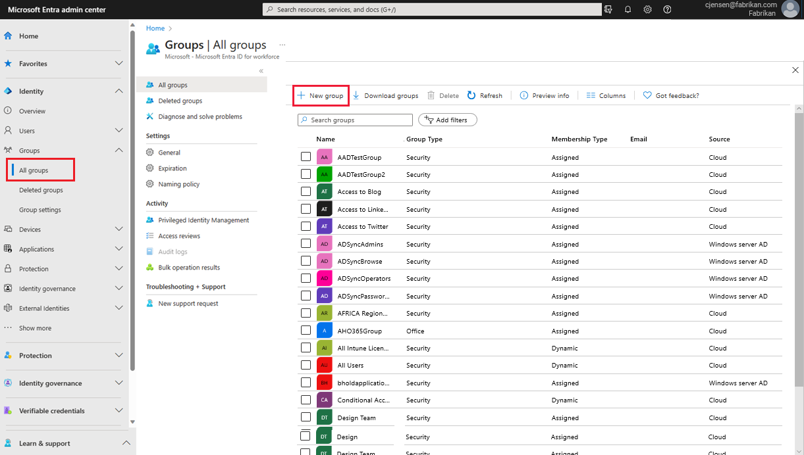
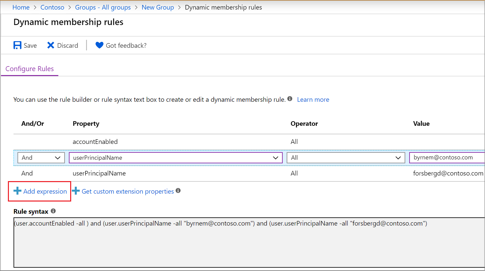
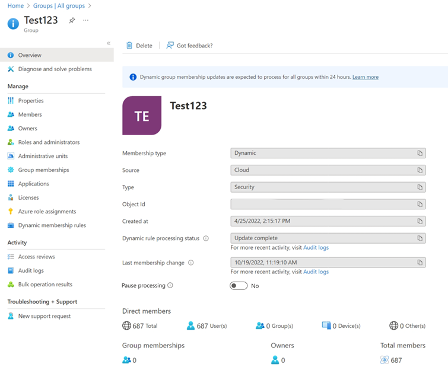

# Create or update a dynamic group in Microsoft Entra ID

You can use rules to determine group membership based on user or device properties In Microsoft Entra ID, part of Microsoft Entra. This article tells how to set up a rule for a dynamic group in the Azure portal. Dynamic membership is supported for security groups and Microsoft 365 Groups. When a group membership rule is applied, user and device attributes are evaluated for matches with the membership rule. When an attribute changes for a user or device, all dynamic group rules in the organization are processed for membership changes. Users and devices are added or removed if they meet the conditions for a group. Security groups can be used for either devices or users, but Microsoft 365 Groups can be only user groups. Using Dynamic groups requires Microsoft Entra ID P1 license or Intune for Education license. See [Dynamic membership rules for groups](./groups-dynamic-membership.md) for more details. 

## Rule builder in the Azure portal

Microsoft Entra ID provides a rule builder to create and update your important rules more quickly. The rule builder supports the construction up to five expressions. The rule builder makes it easier to form a rule with a few simple expressions, however, it can't be used to reproduce every rule. If the rule builder doesn't support the rule you want to create, you can use the text box.

Here are some examples of advanced rules or syntax for which we recommend that you construct using the text box:

- Rule with more than five expressions
- The Direct reports rule
- Setting [operator precedence](groups-dynamic-membership.md#operator-precedence)
- [Rules with complex expressions](groups-dynamic-membership.md#rules-with-complex-expressions); for example `(user.proxyAddresses -any (_ -contains "contoso"))`

> [!NOTE]
> The rule builder might not be able to display some rules constructed in the text box. You might see a message when the rule builder is not able to display the rule. The rule builder doesn't change the supported syntax, validation, or processing of dynamic group rules in any way.

For examples of syntax, supported properties, operators, and values for a membership rule, see [Dynamic membership rules for groups in Microsoft Entra ID](groups-dynamic-membership.md).

## To create a group membership rule

[!INCLUDE [portal updates](~/includes/portal-update.md)]

1. Sign in to the [Microsoft Entra admin center](https://entra.microsoft.com) as at least a [Global Administrator](~/identity/role-based-access-control/permissions-reference.md#global-administrator).
1. Select Microsoft Entra ID.> **Groups**.
1. Select **All groups**, and select **New group**.

   

1. On the **Group** page, enter a name and description for the new group. Select a **Membership type** for either users or devices, and then select **Add dynamic query**. The rule builder supports up to five expressions. To add more than five expressions, you must use the text box.

   

1. To see the custom extension properties available for your membership query:
   1. Select **Get custom extension properties**
   1. Enter the application ID, and then select **Refresh properties**.
1. After creating the rule, select **Save**.
1. Select **Create** on the **New group** page to create the group.

If the rule you entered isn't valid, an explanation of why the rule couldn't be processed is displayed in an Azure notification in the portal. Read it carefully to understand how to fix the rule.

## To update an existing rule

1. Sign in to the [Microsoft Entra admin center](https://entra.microsoft.com) as at least a [Global Administrator](~/identity/role-based-access-control/permissions-reference.md#global-administrator).
1. Select Microsoft Entra ID.
1. Select **Groups** > **All groups**.
1. Select a group to open its profile.
1. On the profile page for the group, select **Dynamic membership rules**. The rule builder supports up to five expressions. To add more than five expressions, you must use the text box.

   

1. To see the custom extension properties available for your membership rule:
   1. Select **Get custom extension properties**
   1. Enter the application ID, and then select **Refresh properties**.
1. After updating the rule, select **Save**.

## Turn on or off welcome email

When a new Microsoft 365 group is created, a welcome email notification is sent the users who are added to the group. Later, if any attributes of a user or device(only in case of security groups) change, all dynamic group rules in the organization are processed for membership changes. Users who are added then also receive the welcome notification. You can turn off this behavior in [Exchange PowerShell](/powershell/module/exchange/set-unifiedgroup).

## Check processing status for a rule

You can see the dynamic rule processing status and the last membership change date on the **Overview** page for the group.
  
  

The following status messages can be shown for **Dynamic rule processing** status:

- **Evaluating**:  The group change has been received and the updates are being evaluated.
- **Processing**: Updates are being processed.
- **Update complete**: Processing has completed and all applicable updates have been made.
- **Processing error**:  Processing couldn't be completed because of an error evaluating the membership rule.
- **Update paused**: Dynamic membership rule updates have been paused by the administrator. MembershipRuleProcessingState is set to “Paused”.

>[!NOTE]
>In this screen you now may also choose to **Pause processing**. Previously, this option was only available through the modification of the membershipRuleProcessingState property. Global admins, group admins, user admins, and Intune admins can manage this setting and can pause and resume dynamic group processing. Group owners without the correct roles do not have the rights needed to edit this setting.

The following status messages can be shown for **Last membership change** status:

- &lt;**Date and time**&gt;: The last time the membership was updated.
- **In Progress**: Updates are currently in progress.
- **Unknown**: The last update time can't be retrieved. The group might be new.

If an error occurs while processing the membership rule for a specific group, an alert is shown on the top of the **Overview page** for the group. If no pending dynamic membership updates can be processed for all the groups within the organization for more than 24 hours, an alert is shown on the top of **All groups**.

## Next steps

The following articles provide additional information on how to use groups in Microsoft Entra ID.

- [See existing groups](~/fundamentals/groups-view-azure-portal.md)
- [Create a new group and adding members](~/fundamentals/how-to-manage-groups.md)
- [Manage settings of a group](~/fundamentals/how-to-manage-groups.md)
- [Manage memberships of a group](~/fundamentals/how-to-manage-groups.md)
- [Manage dynamic rules for users in a group](groups-dynamic-membership.md)
