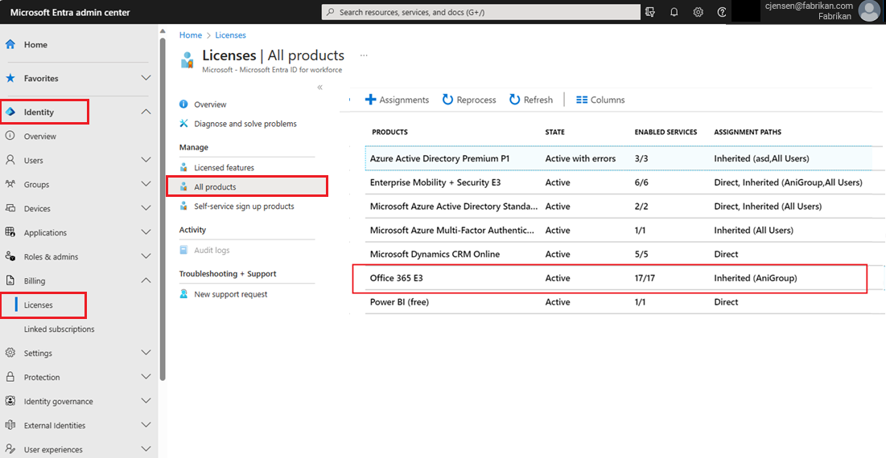

---

title: Add users with direct licenses to group licensing
description: How to migrate from individual user licenses to group-based licensing using Microsoft Entra ID

keywords: Azure AD licensing
author: barclayn
manager: amycolannino

ms.service: entra-id
ms.subservice: users
ms.topic: how-to
ms.date: 11/16/2023
ms.author: barclayn
ms.reviewer: sumitp
ms.custom: "seohack1;it-pro"
---

# How to migrate users with individual licenses to groups for licensing

In Microsoft Entra ID, part of Microsoft Entra, you can have licenses deployed to users in your tenant organizations by direct assignment, using PowerShell scripts or other tools to assign individual user licenses. Before you begin using group-based licensing to manage licenses in your organization, you can use this migration plan to seamlessly replace existing solutions with group-based licensing.

The most important thing to keep in mind is that you should avoid a situation where migrating to group-based licensing will result in users temporarily losing their currently assigned licenses. Any process that may result in removal of licenses should be avoided to remove the risk of users losing access to services and their data.

## Recommended migration process

1. You have existing automation (for example, PowerShell) managing license assignment and removal for users. Leave it running as is.

1. Create a new licensing group (or decide which existing groups to use) and make sure that all required users are added as members.

1. Assign the required licenses to those groups; your goal should be to reflect the same licensing state your existing automation (for example, PowerShell) is applying to those users.

1. Verify that licenses have been applied to all users in those groups. This application can be done by checking the processing state on each group and by checking Audit Logs.

   - You can spot check individual users by looking at their license details. You will see that they have the same licenses assigned “directly” and “inherited” from groups.

   - You can run a PowerShell script to [verify how licenses are assigned to users](licensing-group-advanced.md#use-powershell-to-see-who-has-inherited-and-direct-licenses).

   - When the same product license is assigned to the user both directly and through a group, only one license is consumed by the user. Hence no additional licenses are required to perform migration.

1. Verify that no license assignments failed by checking each group for users in error state. For more information, see [Identifying and resolving license problems for a group](licensing-groups-resolve-problems.md).

Consider removing the original direct assignments. We recommend that you do it gradually, and monitor the outcome on a subset of users first. You could leave the original direct assignments on users, but when the users leave their licensed groups they retain the directly assigned licenses, which might not be what you want.

## An example

An organization has 1,000 users. All users require Office 365 Enterprise E3 licenses. Currently the organization has a PowerShell script running on premises, adding and removing licenses from users as they come and go. However, the organization wants to replace the script with group-based licensing so licenses can be managed automatically by Microsoft Entra ID.

Here is what the migration process could look like:

1. Using the Azure portal, assign the Office 365 E3 license to the **All users** group in Microsoft Entra ID.

1. Confirm that license assignment has completed for all users. Go to the overview page for the group, select **Licenses**, and check the processing status at the top of the **Licenses** blade.

   - Look for “Latest license changes have been applied to all users" to confirm processing has completed.

   - Look for a notification on top about any users for whom licenses may have not been successfully assigned. Did we run out of licenses for some users? Do some users have conflicting license plans that prevent them from inheriting group licenses?

1. Spot check some users to verify that they have both the direct and group licenses applied. Go to the profile page for a user, select **Licenses**, and examine the state of licenses.

   - This is the expected user state during migration:

      :::image type="content" source="./media/licensing-groups-migrate-users/expected-user-state.png" alt-text="Screenshot of the expected user state during migration.":::

     This confirms that the user has both direct and inherited licenses. We see that Office 365 E3 is assigned.

   - Select each license to see which services are enabled. To verify that the direct and group licenses enable exactly the same services for the user, select **Assignments**.

1. After confirming that both direct and group licenses are equivalent, you can start removing direct licenses from users. You can test this by removing them for individual users in the portal and then run automation scripts to have them removed in bulk. Here is an example of the same user with the direct licenses removed through the portal. Notice that the license state remains unchanged, but we no longer see direct assignments.

   

## Next steps

Learn more about other scenarios for group license management:

- [What is group-based licensing in Microsoft Entra ID?](~/fundamentals/concept-group-based-licensing.md)
- [Assigning licenses to a group in Microsoft Entra ID](licensing-groups-assign.md)
- [Identifying and resolving license problems for a group in Microsoft Entra ID](licensing-groups-resolve-problems.md)
- [How to migrate users between product licenses using group-based licensing in Microsoft Entra ID](licensing-groups-change-licenses.md)
- [Microsoft Entra group-based licensing additional scenarios](licensing-group-advanced.md)
- [PowerShell examples for group-based licensing in Microsoft Entra ID](licensing-ps-examples.md)
