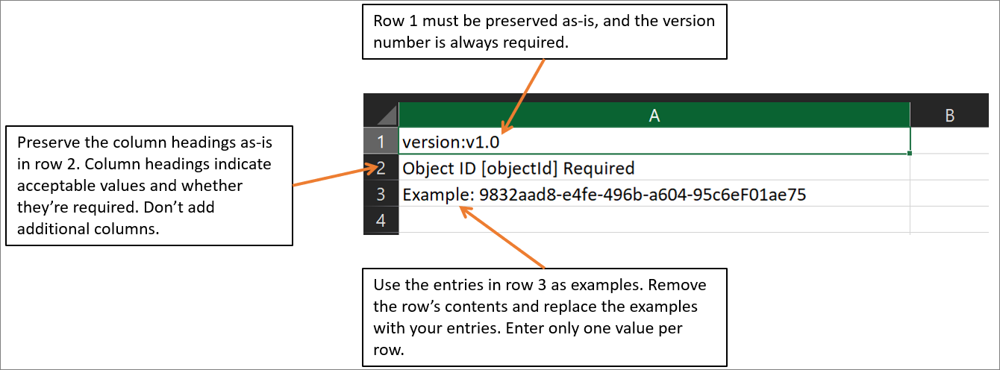

# Bulk restore deleted users in Azure Active Directory

Azure Active Directory (Azure AD), part of Microsoft Entra, supports bulk user restore operations and supports downloading lists of users, groups, and group members.

## Understand the CSV template

Download and fill in the CSV template to help you successfully restore Azure AD users in bulk. The CSV template you download might look like this example:



### CSV template structure

The rows in a downloaded CSV template are as follows:

- **Version number**: The first row containing the version number must be included in the upload CSV.
- **Column headings**: The format of the column headings is &lt;*Item name*&gt; [PropertyName] &lt;*Required or blank*&gt;. For example, `Object ID [objectId] Required`. Some older versions of the template might have slight variations.
- **Examples row**: We have included in the template a row of examples of acceptable values for each column. You must remove the examples row and replace it with your own entries.

### Additional guidance

- The first two rows of the upload template must not be removed or modified, or the upload can't be processed.
- The required columns are listed first.
- We don't recommend adding new columns to the template. Any additional columns you add are ignored and not processed.
- We recommend that you download the latest version of the CSV template as often as possible.

## To bulk restore users

1. [Sign in to your Azure AD organization](https://aad.portal.azure.com) with an account that is a User administrator in the Azure AD organization.
1. In Azure AD, select **Users** > **Deleted**.
1. On the **Deleted users** page, select **Bulk restore** to upload a valid CSV file of properties of the users to restore.

    

1. Open the CSV template and add a line for each user you want to restore. The only required value is **ObjectID**. Then save the file.

    :::image type="content" source="./media/users-bulk-restore/upload-button.png" alt-text="Select a local CSV file in which you list the users you want to add":::

1. On the **Bulk restore** page, under **Upload your csv file**, browse to the file. When you select the file and click **Submit**, validation of the CSV file starts.
1. When the file contents are validated, you’ll see **File uploaded successfully**. If there are errors, you must fix them before you can submit the job.
1. When your file passes validation, select **Submit** to start the Azure bulk operation that restores the users.
1. When the restore operation completes, you'll see a notification that the bulk operation succeeded.

If there are errors, you can download and view the results file on the **Bulk operation results** page. The file contains the reason for each error.

## Check status

You can see the status of all of your pending bulk requests in the **Bulk operation results** page.

[](./media/users-bulk-restore/bulk-center.png#lightbox)

Next, you can check to see that the users you restored exist in the Azure AD organization either in the Azure portal or by using PowerShell.

## View restored users in the Azure portal

1. [Sign in to the Azure AD admin center](https://aad.portal.azure.com) with an account that is a User administrator in the organization.
1. In the navigation pane, select **Azure Active Directory**.
1. Under **Manage**, select **Users**.
1. Under **Show**, select **All users** and verify that the users you restored are listed.

### View users with PowerShell

Run the following command:

``` PowerShell
Get-AzureADUser -Filter "UserType eq 'Member'"
```

You should see that the users that you restored are listed.

## Next steps

- [Bulk import users](users-bulk-add.md)
- [Bulk delete users](users-bulk-delete.md)
- [Download list of users](users-bulk-download.md)
