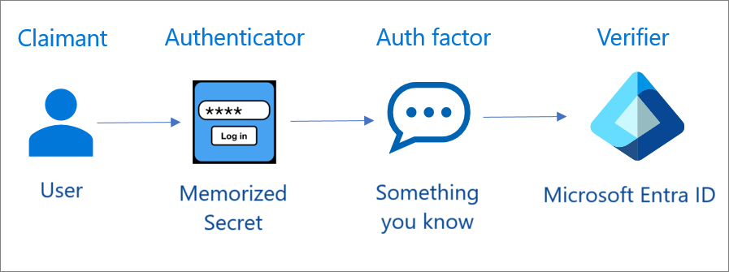

# NIST authentication basics 

Use the information in this article to learn the terminology associated with National Institute of Standards and Technology (NIST) guidelines. In addition, the concepts of Trusted Platform Module (TPM) technology and authentication factors are defined.  

## Terminology

Use the following table to understand NIST terminology.

|Term| Definition|
| - | - |
|Assertion|A statement from a *verifier* to a *relying party* that contains information about the *subscriber*. An assertion might contain verified attributes|
|Authentication|The process of verifying the identity of a *subject*|
|Authentication factor|Something you are, know, or have. Every *authenticator* has one or more authentication factors|
|Authenticator|Something the *claimant* possesses and controls to authenticate the *claimant* identity|
|Claimant|A *subject* identity to be verified with one or more *authentication* protocols|
|Credential|An object or data structure that authoritatively binds an identity to at least one *subscriber authenticator* that a *subscriber* possesses and controls|
|Credential service provider (CSP)|A trusted entity that issues or registers *subscriber authenticators* and issues electronic *credentials* to *subscribers*|
|Relying party|An entity that relies on a *verifier assertion* or a *claimant authenticators* and *credentials*, usually to grant access to a system|
|Subject|A person, organization, device, hardware, network, software, or service|
|Subscriber|A party who received a *credential* or *authenticator* from a *CSP*|
|Trusted Platform Module (TPM) |A tamper-resistant module that does cryptographic operations, including key generation|
|Verifier|An entity that verifies the *claimant* identity by verifying the claimant possession and control of *authenticators*|

## About Trusted Platform Module technology

TPM has hardware-based security-related functions: A TPM chip, or hardware TPM, is a secure cryptographic processor that helps with generating, storing, and limiting the use of cryptographic keys. 

For information on TPMs and Windows, see [Trusted Platform Module](/windows/security/hardware-security/tpm/trusted-platform-module-top-node). 

> [!NOTE]
> A software TPM is an emulator that mimics hardware TPM functionality. 

 ## Authentication factors and their strengths

You can group authentication factors into three categories:

  

Authentication factor strength is determined by how sure you are it's something only the subscriber is, knows, or has. The NIST organization provides limited guidance on authentication factor strength. Use the information in the following section to learn how Microsoft assesses strengths. 

### Something you know

Passwords are the most common known thing, and represent the largest attack surface. The following mitigations improve confidence in the subscriber. They're effective at preventing password attacks like brute-force, eavesdropping, and social engineering:

* [Password complexity requirements](https://www.microsoft.com/research/wp-content/uploads/2016/06/Microsoft_Password_Guidance-1.pdf)

* [Banned passwords](~/identity/authentication/tutorial-configure-custom-password-protection.md)

* [Leaked credentials identification](~/id-protection/overview-identity-protection.md)

* [Secure hashed storage](https://aka.ms/AADDataWhitepaper)

* [Account lockout](~/identity/authentication/howto-password-smart-lockout.md)

### Something you have

The strength of something you have is based on the likelihood of the subscriber keeping it in their possession, without an attacker gaining access to it. For example, when protecting against internal threats, a personal mobile device or hardware key has higher affinity. The device, or hardware key, is more secure than a desktop computer in an office.

### Something you are

When determining requirements for something you are, consider how easy it is for an attacker to obtain, or spoof something like a biometric. NIST is drafting a framework for biometrics, however currently doesn't accept biometrics as a single factor. It must be part of multi-factor authentication (MFA). This precaution is because biometrics don't always provide an exact match, as passwords do. For more information, see [Strength of Function for Authenticators – Biometrics](https://pages.nist.gov/SOFA/SOFA.html) (SOFA-B). 

SOFA-B framework to quantify biometrics strength:

- False match rate
- False fail rate
- Presentation attack detection error rate
- Effort required to perform an attack

## Single-factor authentication

You can implement single-factor authentication by using an authenticator that verifies something you know, or are. A something-you-are factor is accepted as authentication, but it's not accepted solely as an authenticator. 

   

## Multi-factor authentication

You can implement MFA by using an MFA authenticator or two single-factor authenticators. An MFA authenticator requires two authentication factors for a single authentication transaction.

### MFA with two single-factor authenticators

MFA requires two authentication factors, which can be independent. For example: 

* Memorized secret (password) and out of band (SMS)

* Memorized secret (password) and one-time password (hardware or software)

These methods enable two independent authentication transactions with Microsoft Entra ID.

   

### MFA with one multi-factor authenticator

Multifactor authentication requires one factor (something you know, or are) to unlock a second factor. This user experience is easier than multiple independent authenticators.

   

One example is the Microsoft Authenticator app, in passwordless mode: the user access to a secured resource (relying party), and receives notification on the Authenticator app. The user provides a biometric (something you are) or a PIN (something you know). This factor unlocks the cryptographic key on the phone (something you have), which the verifier validates.

## Next steps 

[NIST overview](nist-overview.md)

[Learn about AALs](nist-about-authenticator-assurance-levels.md)

[Authentication basics](nist-authentication-basics.md)

[NIST authenticator types](nist-authenticator-types.md)

[Achieving NIST AAL1 by using Microsoft Entra ID](nist-authenticator-assurance-level-1.md)

[Achieving NIST AAL2 by using Microsoft Entra ID](nist-authenticator-assurance-level-2.md)

[Achieving NIST AAL3 by using Microsoft Entra ID](nist-authenticator-assurance-level-3.md)
