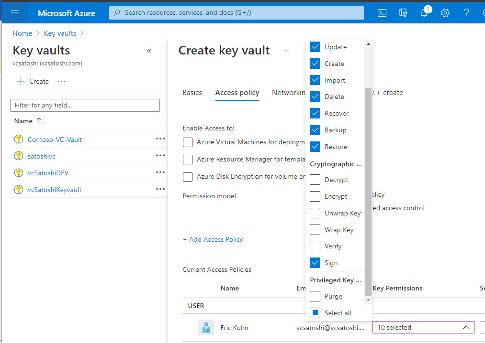
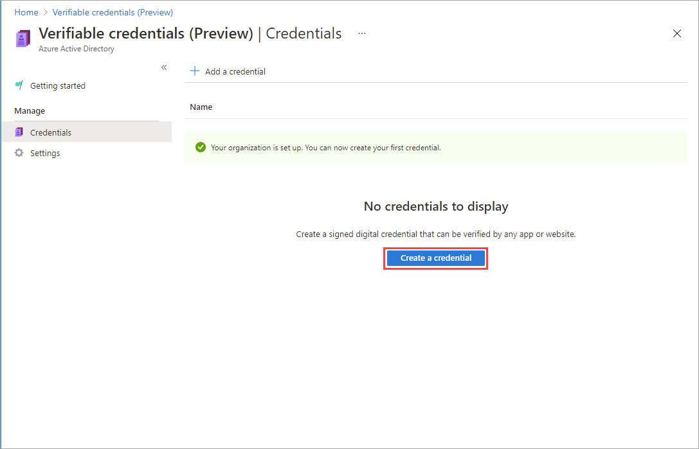
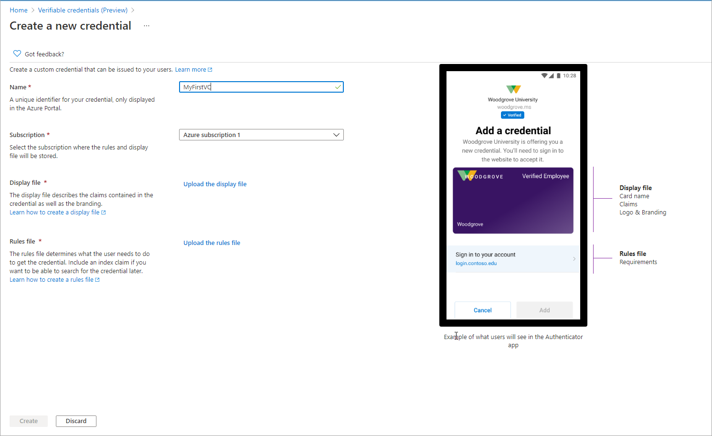
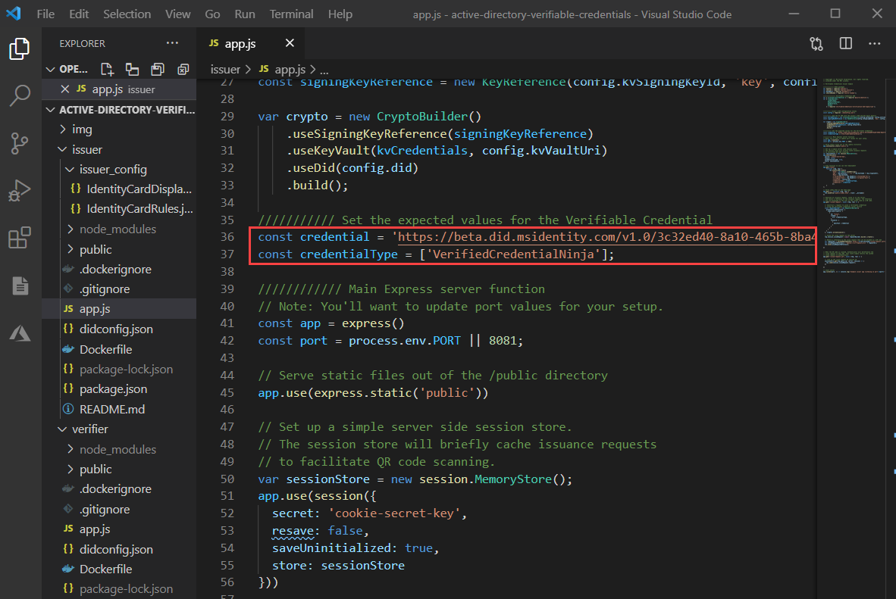

# Tutorial: Configure your Azure Active Directory to issue verifiable credentials (Preview)

In this tutorial, we build on the work done in the [get started](get-started-verifiable-credentials.md) article and we get your Azure Active Directory (AAD) set up with its own [distributed identifier](https://www.microsoft.com/security/business/identity-access-management/decentralized-identity-blockchain?rtc=1#:~:text=Decentralized%20identity%20is%20a%20trust,protect%20privacy%20and%20secure%20transactions.) (DID).

> [!IMPORTANT]
> Azure verifiable credentials is currently in public preview.
> This preview version is provided without a service level agreement, and it's not recommended for production workloads. Certain features might not be supported or might have constrained capabilities. 
> For more information, see [Supplemental Terms of Use for Microsoft Azure Previews](https://azure.microsoft.com/support/legal/preview-supplemental-terms/).

In this article:

> [!div class="checklist"]
> * You create the necessary services to onboard your Azure Active Directory (AAD) for verifiable credentials 
> * Configure verifiable credentials in AAD.
> * Go to  https://aka.ms/vcpreviewportal

## Prerequisites

Before you can successfully complete this tutorial, you must first:

- Complete the [Get started](get-started-verifiable-credentials.md).
- Have an Azure account with an active subscription. [Create an account for free](https://azure.microsoft.com/free/?WT.mc_id=A261C142F).
- Azure AD with a P2 [license](https://azure.microsoft.com/pricing/details/active-directory/).
- An instance of [Azure Key Vault](../../key-vault/general/overview.md) where you have rights to create keys and secrets.

## Azure Active Directory

Before we can start, we need an Azure AD tenant. When your tenant is enabled for verifiable credentials, it is assigned a decentralized identifier (DID) and it is enabled with an issuer service for issuing verifiable credentials. Any verifiable credential you issue is issued by your tenant and its DID. The DID is also used when verifying verifiable credentials.
If you just created a test Azure subscription, your tenant does not need to be populated with user accounts but you will need to have at least one user test account to complete later tutorials.

## Create a Key Vault

When working with verifiable credentials, you have complete control and management of the cryptographic keys your tenant uses to digitally sign verifiable credentials. To issue and verify credentials, you must provide Azure AD with access to your own instance of Azure Key Vault.

1. From the Azure portal menu, or from the **Home** page, select **Create a resource**.
2. In the Search box, enter **Key Vault**.
3. From the results list, choose **Key Vault**.
4. On the Key Vault section, choose **Create**.
5. On the **Create key vault** section provide the following information:
    - **Subscription**: Choose a subscription.
    - Under **Resource Group**, choose **Create new** and enter a resource group name such as **vc-resource-group**. We are using the same resource group name across multiple articles.
    - **Name**: A unique name is required. We use **Contoso-VC-Vault** so replace this value with your own unique name.
    - In the **Location** pull-down menu, choose a location.
    - Leave the other options to their defaults.
6. After providing the information above, select **Access Policy**

    

7. In the Access Policy screen, choose **Access Policy**

    >[!NOTE]
    > By default the account that creates the key vault is the only one with access. The verifiable credential service needs access to key vault to get started. The key vault used needs an access policy allowing the Admin to **create keys***, have the ability to **delete keys** if you opt out, and **sign** to create the domain binding for verifiable credential. If you are using the same account while testing make sure to modify the default policy to grant the account **sign** in addition to the default permissions granted to vault creators.

8. For the User Admin, make sure the key permissions section has **Create**, **Delete**, and **Sign** enabled. By default Create and Delete are already enabled and Sign should be the only Key Permission that needs to be updated. 

    

9. Select **Review + create**.
10. Select **Create**.
11. Go to the vault and take note of the vault name and URI

Take note of the two properties listed below:

- **Vault Name**: In the example, the value name is **Contoso-VC-vault**. You use this name for other steps.
- **Vault URI**: In the example, this value is https://contoso-vc.vault.azure.net/. Applications that use your vault through its REST API must use this URI.

>[!NOTE]
> Each Key Vault transaction results in additional Azure subscription costs. Review the [Key Vault pricing page](https://azure.microsoft.com/pricing/details/key-vault/) for more details.

>[!IMPORTANT]
> During the verifiable credentials preview, keys and secrets created in your vault should not be modified once created. Deleting, disabling, or updating your keys and secrets invalidates any issued credentials. Do not modify your keys or secrets during the preview.

## Set up verifiable credentials Preview

> [!Note]
> While in Preview a P2 license is required. Please follow the [How to create a free developer account](#) if you do not have one. 

Now we need to take the last step to set up your tenant for verifiable credentials.

1. From the Azure portal, search for **verifiable credentials**. 
2. Choose **Get started**
1. We need to set up your organization and provide the organization name, domain, and key vault. Let's look at each one of the values.

      - **organization name**: This name is how you reference your business within the Verifiable Credential service. This value is not customer facing.
      - **Domain:** The domain entered is added to a service endpoint in your DID document. [Microsoft Authenticator](../user-help/user-help-auth-app-download-install.md) and other wallets use this information to validate that your DID is linked to your domain. If the wallet can verify the DID, it displays a verified symbol. If the wallet is unable to verify the DID, it informs the user that the credential was issued by an organization it could not validate. The domain is what binds your DID to something tangible that the user may know about your business. See the example Presentation screen below.
      - **Key vault:** Provide the name of the Key Vault that we created earlier.

 
   >[!IMPORTANT]
   > The domain can not be a redirect, otherwise the DID and domain cannot be linked. Make sure to use https://www.domain.com format.
    
3. Choose **Save and create credential**

    

Congratulations, your tenant is now enabled for the Verifiable Credential preview! 

## Create a storage account

Before creating our first Verifiable Credential, we need to create a Blob Storage container that can hold the needed files. 

1. Create a storage account using the options shown below. For detailed steps review the [Create a storage account](../../storage/common/storage-account-create.md?tabs=azure-portal) article. 

    - **Subscription:** Choose the subscription that we are using for these tutorials.
    - **Resource group:** Choose the same resource group we used in earlier tutorials (**vc-resource-group**).
    - **Name:**  A unique name.
    - **Location:** (US) EAST US.
    - **Performance:** Standard.
    - **Account kind:** Storage V2.
    - **Replication:** Locally redundant.
 
   

2. After creating the storage account, we need to create a container. Select Containers under Blob Storage and create a container using the values provided below:

    - **Name:** vc-container
    - **Public access level:** Private (no anonymous access)

   

3. Now select your new container and upload both the rules and display files from ```sample app download location\issuer\issuer_config\```

   

## Assign the storage blob role data reader role to your account

Before creating the credential, we need to first give the signed in user the correct role assignment so that they can access the files in Storage Blob.

1. Navigate to **Storage** > **Container**.
2. Choose **Access Control (IAM)** from the menu on the left.
3. Choose **Role Assignments**.
4. Select **Add**.
5. In the **Role** section, choose **Storage Blob Data Reader**.
6. Under **Assign access to** choose **User, group, or service principle**.
7. In **Select**: Choose the account that you are using to perform these steps.
8. Select **Save** to complete the role assignment.


   

  >[!IMPORTANT]
  >By default, container creators get the **Owner** role assigned. Even if you created the container with the account you are using, the **Owner** role is not enough on its own. For more information review [Use the Azure portal to assign an Azure role for access to blob and queue data](../../storage/common/storage-auth-aad-rbac-portal.md) Your account needs  the **Storage Blob Data Reader** role.


## Create a Modified Rules and Display File

In this section, we are going to use the Rules and Display files from the Sample Issuer App and slightly modify them to create your tenant's first Verifiable Credential. 

1. Copy both the rules and display json files to a temporary folder and rename them **MyFirstVC-display.json** and **MyFirstVC-rules.json** respectively. You can find both files under **issuer\issuer_config**

   

   

2. Open up the MyFirstVC-rules.json file in your code editor. 

```json
{
  "attestations": {
    "idTokens": [
      {
        "mapping": {
          "firstName": { "claim": "given_name" },
          "lastName": { "claim": "family_name" }
        },
        "configuration": "https://didplayground.b2clogin.com/didplayground.onmicrosoft.com/B2C_1_sisu/v2.0/.well-known/openid-configuration",
        "client_id": "8d5b446e-22b2-4e01-bb2e-9070f6b20c90",
        "redirect_uri": "vcclient://openid"
      }
    ]
  },
  "validityInterval": 2592000,
  "vc": {
    "type": ["VerifiedCredentialNinja"]
  }
}
```
Now let's change the type field to "MyFirstVC". 

```json
"type": ["MyFirstVC"]
```
Save this change. 

 >[!note]
   > We are not changing the "configuration" or the "client_id" here. We will continue to use the Microsoft B2C tenant for this stage of the tutorial and we will change the IDP in the next section. 

3. Open up the MyFirstVC-display.json file in your code editor. 

```json
{
  "default": {
    "locale": "en-US",
    "card": {
      "title": "Verified Credential Ninja",
      "issuedBy": "Microsoft",
      "backgroundColor": "#000000",
      "textColor": "#ffffff",
      "logo": {
        "uri": "https://didcustomerplayground.blob.core.windows.net/public/ninja-icon.png",
        "description": "Ninja Logo"
      },
      "description": "Use your verified credential ninja card to prove to anyone that you know all about verifiable credentials."
    },
    "consent": {
      "title": "Do you want to get your Verified Credential Ninja card?",
      "instructions": "Sign in with your account to get your card."
    },
    "claims": {
      "vc.credentialSubject.firstName": {
        "type": "String",
        "label": "First name"
      },
      "vc.credentialSubject.lastName": {
        "type": "String",
        "label": "Last name"
      }
    }
  }
}
```

Lets make a few modifications so this Verifiable Credential looks visibly different than the Sample Code's version. 

```json
   "card": {
      "title": "My First VC",
      "issuedBy": "Your Issuer Name",
      "backgroundColor": "#ffffff",
      "textColor": "#000000",
```

Save these changes. 

## Create your VC in the Portal
Now that you have modified the Rules and Display file, it's time to create the Verifiable Credential in the portal. 

1. On the Azure portal, navigate to the verifiable credentials preview portal.
1. Select **Credentials** from the verifiable credentials preview page.

   

4. Choose **Create a credential**
5. Under Credential Name, add the name **MyFirstVC**. This name is used in the portal to identify your verifiable credentials and it is included as part of the verifiable credentials contract.

   

6. In the **Display file** section choose **Configure display file**
7. In the **Storage accounts** section, select **contosovcstorage**.
8. From the list of available containers choose **vc-container**.
9. Choose **MyFirstVC-display.json** which we created earlier.
10. From the **Create a new credential** in the **Rules file** section choose **Configure rules file**
11. In the **Storage accounts** section, select **contosovcstorage**
12. Choose **vc-container**.
13. Select **MyFirstVC-rules.json**
14. From the **Create a new credential** screen choose **Create**.

### Credential URL

Now that you have a new credential, copy the credential URL.

   

>[!note]
The credential URL is the combination of the Rules and Display file and is the URL that Authenitcator will evaluate in order to show the User the requirements they need to meet in order to receive the Verifiable Credential.  

## Update the sample app

Now we make modifications to the sample app's issuer code to update it with your verifiable credential URL. This allows you to issue verifiable credentials using your own tenant.

1. Open your Issuer Sample code app.js file.
2. Update the constant 'credential' with your new credential URL and the new credentialType 'MyFirstVC' and save the file.

    

3. Open a command prompt and open the issuer folder.
4. Run the updated node app.

    ```cmd
    node ./app.js
    ```
5. Using a different command prompt run ngrok to set up a URL on 8081

    ```cmd
    ngrok http 8081
    ```
    
    >[!IMPORTANT]
    > You may also notice a warning that this app or website may be risky. The message is expected at this time because we have not yet linked your DID to your domain. Follow the [DNS binding](how-to-dnsbind.md) instructions to configure this. 
    
6. Open the HTTPS URL generated by ngrok and test issuing the VC to yourself.

    


## Test verifying the VC using the sample app

Now that we've issued the verifiable credential from our own tenant, let's verify it using our Sample app.

>[!IMPORTANT]
> When testing, use the same email and password that you used during the [get started](get-started-verifiable-credentials.md) article. You need that information because while you are issuing the vc authentication is still handled by the same B2C tenant that handled authentication while completing the first tutorial.

1. Open up **Settings** in the verifiable credentials blade in Azure portal. Copy the Issuer identifier.

   

2. Now open up your app.js file in your Verifier Sample code and make the following changes:

- credential: change to your credential URL
- credentialType: 'MyFirstVC'
- issuerDid: Copy this value from Azure Portal>Verifiable credentials (Preview)>Settings>Decentralized identifier (DID)

   

3. Now run your verifier app and present the VC.

4. Stop running your issuer ngrok service.

    ```cmd
    control-c
    ```

5. Now run ngrok with the verifier port 8082.

    ```cmd
    ngrok http 8082
    ```

6. In another terminal window, navigate to the verifier app and run it similarly to how we ran the issuer app.

    ```cmd
    cd ..
    cd verifier
    node app.js
    ```

>[!note]
The Verifier DID is still from the Microsoft Sample App tenant. Since Microsoft's DID has been linked to a domain we own, you will not see the warning like we experienced during the Issuance flow. This will be updated in the next section. 

## Next steps

Now that you have the sample code issuing a VC from your issuer, lets continue to the next section where you use your own identity provider to authenticate users trying to get verifiable credentials.

> [!div class="nextstepaction"]
> [Tutorial - Configure your identity provider using the verifiable credentials sample app](tutorial-03-sample-app-your-idp.md)


