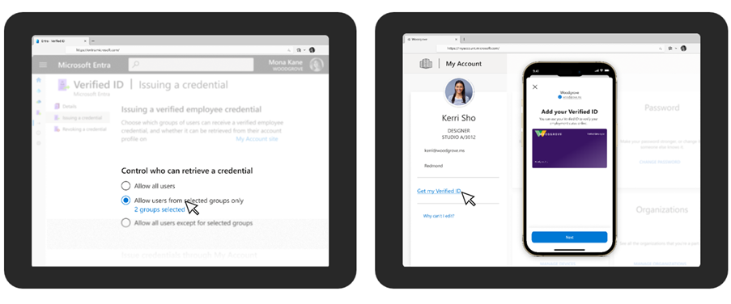
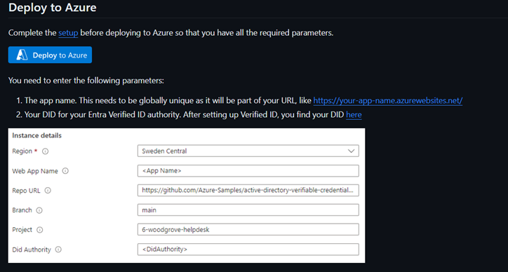
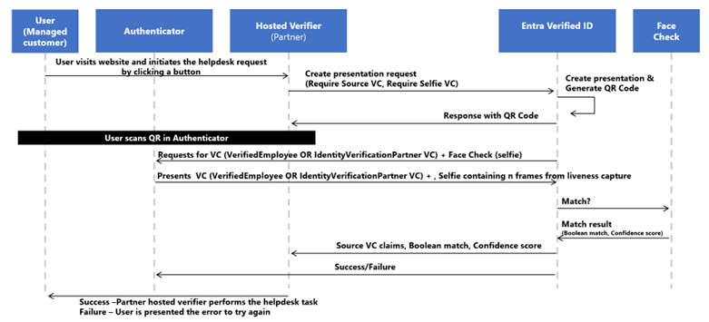

# Verified helpdesk with Entra Verified ID

An ongoing challenge for helpdesk is verifying the identity of callers seeking help, especially in remote interactions via phone, chat, or email. Microsoft Entra Verified ID could help such enterprises add verification processes seamlessly into their existing helpdesk and service desk operations. Upon successful verification, service desk could offer tasks such as password resets, Temporary Access Pass (TAP) provision, MFA (multifactor authentication) onboarding, and account updates, potentially enabling self-service automation.

## When to use this pattern

- You have an service desk system with API support.
- Your service desk system allows programmatic integration to query Entra ID or any other directory services system to do a reliable matching and updates to user profiles.

## Solution

To deploy verification flows, an enterprise must follow three main steps:

1. Setup Microsoft Entra Verified ID in your M365 tenant and enable VerifiedEmployee credential for issuance. Alternatively, an enterprise can also issue Verified ID based on Identity verification flow by working with our IDV (Identity Proofing and Verification) partners [https://aka.ms/verifiedidisv](https://aka.ms/verifiedidisv). 
1. Issue Verified ID to your users.
1. Add verification flow to your existing service desk solution.

### Setting up Entra Verified ID

To setup the Entra Verified ID service, follow the instructions for Quick Configuration - [Set up a tenant for Microsoft Entra Verified ID](verifiable-credentials-configure-tenant-quick.md). Alternatively, customers could use [Advanced setup](verifiable-credentials-configure-tenant.md) for setting up Verified ID where you as an admin must configure Azure Key Vault, take care of registering your decentralized ID and verifying your domain.

### Get Started with issuing VerifiedEmployee Verified ID

1. Create a test user in your [Entra tenant](https://entra.microsoft.com/#view/Microsoft_AAD_UsersAndTenants/UserManagementMenuBlade/%7E/AllUsers/menuId/) and upload a photo of [yourself](https://support.microsoft.com/office/add-your-profile-photo-to-microsoft-365-2eaf93fd-b3f1-43b9-9cdc-bdcd548435b7).
1. Go to [MyAccount](verifiable-credentials-configure-tenant-quick.md#myaccount-available-now-to-simplify-issuance-of-workplace-credentials), sign in as the test user and issue a VerifiedEmployee credential for the user.



You first select who can request issuance of a Verified ID by selecting all users or a specific group of users. Then sign in to [https://myaccount.microsoft.com](https://myaccount.microsoft.com) and get your [Face Check](using-facecheck.md) ready credential using [Microsoft Authenticator](https://www.microsoft.com/security/mobile-authenticator-app). 

### Add verification flows to service desk solution

An enterprise can setup Entra Verified ID integration by either:

1. Adding it as an inline process like a `Get Verified` button in the Service desk webapp, follow the steps to add a Presentation request to verify VerifedID with Face Check. Steps are mentioned in the link [https://aka.ms/verifiedidfacecheck](https://aka.ms/verifiedidfacecheck)
1. Setting up a dedicated web application that could accept Entra Verified ID `VerifiedEmployee` with [Face Check](using-facecheck.md). Use the GitHub [sample](https://github.com/Azure-Samples/active-directory-verifiable-credentials-dotnet/tree/main/6-woodgrove-helpdesk) to deploy the custom webapp. Click `Deploy to Azure` to deploy the [ARM template](/azure/azure-resource-manager/templates/) that uses Managed Identity.



An enterprise could add a webhook to send the response of Verified ID verification with [Face Check](using-facecheck.md) to the ServiceDesk tool. You can refer this example of [adding webhook](/microsoftteams/platform/webhooks-and-connectors/what-are-webhooks-and-connectors) to a Teams channel. This GitHub sample deploys a verification webapp on Azure using Azure App Service. 

An enterprise can add self-service automation services like generate a [Temporary Access Pass](/entra/identity/authentication/howto-authentication-temporary-access-pass.md) post successful verification of Verified ID taking claims from Verified ID. GitHub [sample](https://github.com/Azure-Samples/active-directory-verifiable-credentials-dotnet/tree/main/5-onboard-with-tap) explains this self-service automation process.

If you are a **Managed Services provider (MSP)** or **Cloud Solutions Provider (CSP)**, you could also add this pattern to your existing Service Desk process. Deploy the verification flow inline or as a custom web application. For the presentation flow, add acceptedissuers field in the payload and specify the decentralized identifier’s (did’s) for your customers to verify VerifiedEmployee with Face Check.

```json
...
"requestedCredentials": [ 
  { 
    "type": "VerifiedEmployee", 
    "acceptedIssuers": [ "<authirity1>", "<authority2>", "..." ], 
    "configuration": { 
      "validation": { 
        "allowRevoked": false, 
        "validateLinkedDomain": true, 
        "faceCheck": { 
          "sourcePhotoClaimName": "photo", 
          "matchConfidenceThreshold": 70 
        } 
      }
  ...
```



## Additional resources

- Public architecture document for generalized account onboarding: [Plan your Microsoft Entra Verified ID verification solution](plan-verification-solution#account-onboarding.md)
- Entra Verified Face Check: [Using FaceCheck with Verified ID and unlocking high assurance verifications at scale](using-facecheck.md)
- Entra Verified ID GitHub repository: [samples](https://aka.ms/vcsample)
