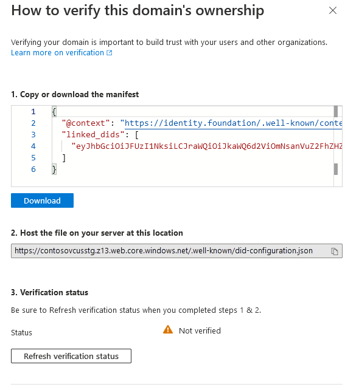

# Link your Domain to your Decentralized Identifier (DID)

> [!IMPORTANT]
> Azure Active Directory verifiable credentials is currently in public preview.
> This preview version is provided without a service level agreement, and it's not recommended for production workloads. Certain features might not be supported or might have constrained capabilities.
> For more information, see [Supplemental Terms of Use for Microsoft Azure Previews](https://azure.microsoft.com/support/legal/preview-supplemental-terms/).

In this article:
> [!div class="checklist"]
> * Why do we need to link our DID to our domain?
> * How do we link DIDs and domains?
> * How does the domain linking process work?
> * How does the verify/unverified domain logic work?

## Prerequisites

To link your DID to your domain, you need to have completed the following.

- Complete the [Getting Started](get-started-verifiable-credentials.md) and subsequent [tutorial set](enable-your-tenant-verifiable-credentials.md).

## Why do we need to link our DID to our domain?

A DID starts out as an identifier that is not anchored to existing systems. A DID is useful because a user or organization can own it and control it. If an entity interacting with the organization does not know 'who' the DID belongs to, then the DID is not as useful.

Linking a DID to a domain solves the initial trust problem by allowing any entity to cryptographically verify the relationship between a DID and a Domain.

## How do we link DIDs and domains?

We make a link between a domain and a DID by implementing an open standard written by the Decentralized Identity Foundation called [Well-Known DID configuration](https://identity.foundation/.well-known/resources/did-configuration/). The verifiable credentials service in Azure Active Directory (AAD) helps your organization make the link between the DID and domain by included the domain information that you provided in your DID, and generating the well-known config file:

1. AAD uses the domain information you provide during organization setup to write a Service Endpoint within the DID Document. All parties who interact with your DID can see the domain your DID proclaims to be associated with.  

    ```json
        "service": [
          {
            "id": "#linkeddomains",
            "type": "LinkedDomains",
            "serviceEndpoint": {
              "origins": [
                "https://www.contoso.com/"
              ]
            }
          }
    ```

2. The verifiable credential service in AAD generates a compliant well-known configuration resource that you can host on your domain. The configuration file includes a self-issued verifiable credential of credentialType 'DomainLinkageCredential' signed with your DID that has an origin of your domain. Here is an example of the config doc that is stored at the root domain url.


    ```json
    {
      "@context": "https://identity.foundation/.well-known/contexts/did-configuration-v0.0.jsonld",
      "linked_dids": [
        "jwt..."
      ]
    }
    ```

After you have the well-known configuration file, you need to make the file available using the domain name you specified when enabling your AAD for verifiable credentials.

* Host the well-known DID configuration file at the root of the domain.
* Do not use redirects.
* Use https to distribute the configuration file.

>[!IMPORTANT]
>Microsoft Authenticator does not honor redirects, the URL specified must be the final destination URL.

## User Experience 

When a user is going through an issuance flow or presenting a verifiable credential, they should know something about organization and its DID. If the domain our verifiable credential wallet, Microsoft Authenticator, validates a DID's relationship with the domain in the DID document and presents users with two different experiences depending on the outcome.

## Verified Domain

Before Microsoft Authenticator displays a **Verified** icon, a few things need to be true:

* The DID signing the self-issued open ID (SIOP) request must have a Service endpoint for Linked Domain.
* The root domain does not use a redirect and uses https.
* The domain listed in the DID Document has a resolvable well-known resource.
* The well-known resource's verifiable credential is signed with the same DID that was used to sign the SIOP that Microsoft Authenticator used to kick start the flow.

If all of the previously mentioned are true, then Microsoft Authenticator displays a verified page and includes the domain that was validated.

 

## Unverified Domain

If any of the above are not true, the Microsoft Authenticator will display a full page warning to the user that the domain is unverified, the user is in the middle of a risky transaction and they should proceed with caution. We have chosen to take this route because:

* The DID is either not anchored to a domain.
* The configuration was not set up properly.
* The DID the user is interacting with is malicious and actually can't prove they own a domain (since they actually don't). Due to this last point, it is imperative that you link your DID to the domain the user is familiar with, to avoid propagating the warning message.


## Distribute well-known config

1. Navigate to the Settings page in Verifiable Credentials and choose **Verify this domain**

    

2. Download the did-configuration.json file shown in the image below.

    

3. Copy the JWT, open [jwt.ms](https://www.jwt.ms) and validate the domain is correct.

4. Copy your DID and open the [ION Network Explorer](https://identity.foundation/ion/explorer) to verify the same domain is included in the DID Document. 

5. Host the well-known config resource at the location specified. Example: https://www.example.com/.well-known/did-configuration.json

6. Test out issuing or presenting with Microsoft Authenticator to validate. Make sure the setting in Authenticator 'Warn about unsafe apps' is toggled on.

>[!NOTE]
>By default, 'Warn about unsafe apps' is turned on.

Congratulations, you now have bootstrapped the web of trust with your DID!

## Next steps

If during onboarding you enter the wrong domain information of you decide to change it, you will need to [opt out](how-to-opt-out.md). At this time, we don't support updating your DID document. Opting out and opting back in will create a brand new DID.