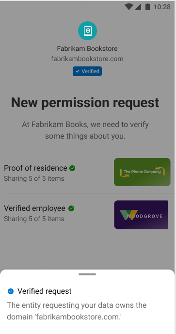

# Link your Domain to your Distributed Identifier (DID)

> [!IMPORTANT]
> Azure Verifiable Credentials is currently in public preview.
> This preview version is provided without a service level agreement, and it's not recommended for production workloads. Certain features might not be supported or might have constrained capabilities.
> For more information, see [Supplemental Terms of Use for Microsoft Azure Previews](https://azure.microsoft.com/support/legal/preview-supplemental-terms/).


In this article:
- Why you want to link your domain
- How we use open standards 
- User Experience
- Next Steps 

## Prerequisites

To link your DID to your domain, you need to have completed the following.

- Complete the Getting Started and Tutorial.  (WHICH TUTORIAL? ALL OF THEM? If a customer arrives to this article not having followed the quickstart or tutorials what should they have done already before they can do this?)

## Why do we link our domain to our DID?

A DID starts out as an identifier that is not anchored to existing systems. A DID is useful because a user or organization can own it and control it. If an entity interacting with the organization does not know 'who' the DID belongs to, then the DID is not as useful.

Linking a DID to a domain solves the initial trust problem by allowing any entity to cryptographically verify the relationship between a DID and a Domain.


## How do we link DIDs and domains?

To make a link between a domain and a DID we follow an open standard written by the Decentralized Identity Foundation called [Well Known DID Configuration](https://identity.foundation/.well-known/resources/did-configuration/). The Verifiable Credentials Service in Azure Active Directory (AAD) helps your organization make the link between the DID and domain by doing the following:

1. AAD uses the domain information you provide during organization setup to write a Service Endpoint within the DID Document. All parties who interact with your DID can see the domain your DID proclaims to be associated with.  

```json
    "service": [
      {
        "id": "#linkeddomains",
        "type": "LinkedDomains",
        "serviceEndpoint": {
          "origins": [
            "https://www.contoso.com/"
          ]
        }
      }
```

2. The Verifiable Credential service in AAD will also generate a compliant Well Known Configuration Resource that you can host on your domain. The configuration file includes a self issued Verifiable Credential of credentialType 'DomainLinkageCredential' signed with your DID that has an origin of your domain. Here is an example of the config doc that will be stored at the root domain url.

```json
https://www.example.com/.well-known/did-configuration.json
```
```json
{
  "@context": "https://identity.foundation/.well-known/contexts/did-configuration-v0.0.jsonld",
  "linked_dids": [
    "jwt..."
  ]
}
```

3. The Well Known DID Configuration file needs to be hosted on the root domain, without redirects and https needs to be enabled. 

>[!NOTE]
>Microsoft Authenticator will not honor any redirect, that it has to be the final destination URL.

## User Experience 

When a user is going through an Issuance flow or presenting a Verifiable Credential, they should know something about the DID they are interacting with. If the domain our Verifiable Credential Wallet, Microsoft Authenticator, will validate a DID's relationship with the domain in the DID document and present two different user experiences depending on the outcome. 

## Verified Domain

Before Microsoft Authenticator displays a 'Verified' icon, a few things need to be true:

- The DID signing the SIOP request must have a Service endpoint for Linked Domain. (WHAT IS THIS? WHAT IS A STOP REQUEST?)
- The root domain does not have a redirect and uses https. 
- The domain listed in the DID Document has a resolvable Well Known Resource. 
- The Well Known Resource's Verifiable Credential is signed with the same DID that was used to sign the SIOP that Microsoft Authenticator used to kick start the flow. 

If all of the previously mentioned are true, then Microsoft Authenticator will display a Verified page and include the domain that was validated. 

 

## Unverified Domain

If any of the above are not true, the Microsoft Authenticator will display a full page warning to the user that this is a risky transaction and they should proceed with caution. We have chosen to take this route because the DID is either not anchored to a domain, the configuration was not set up properly or the DID the user is interacting with is malicious and actually can't prove they own a domain (since they actually don't). Due to this last point, it is imperative that our customers properly set up linking their DID to the domain the user will be familiar with, to avoid propagating the warning message.

<todo: add image of unverified domain>

## Next Steps

1. Navigate to the Settings page in Verifiable Credentials and click 'Verify this domain'

 

2. Download the Well Known Config Resource

 

3. Copy the JWT, open [jwt.ms](https://www.jwt.ms) and validate the domain is correct.

4. Copy your DID and open the [ION Network Explorer](https://identity.foundation/ion/explorer) to verify the same domain is included in the DID Document. 

5. Host the Well KNown Config Resource at the location specified. Example: https://www.example.com/.well-known/did-configuration.json

6. Test out issuing or presenting with Microsoft Authenticator to validate. Make sure the setting in Authenticator 'Warn about unsafe apps' is toggled on. 

>[!NOTE]
>By default, 'Warn about unsafe apps' is turned on. 

Congratualations, you now have bootstrapped the web of trust with your DID!

## Troubleshooting

If the domain that was entered during onboarding is incorrect or you want to change it, you will need to opt out at this time. We currently don't support updating your DID document. Opting out and opting back in will create a brand new DID. 