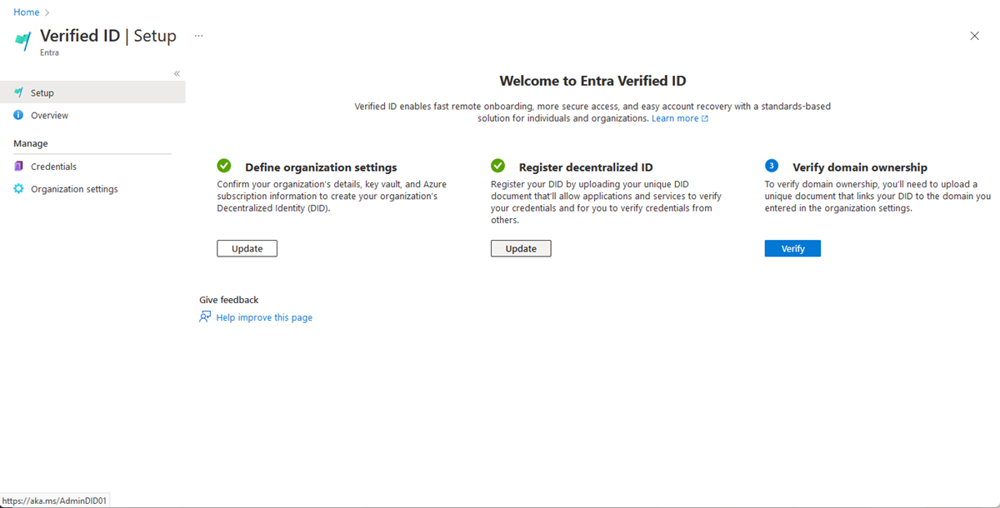
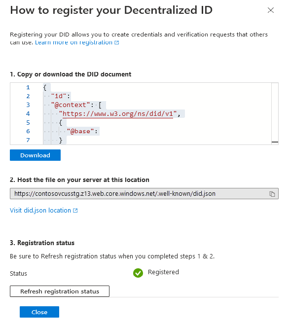

# How to register your website ID for did:web

[!INCLUDE [Verifiable Credentials announcement](../../../includes/verifiable-credentials-brand.md)]

> [!IMPORTANT]
> Azure Active Directory Verifiable Credentials is currently in public preview.
> This preview version is provided without a service level agreement, and it's not recommended for production workloads. Certain features might not be supported or might have constrained capabilities.
> For more information, see [Supplemental Terms of Use for Microsoft Azure Previews](https://azure.microsoft.com/support/legal/preview-supplemental-terms/).

## Prerequisites

- Complete verifiable credentials onboarding with Web as the selected trust system.
- Complete the Linked Domain setup.

## Why do I need to register my website ID?

If your trust system for the tenant is Web, you need register your website ID to be able to issue and verify your credentials. When you use the ION based trust system, information like your issuers' public keys are published to the blockchain. When the trust system is Web, you have to make this information available on your website.  

## How do I register my website ID?

1. Navigate to the Verifiable Credentials | Getting Started page.
1. On the left side of the page, select Domain.
1. At the Website ID registration, select Review.

   
1. Copy or download the DID document being displayed in the box

   
1. Upload the file to your webserver. The DID document JSON file needs to be uploaded to location /.well-known/did.json on your webserver.
1. Once the file is available on your webserver, you need to select the Refresh registration status button to verify that the system can request the file.

## When is the DID document in the did.json file used?

The DID document contains the public keys for your issuer and is used during both issuance and presentation. An example of how the public keys are used is when Authenticator, as a wallet, validates the signature of an issuance or presentation request.

## When does the did.json file need to be republished to the webserver?

The DID document in the did.json file needs to be republished if you changed the Linked Domain or if you rotate your signing keys.

## Next steps

- [Tutorial for issue a verifiable credential](verifiable-credentials-configure-issuer.md)