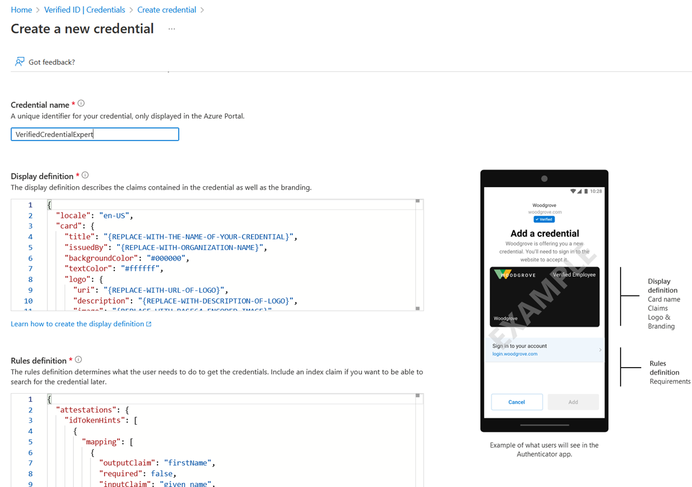
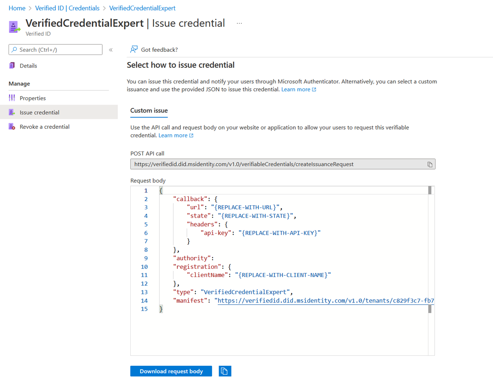

# How to create credentials using the Quickstart for idToken flow

[!INCLUDE [Verifiable Credentials announcement](../../../includes/verifiable-credentials-brand.md)]

> [!IMPORTANT]
> Microsoft Entra Verified ID is currently in public preview.
> This preview version is provided without a service level agreement, and it's not recommended for production workloads. Certain features might not be supported or might have constrained capabilities.
> For more information, see [Supplemental Terms of Use for Microsoft Azure Previews](https://azure.microsoft.com/support/legal/preview-supplemental-terms/).

A [rules definition](rules-and-display-definitions-model.md#rulesmodel-type) using the [idTokens attestation](rules-and-display-definitions-model.md#idtokenattestation-type) will produce an issuance flow where the user will be required to do an interactive sign-in to an OIDC identity provider in the Authenticator. Claims in the id_token the identity provider returns can be used to populate the issued verifiable credential. The claims mapping section in the rules definition specifies which claims are used. 

## Create a Custom credential with the idTokens attestation type

When you select + Add credential in the portal, you get the option to launch two Quickstarts. Select [x] Custom credential and select Next. 


In the next screen, you enter JSON for the Display and the Rules definitions and give the credential a type name. Select Create to create the credential.



## Sample JSON Display definitions

The Display JSON definition is very much the same regardless of attestation type. You just have to adjust the labels depending on what claims your VC have. The Display JSON definition is the same regardless of attestation type. The expected JSON for the Display definitions is the inner content of the displays collection. The JSON is a collection, so if you want to support multiple locales, you add multiple entries with a comma as separator. 

```json
{
    "locale": "en-US",
    "card": {
      "title": "Verified Credential Expert",
      "issuedBy": "Microsoft",
      "backgroundColor": "#000000",
      "textColor": "#ffffff",
      "logo": {
        "uri": "https://didcustomerplayground.blob.core.windows.net/public/VerifiedCredentialExpert_icon.png",
        "description": "Verified Credential Expert Logo"
      },
      "description": "Use your verified credential to prove to anyone that you know all about verifiable credentials."
    },
    "consent": {
      "title": "Do you want to get your Verified Credential?",
      "instructions": "Sign in with your account to get your card."
    },
    "claims": [
      {
        "claim": "vc.credentialSubject.userName",
        "label": "User name",
        "type": "String"
      },
      {
        "claim": "vc.credentialSubject.displayName",
        "label": "Display name",
        "type": "String"
      },
      {
        "claim": "vc.credentialSubject.firstName",
        "label": "First name",
        "type": "String"
      },
      {
        "claim": "vc.credentialSubject.lastName",
        "label": "Last name",
        "type": "String"
      }
    ]
}
```

## Sample JSON Rules definitions

The JSON attestation definition should contain the **idTokens** name, the [OIDC configuration details](rules-and-display-definitions-model.md#idtokenattestation-type) and the claims mapping section. The expected JSON for the Rules definitions is the inner content of the rules attribute, which starts with the attestation attribute. The claims mapping in the below example will require that you do the token configuration as explained below in the section [Claims in id_token from Identity Provider](#claims-in-id_token-from-identity-provider).

```json
{
  "attestations": {
    "idTokens": [
      {
        "clientId": "8d5b446e-22b2-4e01-bb2e-9070f6b20c90",
        "configuration": "https://didplayground.b2clogin.com/didplayground.onmicrosoft.com/B2C_1_sisu/v2.0/.well-known/openid-configuration",
        "redirectUri": "vcclient://openid",
        "scope": "openid profile email",
        "mapping": [
          {
            "outputClaim": "userName",
            "required": true,
            "inputClaim": "$.upn",
            "indexed": false
          },
          {
            "outputClaim": "displayName",
            "required": true,
            "inputClaim": "$.name",
            "indexed": false
          },
          {
            "outputClaim": "firstName",
            "required": true,
            "inputClaim": "$.given_name",
            "indexed": false
          },
          {
            "outputClaim": "lastName",
            "required": true,
            "inputClaim": "$.family_name",
            "indexed": true
          }
        ],
        "required": false
      }
    ]
  }
}
```

## Application Registration

The **clientId** attribute is the AppId of a registered application in the OIDC identity provider. For **Azure Active Directory**, you create the application via these steps.

1. Navigate to [Azure Active Directory in portal.azure.com](https://portal.azure.com/#view/Microsoft_AAD_IAM/ActiveDirectoryMenuBlade/~/RegisteredApps).
1. Select **App registrations** and select on **+New registration** and give the app a name 
1. Let the selection of **Accounts in this directory only** if you only want accounts in your tenant to be able to sign in
1. In **Redirect URI (optional)**, select **Public client/native (mobile & desktop)** and enter value **vcclient://openid**
 
If you want to be able to test what claims are in the token, do the following
1. Select **Authentication** in the left hand menu and do
1. **+Add platform**
1. **Web**
1. Enter **https://jwt.ms** as **Redirect URI** and select **ID Tokens (used for implicit and hybrid flows)**
1. Select on **Configure**

Once you finish testing your id_token, you should consider removing **https://jwt.ms** and the support for **implicit and hybrid flows**.

For **Azure Active Directory**, you can test your app registration and that you get an id_token via running the following in the browser if you have enabled support for redirecting to jwt.ms. 

```http
https://login.microsoftonline.com/<your-tenantId>/oauth2/v2.0/authorize?client_id=<your-appId>&nonce=defaultNonce&redirect_uri=https%3A%2F%2Fjwt.ms&scope=openid%20profile&response_type=id_token&prompt=login
```

Replace the <your-tenantidNote that you need to have **profile** as part of the **scope** in order to get the extra claims.

For **Azure Active Directory B2C**, the app registration process is the same but B2C has built in support in the portal for testing your B2C policies via the **Run user flow** functionality.

## Claims in id_token from Identity Provider

Claims must exist in the returned identity provider so that they can successfully populate your VC.
If the claims don't exist, there will be no value in the issued VC. Most OIDC identity providers don't issue a claim in an id_token if the claim has a null value in the user's profile. Make sure you include the claim in the id_token definition and that the user has a value for the claim in the user profile.

For **Azure Active Directory**, see documentation [Provide optional claims to your app](../../active-directory/develop/active-directory-optional-claims.md) on how to configure what claims to include in your token. The configuration is per application, so the configuration you make should be for the app with AppId specified in the **clientId** in the rules definition.

To match the above Display & Rules definition, you should have your application manifest having its **optionalClaims** looking like below.

```json
"optionalClaims": {
    "idToken": [
        {
            "name": "upn",
            "source": null,
            "essential": false,
            "additionalProperties": []
        },
        {
            "name": "family_name",
            "source": null,
            "essential": false,
            "additionalProperties": []
        },
        {
            "name": "given_name",
            "source": null,
            "essential": false,
            "additionalProperties": []
        },
        {
            "name": "preferred_username",
            "source": null,
            "essential": false,
            "additionalProperties": []
        }
    ],
    "accessToken": [],
    "saml2Token": []
},
```

For **Azure Active Directory B2C**, configuring other claims in your id_token depends on if your B2C policy is a **User Flow** or a **Custom Policy**. For documentation on User Flows, see [Set up a sign-up and sign-in flow in Azure Active Directory B2C](../../active-directory-b2c/add-sign-up-and-sign-in-policy.md?pivots=b2c-user-flow) and for Custom Policy, see documentation [Provide optional claims to your app](../../active-directory-b2c/configure-tokens.md?pivots=b2c-custom-policy#provide-optional-claims-to-your-app).  

For other identity providers, see the relevant documentation.

## Configure the samples to issue and verify your Custom credential

To configure your sample code to issue and verify using custom credentials, you need:

- Your tenant's issuer DID
- The credential type
- The manifest url to your credential. 

The easiest way to find this information for a Custom Credential is to go to your credential in the portal, select **Issue credential** and switch to Custom issue.


After switching to custom issue, you have access to a textbox with a JSON payload for the Request Service API. Replace the place holder values with your environment's information. The issuer’s DID is the authority value.



## Next steps

- Reference for [Rules and Display definitions model](rules-and-display-definitions-model.md)
