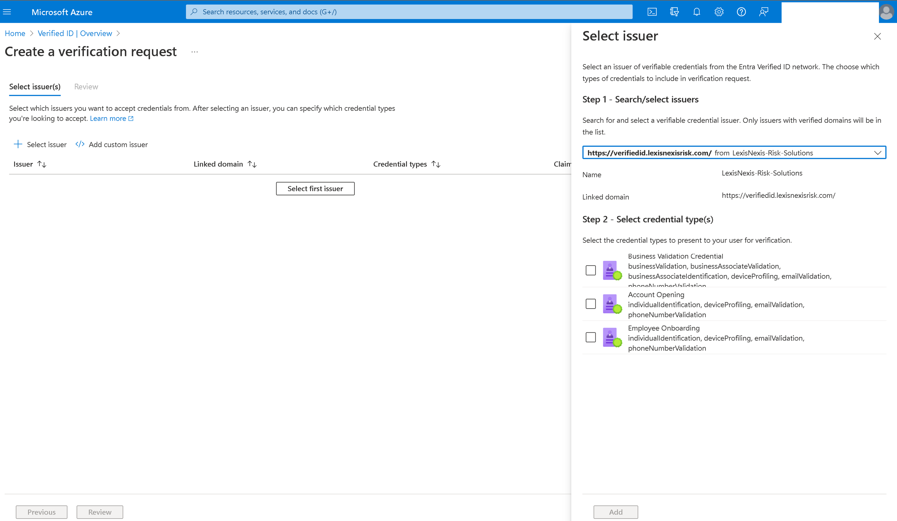

# Configure Verified ID with LexisNexis as your Identity Verification Partner

Verifiable credentials from LexisNexis Risk Solutions can be used to enable faster onboarding by replacing some human interactions. VCs can be used to onboard employees, students, citizens, or others to access services.
## Pre-requisites

- [Configure your tenant](verifiable-credentials-configure-tenant.md) for Entra Verified ID service.
- If needed, [create an Azure account for free](https://azure.microsoft.com/free/?WT.mc_id=A261C142F).

## Scenario description

Verifiable Credentials can be used to onboard employees, students, citizens, or others to access services. For example, rather than an employee needing to go to a central office to activate an employee badge, they can use a verifiable credential to verify their identity to activate a badge that is delivered to them remotely. Rather than a citizen receiving a code they must redeem to access governmental services, they can use a VC to prove their identity and gain access.

:::image type="content" source="media/verified-id-partner-au10tix/vc-system-diagram.png" alt-text="diagram of the verifiable credential solution":::

## Onboard with LexisNexis risk solutions

1. Create a LexisNexis account, you can request a [demo](https://solutions.risk.lexisnexis.com/did-microsoft). Expect response from your LexisNexis Risk Solutions within 48 hours.
1. You will eventually get the URL for users to get Verified ID issued from LexisNexis following the identity verification process.

## Configure your Application to use LexisNexis

For incorporating identity verification into your Apps, using LexisNexis Verified ID follow these steps.

### Part 1

As a developer you will provide these below steps to your tenant administrator to obtain the verification request URL and body for your application or website to request verifiable credentials from your users. 

1. Go to [Microsoft Entra portal -> Verified ID](https://entra.microsoft.com/#view/Microsoft_AAD_DecentralizedIdentity/ResourceOverviewBlade).
    >[!Note]
    > Make sure this is the tenant you set up for Verified ID per the pre-requisites.
1. Go to [Quickstart-> Verification Request -> Start](https://entra.microsoft.com/#view/Microsoft_AAD_DecentralizedIdentity/QuickStartVerifierBlade).
1. Click on **Select Issuer**.
1. Look for LexisNexis in the Search/select issuers drop-down. 
   
   
   
1. Check the credential type you have discussed with LexisNexis Customer success manager for your specific needs.
1. Choose **Add** and then choose **Review**.
1. Download the request body and Copy/paste POST API request URL.

### Part 2

As a developer you now have the request URL and body from your tenant admin, follow these steps to update your application or website:

1. Add the request URL and body to your application or website to request Verified IDs from your users. Note: If you are using [one of the sample apps](https://aka.ms/vcsample) to begin with you will need to replace the contents of the presentation_request_config.json with the request body obtained.
1. Be sure to replace the values for the "url", "state", and "api-key" with your respective values.
1. [Grant permissions](verifiable-credentials-configure-tenant.md#grant-permissions-to-get-access-tokens) to your app to obtain access token for the Verified ID service request service principal.

## Test the user flow

This will be specific to your application or website. However if you are using [one of the sample apps](https://aka.ms/vcsample) follow the steps here - [Run the test the sample app](https://aka.ms/vcsample)

## Next steps

- URL 01
- URL 02