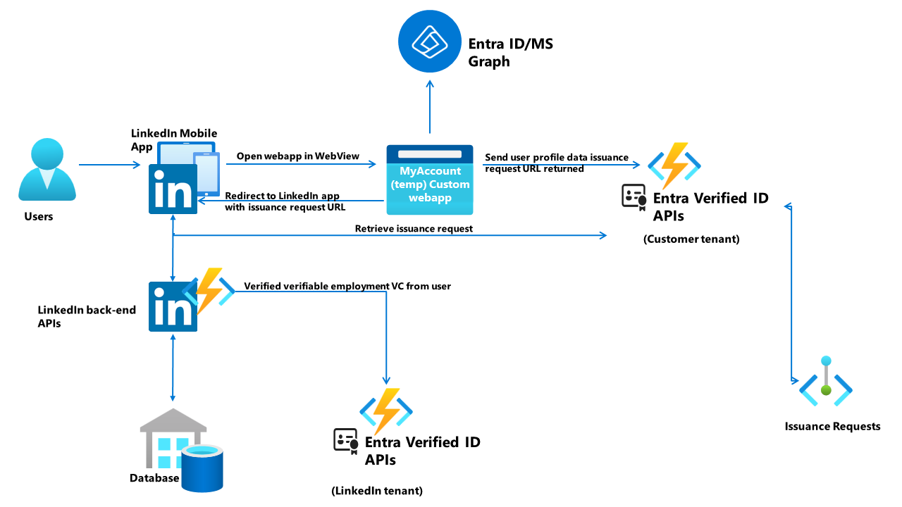

# LinkedIn employment verification

If your organization wants its employees get verified on LinkedIn, you need to follow these few steps:

1. Setup your Microsoft Entra Verified ID service by following these instructions.
2. [Create](how-to-use-quickstart-verifiedemployee.md#create-a-verified-employee-credential) a Verified ID Employee credential.
3. Enable the myaccount page for Verified Employee ID issuance (preview coming soon)
4. Configure the LinkedIn company page with your organization DID (decentralized identity) and URL of the myaccount page (default) or custom website.
5. Once the updated LinkedIn mobile app is deployed, your employees are able to get verified.

The initial version of myaccount allows an administrator to switch on/off the issuance of a verified employment id. In the future, an administrator can configure which users are allowed to get verified on LinkedIn. There is an alternative for the myaccount page by deploying a custom webapp.

## Deploying custom Webapp

Deploying this custom webapp from [GitHub](https://github.com/Azure-Samples/VerifiedEmployeeIssuance) allows an administrator to have control over who can get verified and change which information is shared with LinkedIn.
There are two reasons to deploy the custom webapp for the Linked Employment verification pilot.

1. You do not want to wait for the myaccount preview.
1. You need control over who can get verified on LinkedIn. The initial preview of myaccount will not allow an administrator to assign permissions. The webapp allows you to use user assignments to grant access.
1. You want more control over the issuance of the Verified Employee ID. By default, the Employee Verified ID contains a few claims:

   - firstname
   - lastname
   - displayname
   - jobtitle
   - upn
   - email
   - photo

>[!NOTE]
>The web app can be modified to remove claims, for example, you may choose to remove the photo claim.

Installation instructions for the Webapp can be found in the [GitHub repository](https://github.com/Azure-Samples/VerifiedEmployeeIssuance/blob/main/ReadmeFiles/Deployment.md)
Once the myaccount preview is available you can modify the LinkedIn company page information with the new URL and remove the Webapp.

## Architecture overview

The LinkedIn mobile app will be updated and will have a digital wallet for employment verifiable IDs. Once the administrator configures the company page on LinkedIn, employees can get verified. Below are the high-level steps for LinkedIn integration:

1. User starts the LinkedIn mobile app. 
1. The mobile app retrieves information from the LinkedIn backend and checks if the company is enabled for the pilot and it retrieves a URL to the myaccount website or the custom Webapp.
1. If the company is enabled, the user can tap on the verify employment link, and the user is sent to the myaccount website or Webapp in a web view.
1. The user needs to provide their corporate credentials to sign in.
1. The Webapp retrieves the user profile from Microsoft Graph including, ```firstname```, ```lastname```, ```displayname```, ```jobtitle```, ```upn```, ```email``` and ```photo``` and call the Microsoft Entra Verified ID service with the profile information.
1. The Microsoft Entra Verified ID service creates a verifiable credentials issuance request and returns the URL of that specific request.
1. The Webapp redirects back to the LinkedIn app with this specific URL.
1. LinkedIn app wallet communicates with the Microsoft Entra Verified ID services to get the Verified Employment VC issued in their wallet which is part of the LinkedIn mobile app.
1. The LinkedIn app then verifies the received verifiable credential.
1. If the verification is completed, they change the status to ‘verified’ in their backend system and is visible to other users of LinkedIn.
 
The diagram below shows the dataflow of the entire solution.




## Frequently asked questions

### Can I use Microsoft Authenticator to store my Employee Verified ID and use it to get verified on LinkedIn?

Currently the solution works through the embedded webview. In the future LinkedIn will allow us to use Microsoft authenticator or any compatible custom wallet to verify employment. The myaccount page will also be updated to allow issuance of the verified employee ID to Microsoft Authenticator.

### When will the myaccount page preview be released?

The first preview is expected end of April, the update which allows user assignments is expected in May. Sign up through the form to get notified.

### If I start with the Webapp, are my users impacted if I switch to the myaccount preview?

No, your verified users are still verified. Employees who go through the verification process are redirected to the myaccount page instead of the Webapp instead, there is no difference in the verification process.

### How do users sign-in?

The Webapp and the myaccount page are protected using Microsoft Entra Azure Active directory. Users sign-in according to the administrator's policy, either with passwordless, regular username and password, with or without MFA, etc. This is proof a user is allowed to get issued a verified employee ID.

### What happens when an employee leaves the organization?

Nothing by default. You can choose the revoke the Verified Employee ID but currently LinkedIn isn't checking for that status.

### What happens when my Verified Employee ID expires?

LinkedIn will ask you again to get verified, if you don’t, the verified checkmark will be removed from your profile.

### Can former employees use this feature to get verified?

Currently this option only verifies current employment.
