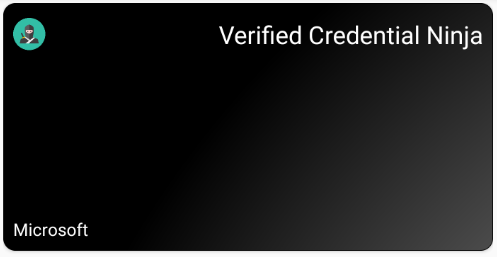

# Quickstart: Issue and Validate verifiable credentials using a sample app (Preview)

In this quickstart, we go over the steps needed to issue your first verifiable credential: a Verified Credential Ninja Card. You can then use this card to prove to a verifier that you are a Verified Credential Ninja, mastered in the art of digital credentialing. Get started with Azure Active Directory Verifiable Credentials by using the Verifiable Credentials sample app to issue your first verifiable credential.




> [!IMPORTANT]
> Azure Verifiable Credentials is currently in public preview.
> This preview version is provided without a service level agreement, and it's not recommended for production workloads. Certain features might not be supported or might have constrained capabilities. 
> For more information, see [Supplemental Terms of Use for Microsoft Azure Previews](https://azure.microsoft.com/support/legal/preview-supplemental-terms/).

## Prerequisites

- [Visual Studio Code](https://code.visualstudio.com/Download)
- A system to host our sample site.
- [NodeJS](https://nodejs.org/en/download/) version 10.14 or higher installed on our test system.
- You need [GIT](https://git-scm.com/downloads) installed If you want to clone the repository that hosts the sample app,
- A mobile device with Microsoft Authenticator version 6.2005.3599 or higher installed.
- [NGROK](https://ngrok.com/) free.

## Download the sample code

To issue yourself a Verified Credential Ninja Card, you'll need to run a website on your local machine. The website is used to initiate a verifiable credential issuance process. We've provided a simple website, written in NodeJS, that we'll use throughout this tutorial.

First, download our sample code from GitHub [here](https://github.com/Azure-Samples/active-directory-verifiable-credentials), or clone the repository to your local machine:

```cmd
git clone https://github.com/Azure-Samples/active-directory-verifiable-credentials.git
```

You may want to familiarize yourself with the code in the sample websites. The `issuer` folder contains all code used to issue a verifiable credential. More details are available in the sample's [readme](https://github.com/Azure-Samples/active-directory-verifiable-credentials).

## Run the issuer website

You can run the steps from within visual studio code or any other terminal available in your operating system. When you run the sample website, your device needs to communicate with the Node server running on your local machine. We recommend using [ngrok](https://ngrok.com/) as an easy way to make your local development server available over the internet.

1. After you download and extract **ngrok**, we need to run:

    ```cmd
    ngrok http 8081
    ```

    By default the sample website runs on port `8081`. **Ngrok** outputs two forwarding URLs for your server. Copy the URL with the `https://` prefix.


    

    >[!NOTE]
    > If you are using PowerShell you may need to type ```./ngrok``` for the command to be recognized.

    Now that your local port is exposed to the internet using ngrok, the sample site automatically uses the host name generated by ngrok. You're now ready to run the sample website and issue yourself a Verified Credential Ninja Card. 

2. Navigate to the `issuer` folder. 

    ```bash
    cd ./issuer
    ```

3. Once there we need to install all required packages and start the site.

   ```bash
    npm install
    node ./app.js
    ```

4. On your mobile device, open your browser and navigate to the ngrok forwarding URL. You should be able of successfully visiting the sample site's homepage. If the page opens, your device can communicate with the sample app running on your local server.

## Issue a credential

1. Install Authenticator on your mobile device. Microsoft Authenticator is used to receive, store, and present your verifiable credentials to interested parties.

2. Next, issue yourself a verifiable credential. The sample website displays a QR code, that you can be scan using Authenticator. The website also displays a deep link, which you can tap if you visit the website using your device's mobile browser.

    

3. Scan the website's QR code using Authenticator, or tap the website's deep link. To get your Ninja Card, you'll be prompted to sign in with your Credential Ninja account. After you are signed in, accept your Verified Credential Ninja Card.

Congratulations! You are now a verified credentialing Ninja. Now it is time to verify your credential.  

## Validate credentials

Now that you have completed the issuance portion of the quickstart and you have a verifiable credential in Authenticator, it is time to validate it in your own verifier app.

1. Stop running your issuer ngrok service.

    ```bash
    control-c
    ```

2. Now run ngrok with the verifier port 8082.

    ```bash
    .\ngrok http 8082
    ```

3. In another terminal window, open the Verifier app folder and run it similarly to how we ran the issuer app.

    ```bash
    cd ./verifier
    npm install
    node ./app.js
    ```

4. Open the ngrok forwarding url in your browser and tap on the button.

5. Open Authenticator in the Credentials tab and tap on the QR code icon.

    >[!IMPORTANT]
    >On iOS, it is the top right and on Android it is the bottom right. Scan the QR code and choose **Allow** on the new permission request screen in Authenticator.  

After a successful presentation three things should have been updated:

- The webpage should now display the attributes of your name "is a Verified Credential Ninja".
- Your verifier app terminal should also display the same message from the logs.
- In Authenticator, there should be an entry for recent activity of this presentation.

## Next steps

Now that you have successfully completed the quick start guide, it's time to create your own Decentralized identifier in the Azure AD verifiable credentials service and issue your own verifiable credential.

> [!div class="nextstepaction"]
> [Configure your own issuer using the verifiable credentials sample app](./tutorial-01-verifiable-credentials-issuer.md)