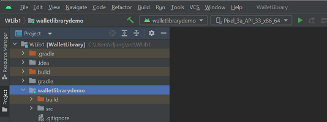
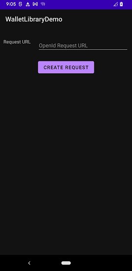
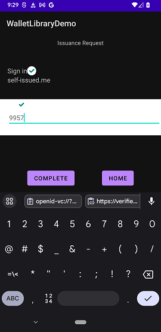
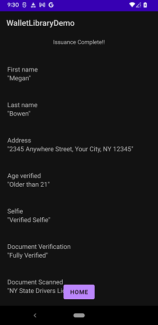
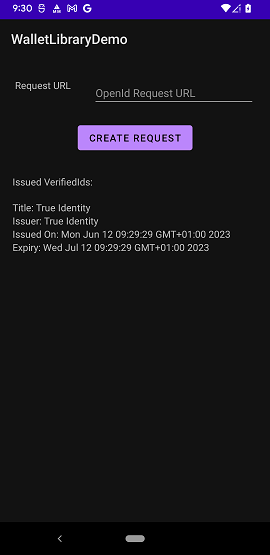
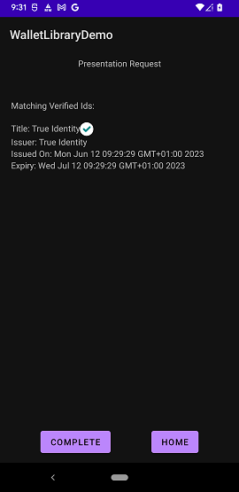
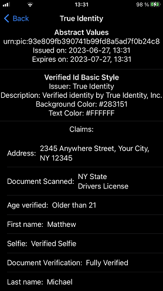
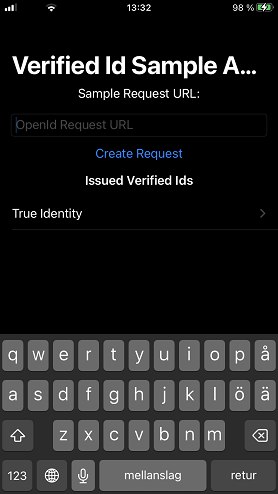

# Using the Wallet Library with Verified ID

[!INCLUDE [Verifiable Credentials announcement](../../../includes/verifiable-credentials-brand.md)]

In this tutorial, you learn how a mobile app can use the Microsoft Entra Wallet Library with Verified ID to issue and present verifiable credentials.

## Prerequisites

- [Android Studio](https://developer.android.com/studio) installed on Mac/Windows and an Android test device. You need to enable [developer mode](https://developer.android.com/studio/debug/dev-options) on your Android test device.
- An [Apple developer account](https://developer.apple.com/account/), Mac with [Xcode](https://developer.apple.com/xcode/) and an iOS test device with [developer mode](https://developer.apple.com/documentation/xcode/enabling-developer-mode-on-a-device) enabled. The iOS version needs to be 16 and above.
- Install the [QR Code Reader](https://apps.apple.com/us/app/qr-code-reader/id1200318119) app on your test device. The WalletLibraryDemo app does not come with the ability to scan QR codes, so you need the QR Code Reader app to scan the QR codes with.

You don't need to be a mobile developer to follow this tutorial and get the demo app up and running. The tools and a test device and the courage to try is all you need. You also do not need an Entra Verified ID tenant onboarded as you can test the demo app with our public end to end demo website.

## What is the Wallet Library?
The Microsoft Entra Wallet Library for iOS and Android gives your mobile app the ability to begin using the Microsoft Entra Verified ID platform by supporting the issuance and presentation of verifiable credentials in accordance with OpenID Connect, Presentation Exchange, Verifiable Credentials and more up and coming industry standards.

## When should I use the Wallet Library?
Microsoft Authenticator has all the functionality to act as the wallet for issuing and presenting credentials with Entra Verified ID, but in cases where you can’t or won’t use the Microsoft Authenticator, the Wallet Library is your alternative. This might be the case when you already have a mobile app that your users are familiar with and where it makes more sense to include verifiable credentials technology into this app. 

You can use the Microsoft Authenticator and a mobile app using the Wallet Library side-by-side on the same mobile device, but the Authenticator, if installed, will be the app that has registered the protocol handler for openid://, so your app needs to make sure that the issuance and presentation requests find your app. If your app scans QR codes, this will not be a problem, but embedding deep links in HTML-pages that relies on the openid:// protocol will result in the Microsoft Authenticator being launched. 

## Does Microsoft use the Wallet Library?
Yes, the Wallet Library is used by the Microsoft Authenticator. Some features may appear in the Authenticator first, but it is our ambition to make them available in the Wallet Library.

## What is the effort of adding the Wallet Library to my app?
Adding the Wallet Library to your mobile app project is as easy as adding a maven dependency for Android or adding a cocoapod dependency for iOS and adding some glue code. Then, you have to handle the following major tasks in your app.

- Getting the request URLs. The Wallet Library does not come with any functionality to scan a QR code or similar. Obtaining the request URL via methods like scanning a QR code must be added by you. 
- Storing the credentials. The Wallet Library creates the private and public key used for signing responses and stores this on the device, but it does not come with any functionality for storing credentials. You have to manage credential storage for your mobile app.
- User Interface. Any visual representation of stored credentials and the UI for driving the issuance and presentation process must be implemented by you. 

## Wallet Library Demo app
The Wallet Library comes with a demo app in the github repo that is ready to use without any modifications. You just have to build and deploy it. The demo app is a very lightweight and simple implementation that illustrates issuance and presentation at its minimum. To quickly get going, you can use the QR Code Reader app to scan the QR code and then copy and paste it into the demo app.

In order to test the demo app, you need a webapp that issues credentials and makes presentation requests for credentials. The [Woodgrove public demo webapp](https://aka.ms/vcdemo) is used for this purpose in this tutorial.

## Building the Android sample
On your developer machine with Android Studio, do the following:

1.	Download or clone the Android Wallet Library [github repo](https://github.com/microsoft/entra-verifiedid-wallet-library-android/archive/refs/heads/dev.zip). 
You don’t need the walletlibrary folder and you can delete it if you like.
1.	Start Android Studio and open the parent folder of walletlibrarydemo

    

1.	Select **Build** menu and then **Make Project**. This step will take some time. 
1.	Connect your Android test device via USB cable to your laptop
1.	Select your test device in Android Studio and click **run** button (green triangle)

## Issuing credentials using the Android sample
1.	Start the WalletLibraryDemo app

    

1.	On your laptop, launch the public demo website [https://aka.ms/vcdemo](https://aka.ms/vcdemo) and do the following
    1. Enter your First Name and Last Name and press **Next**
    1. Select **Verify with True Identity**
    1. Click **Take a selfie** and **Upload government issued ID**. The demo uses simulated data and you don't need to provide a real selfie or an ID. 
    1. Click **Next** and **OK**

1.	Scan the QR code with your QR Code Reader app on your test device, then copy the full URL displayed in the QR Code Reader app. Remember the pin code.
1.	Switch back to WalletLibraryDemo app and paste in the URL from the clipboard
1.	Press **CREATE REQUEST** button
1.	When the app has downloaded the request, it will show a screen like below. Click on the white rectangle, which is a textbox, and enter the pin code that is displayed in the browser page. Then click the **COMPLETE** button.

    

1.	Once issuance completes, the demo app will display the claims in the credential

       

## Presenting credentials using the Android sample
The sample app holds the issued credential in memory, so after issuance, you can use it for presentation.
1.	The WalletLibraryDemo app should display some credential details on the home screen if you have successfully issued a credential.

    

1.	In the Woodgrove demo in the browser, click **Return to Woodgrove** if you haven’t done so already and continue with step 3 **Access personalized portal**.
1.	Scan the QR code with the QR Code Reader app on your test device, then copy the full URL to the clipboard.
1.	Switch back to the WalletLibraryDemo app and paste in the URL and click **CREATE REQUEST** button
1.	The app will retrieve the presentation request and display the matching credentials you have in memory. In this case you only have one. **Click on it** so that the little check mark appears, then click the **COMPLETE** button to submit the presentation response

       
 
## Getting started on iOS
On your Mac developer machine with Xcode, do the following:
1.	Download or clone the iOS Wallet Library [github repo](https://github.com/microsoft/entra-verifiedid-wallet-library-ios/archive/refs/heads/dev.zip). 
1.	Start Xcode and open the top level folder for the WalletLibrary
1.	Set focus on WalletLibraryDemo project

      

1.	Change the Team ID to your [Apple Developer Team ID](https://developer.apple.com/help/account/manage-your-team/locate-your-team-id).
1.	Select Product menu and then **Build**. This step will take some time. 
1.	Connect your iOS test device via USB cable to your laptop
1.	Select your test device in Xcode
1.	Select Product menu and then **Run** or click on run triangle
 
### Issuing credentials using the iOS sample
1.	Start the WalletLibraryDemo app 

     
 
1.	On your laptop, launch the public demo website [https://aka.ms/vcdemo](https://aka.ms/vcdemo) and do the following
    1. Enter your First Name and Last Name and press **Next**
    1. Select **Verify with True Identity**
    1. Click **Take a selfie** and **Upload government issued ID**. The demo uses simulated data and you don't need to provide a real selfie or an ID. 
    1. Click **Next** and **OK**

1.	Scan the QR code with your QR Code Reader app on your test device, then copy the full URL displayed in the QR Code Reader app. Remember the pin code.
1.	Switch back to WalletLibraryDemo app and paste in the URL from the clipboard
1.	Press **Create Request** button
1.	When the app has downloaded the request, it will show a screen like below. Click on the **Add Pin** text to go to a screen where you can input the pin code, then click **Add** button to get back and finally click the **Complete** button.

    
   
1.	Once issuance completes, the demo app will display the claims in the credential.

       

### Presenting credentials using the iOS sample
The sample app holds the issued credential in memory, so after issuance, you can use it for presentation.
1.	The WalletLibraryDemo app should display credential type name on the home screen if you have successfully issued a credential.

    
 
1.	In the Woodgrove demo in the browser, click **Return to Woodgrove** if you haven’t done so already and continue with step 3 **Access personalized portal**.
1.	Scan the QR code with the QR Code Reader app on your test device, then copy the full URL to the clipboard.
1.	Switch back to the WalletLibraryDemo app, ***clear the previous request*** from the textbox, paste in the URL and click **Create Request** button
1.	The app will retrieve the presentation request and display the matching credentials you have in memory. In this case you only have one. **Click on it** so that the little check mark switches from blue to green, then click the **Complete** button to submit the presentation response

       
 
## Next steps

Learn how to [configure your tenant for Microsoft Entra Verified ID](verifiable-credentials-configure-tenant.md).
