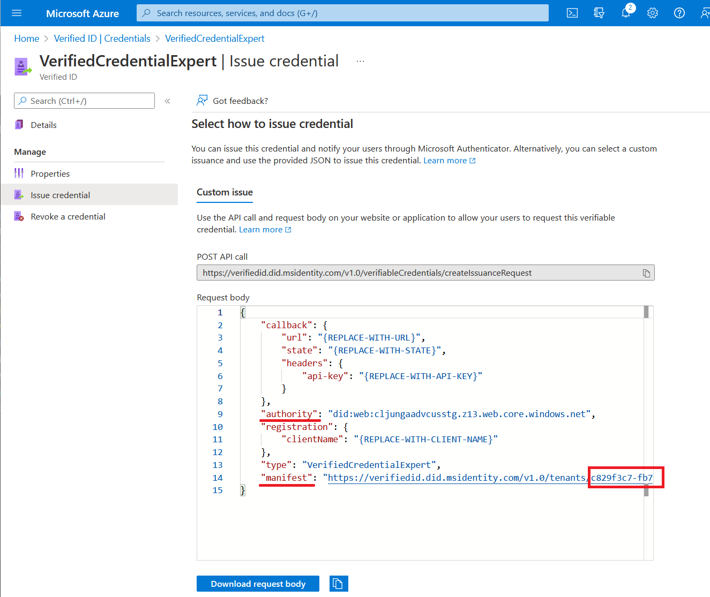
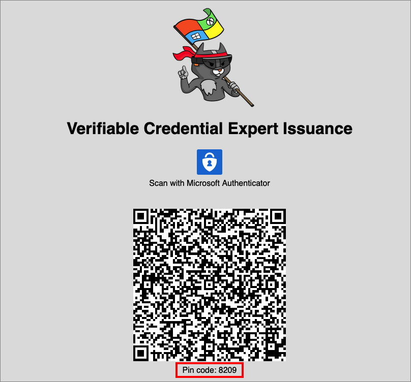
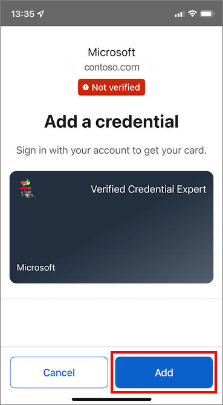

# Issue Microsoft Entra Verified ID credentials from an application

[!INCLUDE [Verifiable Credentials announcement](../../../includes/verifiable-credentials-brand.md)]

In this tutorial, you run a sample application from your local computer that connects to your Azure Active Directory (Azure AD) tenant. Using the application, you're going to issue and verify a verified credential expert card.

In this article, you learn how to:

> [!div class="checklist"]
>
> - Create the verified credential expert card in Azure.
> - Gather credentials and environment details to set up the sample application.
> - Download the sample application code to your local computer.
> - Update the sample application with your verified credential expert card and environment details.
> - Run the sample application and issue your first verified credential expert card.
> - Verify your verified credential expert card.

The following diagram illustrates the Microsoft Entra Verified ID architecture and the component you configure.


## Prerequisites

- [Set up a tenant for Microsoft Entra Verified ID](./verifiable-credentials-configure-tenant.md).
- To clone the repository that hosts the sample app, install [GIT](https://git-scm.com/downloads).
- [Visual Studio Code](https://code.visualstudio.com/Download), or similar code editor.
- [.NET 5.0](https://dotnet.microsoft.com/download/dotnet/5.0).
- Download [ngrok](https://ngrok.com/) and sign up for a free account. If you can't use `ngrok` in your organization, please read this [FAQ](verifiable-credentials-faq.md#i-can-not-use-ngrok-what-do-i-do).
- A mobile device with Microsoft Authenticator:
  - Android version 6.2206.3973 or later installed.
  - iOS version 6.6.2 or later installed.

## Create the verified credential expert card in Azure

In this step, you create the verified credential expert card by using Microsoft Entra Verified ID. After you create the credential, your Azure AD tenant can issue it to users who initiate the process.

1. Using the [Azure portal](https://portal.azure.com/), search for **Verified ID** and select it.
1. After you [set up your tenant](verifiable-credentials-configure-tenant.md), the **Create credential** should appear. Alternatively, you can select **Credentials** in the left hand menu and select **+ Add a credential**.
1. In **Create credential**, select **Custom Credential** and select **Next**:

    1. For **Credential name**, enter **VerifiedCredentialExpert**. This name is used in the portal to identify your verifiable credentials. It's included as part of the verifiable credentials contract.

    1. Copy the following JSON and paste it in the  **Display definition** textbox

    
```json
{
    "locale": "en-US",
    "card": {
      "title": "Verified Credential Expert",
      "issuedBy": "Microsoft",
      "backgroundColor": "#000000",
      "textColor": "#ffffff",
      "logo": {
        "uri": "https://didcustomerplayground.blob.core.windows.net/public/VerifiedCredentialExpert_icon.png",
        "description": "Verified Credential Expert Logo"
      },
      "description": "Use your verified credential to prove to anyone that you know all about verifiable credentials."
    },
    "consent": {
      "title": "Do you want to get your Verified Credential?",
      "instructions": "Sign in with your account to get your card."
    },
    "claims": [
      {
        "claim": "vc.credentialSubject.userName",
        "label": "User name",
        "type": "String"
      },
      {
        "claim": "vc.credentialSubject.displayName",
        "label": "Display name",
        "type": "String"
      },
      {
        "claim": "vc.credentialSubject.firstName",
        "label": "First name",
        "type": "String"
      },
      {
        "claim": "vc.credentialSubject.lastName",
        "label": "Last name",
        "type": "String"
      }
    ]
}
```

   1. Copy the following JSON and paste it in the  **Rules definition** textbox


    ```json
    {
      "attestations": {
        "idTokens": [
          {
            "clientId": "8d5b446e-22b2-4e01-bb2e-9070f6b20c90",
            "configuration": "https://didplayground.b2clogin.com/didplayground.onmicrosoft.com/B2C_1_sisu/v2.0/.well-known/openid-configuration",
            "redirectUri": "vcclient://openid",
            "scope": "openid profile email",
            "mapping": [
              {
                "outputClaim": "userName",
                "required": true,
                "inputClaim": "$.upn",
                "indexed": false
              },
              {
                "outputClaim": "displayName",
                "required": true,
                "inputClaim": "$.name",
                "indexed": false
              },
              {
                "outputClaim": "firstName",
                "required": true,
                "inputClaim": "$.given_name",
                "indexed": false
              },
              {
                "outputClaim": "lastName",
                "required": true,
                "inputClaim": "$.family_name",
                "indexed": true
              }
            ],
            "required": false
          }
        ]
      },
      "validityInterval": 2592000,
      "vc": {
        "type": [
          "VerifiedCredentialExpert"
        ]
      }
    }
    ```

   1. Select **Create**.

The following screenshot demonstrates how to create a new credential:

  

## Gather credentials and environment details

Now that you have a new credential, you're going to gather some information about your environment and the credential that you created. You use these pieces of information when you set up your sample application.

1. In Verifiable Credentials, select **Issue credential**. 

    

1. Copy the **authority**, which is the Decentralized Identifier, and record it for later.

1. Copy the **manifest** URL. It's the URL that Authenticator evaluates before it displays to the user verifiable credential issuance requirements. Record it for later use.

1. Copy your **Tenant ID**, and record it for later. The Tenant ID is the guid in the manifest URL highlighted in red above.

## Download the sample code

The sample application is available in .NET, and the code is maintained in a GitHub repository. Download the sample code from [GitHub](https://github.com/Azure-Samples/active-directory-verifiable-credentials-dotnet), or clone the repository to your local machine:


```
git clone https://github.com/Azure-Samples/active-directory-verifiable-credentials-dotnet.git
```

## Configure the verifiable credentials app

Create a client secret for the registered application that you created. The sample application uses the client secret to prove its identity when it requests tokens.

1. Go to the **App registrations** page that is located inside **Azure Active Directory**.

1. Select the **verifiable-credentials-app** application you created earlier.

1. Select the name to go into the registration details.

1. Copy the **Application (client) ID**, and store it for later.  

     

1. From the main menu, under **Manage**, select **Certificates & secrets**.

1. Select **New client secret**, and do the following:

    1. In **Description**, enter a description for the client secret (for example, **vc-sample-secret**).

    1. Under **Expires**, select a duration for which the secret is valid (for example, six months). Then select **Add**.

    1. Record the secret's **Value**. You'll use this value for configuration in a later step. The secret’s value won't be displayed again, and isn't retrievable by any other means. Record it as soon as it's visible.

At this point, you should have all the required information that you need to set up your sample application.

## Update the sample application

Now you'll make modifications to the sample app's issuer code to update it with your verifiable credential URL. This step allows you to issue verifiable credentials by using your own tenant.

1. Under the *active-directory-verifiable-credentials-dotnet-main* folder, open Visual Studio Code, and select the project inside the *1-asp-net-core-api-idtokenhint* folder.

1. Under the project root folder, open the *appsettings.json* file. This file contains information about your Microsoft Entra Verified ID environment. Update the following properties with the information that you recorded in earlier steps:

    1. **Tenant ID:** your tenant ID
    1. **Client ID:** your client ID
    1. **Client Secret**: your client secret
    1. **IssuerAuthority**: Your Decentralized Identifier
    1. **VerifierAuthority**: Your Decentralized Identifier
    1. **Credential Manifest**: Your manifest URL

1. Save the *appsettings.json* file.

The following JSON demonstrates a complete *appsettings.json* file:

```json
{
  "AppSettings": {
    "Endpoint": "https://verifiedid.did.msidentity.com/v1.0",
    "VCServiceScope": "3db474b9-6a0c-4840-96ac-1fceb342124f/.default",
    "Instance": "https://login.microsoftonline.com/{0}",
    "TenantId": "12345678-0000-0000-0000-000000000000",
    "ClientId": "33333333-0000-0000-0000-000000000000",
    "ClientSecret": "123456789012345678901234567890",
    "CertificateName": "[Or instead of client secret: Enter here the name of a certificate (from the user cert store) as registered with your application]",
    "IssuerAuthority": "did:web:example.com...",
    "VerifierAuthority": "did:web:example.com...",
    "CredentialManifest":  "https://verifiedid.did.msidentity.com/v1.0/12345678-0000-0000-0000-000000000000/verifiableCredential/contracts/VerifiedCredentialExpert"
  }
}
```

## Issue your first verified credential expert card

Now you're ready to issue your first verified credential expert card by running the sample application.

1. From Visual Studio Code, run the *Verifiable_credentials_DotNet* project. Or, from your operating system's command line, run:

    ```
    cd active-directory-verifiable-credentials-dotnet/1-asp-net-core-api-idtokenhint
    dotnet build "AspNetCoreVerifiableCredentials.csproj" -c Debug -o .\\bin\\Debug\\netcoreapp3.
    dotnet run
    ```

1. In another command prompt window, run the following command. This command runs [ngrok](https://ngrok.com/) to set up a URL on 5000, and make it publicly available on the internet.

    ```
    ngrok http 5000
    ```

    >[!NOTE]
    > On some computers, you might need to run the command in this format: `./ngrok http 3000`.

1. Open the HTTPS URL generated by ngrok.

     

1. From a web browser, select **Get Credential**.

     

1. Using your mobile device, scan the QR code with the Authenticator app. You can also scan the QR code directly from your camera, which will open the Authenticator app for you.

    

1. At this time, you'll see a message warning that this app or website might be risky. Select **Advanced**.

     

1. At the risky website warning, select **Proceed anyways (unsafe)**. You're seeing this warning because your domain isn't linked to your decentralized identifier (DID). To verify your domain, follow [Link your domain to your decentralized identifier (DID)](how-to-dnsbind.md). For this tutorial, you can skip the domain registration, and select **Proceed anyways (unsafe).**

     

1. You'll be prompted to enter a PIN code that is displayed in the screen where you scanned the QR code. The PIN adds an extra layer of protection to the issuance. The PIN code is randomly generated every time an issuance QR code is displayed.

     

1. After you enter the PIN number, the **Add a credential** screen appears. At the top of the screen, you see a **Not verified** message (in red). This warning is related to the domain validation warning mentioned earlier.

1. Select **Add** to accept your new verifiable credential.

    

Congratulations! You now have a verified credential expert verifiable credential.

  

Go back to the sample app. It shows you that a credential successfully issued.

  

## Verify the verified credential expert card

Now you are ready to verify your verified credential expert card by running the sample application again.

1. Hit the back button in your browser to return to the sample app home page.

1. Select **Verify credentials**.  

   

1. Using the authenticator app, scan the QR code, or scan it directly from your mobile camera.

1. When you see the warning message, select **Advanced**. Then select **Proceed anyways (unsafe)**.

1. Approve the presentation request by selecting **Allow**.

    

1. After you approve the presentation request, you can see that the request has been approved. You can also check the log. To see the log, select the verifiable credential.  

    

1. Then select **Recent Activity**.  

    

1. You can now see the recent activities of your verifiable credential.

    

1. Go back to the sample app. It shows you that the presentation of the verifiable credentials was received.  
    

## Verifiable credential names 

Your verifiable credential contains **Megan Bowen** for the first name and last name values in the credential. These values were hardcoded in the sample application, and were added to the verifiable credential at the time of issuance in the payload. 

In real scenarios, your application pulls the user details from an identity provider. The following code snippet shows where the name is set in the sample application. 

```csharp
//file: IssuerController.cs
[HttpGet("/api/issuer/issuance-request")]
public async Task<ActionResult> issuanceRequest()
  {
    ...

    // Here you could change the payload manifest and change the first name and last name.
    payload["issuance"]["claims"]["given_name"] = "Megan";
    payload["issuance"]["claims"]["family_name"] = "Bowen";
    ...
}
  ```

## Next steps

In the [next step](verifiable-credentials-configure-verifier.md), learn how a third-party application, also known as a relying party application, can verify your credentials with its own Azure AD tenant verifiable credentials API service.
