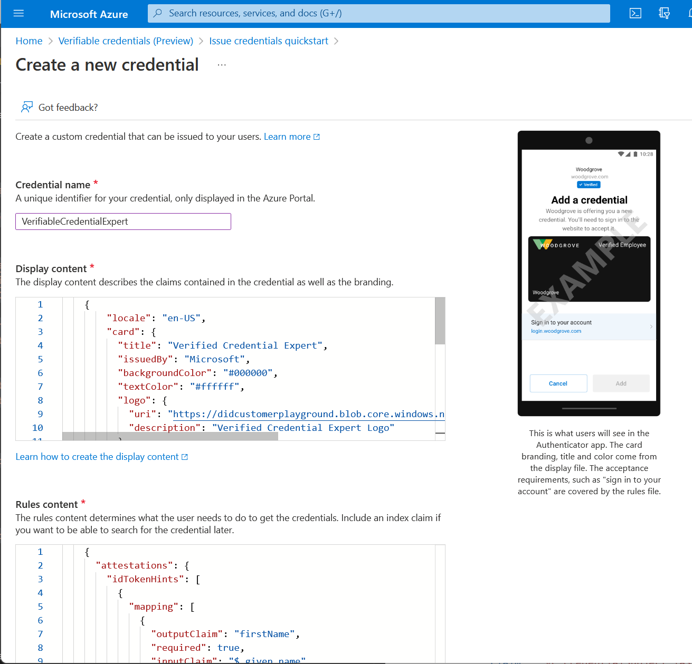
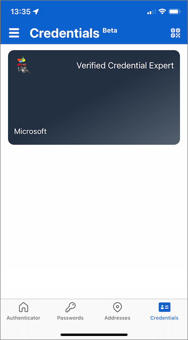
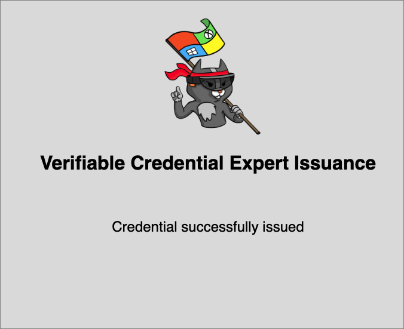

# Issue Azure AD Verifiable Credentials from an application (preview)

In this tutorial, you run a sample application from your local computer that connects to your Azure Active Directory (Azure AD) tenant. Using the application, you're going to issue and verify a verified credentials expert card.

In this article, you learn how to:

> [!div class="checklist"]
>
> - Set up Azure Blob Storage for storing your Azure AD Verifiable Credentials configuration files.
> - Create and upload your Verifiable Credentials configuration files.
> - Create the verified credential expert card in Azure.
> - Gather credentials and environment details to set up the sample application.
> - Download the sample application code to your local computer.
> - Update the sample application with your verified credentials expert card and environment details.
> - Run the sample application and issue your first verified credentials expert card.
> - Verify your verified credentials expert card.

The following diagram illustrates the Azure AD Verifiable Credentials architecture and the component you configure.


## Prerequisites

- [Set up a tenant for Azure AD Verifiable Credentials](./verifiable-credentials-configure-tenant.md).
- To clone the repository that hosts the sample app, install [GIT](https://git-scm.com/downloads).
- [Visual Studio Code](https://code.visualstudio.com/Download), or similar code editor.
- [.NET 5.0](https://dotnet.microsoft.com/download/dotnet/5.0).
- [ngrok](https://ngrok.com/) (free).
- A mobile device with Microsoft Authenticator:
  - Android version 6.2108.5654 or later installed.
  - iOS version 6.5.82 or later installed.

## Create a storage account

Azure Blob Storage is an object storage solution for the cloud. Azure AD Verifiable Credentials uses [Azure Blob Storage](../../storage/blobs/storage-blobs-introduction.md) to store the configuration files when the service is issuing verifiable credentials.

Create and configure Blob Storage by following these steps:

1. If you don't have an Azure Blob Storage account, [create one](../../storage/common/storage-account-create.md).
1. After you've created the storage account, create a container. In the left menu for the storage account, scroll to the **Data storage** section, and select **Containers**.
1. Select **+ Container**.
1. Type a name for your new container. The container name must be lowercase, must start with a letter or number, and can include only letters, numbers, and the dash (-) character. For example, *vc-container*.
1. Set **Public access level** to **Private** (no anonymous access).
1. Select **Create**.  

   

## Grant access to the container

After you create your container, grant the signed-in user the correct role assignment so they can access the files in Blob Storage.

1. From the list of containers, select **vc-container**.

1. From the menu, select **Access Control (IAM)**.

1. Select **+ Add,** and then select **Add role assignment**

     

1. In **Add role assignment**:

    1. For the **Role**, select **Storage Blob Data Reader**.

    1. For the **Assign access to**, select **User, group, or service
        principal**.

    1. Then, search the account that you're using to perform these steps, and
        select it.

        

>[!IMPORTANT]
>By default, container creators get the owner role assigned. The owner role isn't enough on its own. Your account needs the storage blob data reader role. For more information, see [Use the Azure portal to assign an Azure role for access to blob and queue data](../../storage/blobs/assign-azure-role-data-access.md).

### Upload the configuration files

Azure AD Verifiable Credentials uses two JSON configuration files, the rules file and the display file. 

- The *rules* file describes important properties of verifiable credentials. In particular, it describes the claims that subjects (users) need to provide before a verifiable credential is issued for them. 
- The *display* file controls the branding of the credential and styling of the claims.

In this section, you upload sample rules and display files to your storage. For more information, see [How to customize your verifiable credentials](credential-design.md).

To upload the configuration files, follow these steps:

1. Copy the following JSON, and save the content into a file called *VerifiedCredentialExpertDisplay.json*.

    ```json
    {
      "default": {
        "locale": "en-US",
        "card": {
          "title": "Verified Credential Expert",
          "issuedBy": "Microsoft",
          "backgroundColor": "#2E4053",
          "textColor": "#ffffff",
          "logo": {
            "uri": "https://didcustomerplayground.blob.core.windows.net/public/VerifiedCredentialExpert_icon.png",
            "description": "Verified Credential Expert Logo"
          },
          "description": "Use your verified credential to prove to anyone that you know all about verifiable credentials."
        },
        "consent": {
          "title": "Do you want to get your Verified Credential?",
          "instructions": "Sign in with your account to get your card."
        },
        "claims": {
          "vc.credentialSubject.firstName": {
            "type": "String",
            "label": "First name"
          },
          "vc.credentialSubject.lastName": {
            "type": "String",
            "label": "Last name"
          }
        }
      }
    }
    ```

1. Copy the following JSON, and save the content into a file called *VerifiedCredentialExpertRules.json*. The following verifiable credential defines a couple of simple claims in it: `firstName` and `lastName`.

    ```json
    {
      "attestations": {
        "idTokens": [
          {
            "id": "https://self-issued.me",
            "mapping": {
              "firstName": { "claim": "$.given_name" },
              "lastName": { "claim": "$.family_name" }
            },
            "configuration": "https://self-issued.me",
            "client_id": "",
            "redirect_uri": ""
          }
        ]
      },
      "validityInterval": 2592001,
      "vc": {
        "type": [ "VerifiedCredentialExpert" ]
      }
    }
    ```
    
1. In the Azure portal, go to the Azure Blob Storage container that [you created](#create-a-storage-account).

1. In the left menu, select **Containers** to show a list of blobs it contains. Then select the **vc-container** that you created earlier.

1. Select **Upload** to open the upload pane and browse your local file system to find a file to upload. Select the **VerifiedCredentialExpertDisplay.json** and **VerifiedCredentialExpertRules.json** files. Then select **Upload** to upload the files to your container.

## Create the verifiable credential expert card in Azure

In this step, you create the verifiable credential expert card by using Azure AD Verifiable Credentials. After creating a verified credential, your Azure AD tenant can issue this credential to users who initiate the process.

1. Using the [Azure portal](https://portal.azure.com/), search for *verifiable credentials*. Then select **Verifiable Credentials (Preview)**.
1. After you [set up your tenant](verifiable-credentials-configure-tenant.md), the **Create a new credential** window should appear. If it’s not opened, or you want to create more credentials, in the left menu, select **Credentials**. Then select **+ Credential**.
1. In **Create a new credential**, do the following:

    1. For **Name**, enter **VerifiedCredentialExpert**. This name is used in the portal to identify your verifiable credentials. It's included as part of the verifiable credentials contract.

    1. For **Subscription**, select your Azure AD subscription where you created Blob Storage.

    1. Under the **Display file**, select **Select display file**. In the Storage accounts section, select **vc-container**. Then select the **VerifiedCredentialExpertDisplay.json** file and click **Select**.

    1. Under the **Rules file**, **Select rules file**. In the Storage accounts section, select the **vc-container**. Then select the **VerifiedCredentialExpertRules.json** file, and choose **Select**.

    1. Select **Create**.    

The following screenshot demonstrates how to create a new credential:

  

## Gather credentials and environment details

Now that you have a new credential, you're going to gather some information about your environment and the credential that you created. You use these pieces of information when you set up your sample application.

1. In Verifiable Credentials, select **Credentials**. From the list of credentials, select **VerifiedCredentialExpert**, which you created earlier.

    

1. Copy the **Issue Credential URL**. This URL is the combination of the rules and display files. It's the URL that Authenticator evaluates before it displays to the user verifiable credential issuance requirements. Record it for later use.

1. Copy the **Decentralized identifier**, and record it for later.

1. Copy your **Tenant ID**, and record it for later.

   

## Download the sample code

The sample application is available in .NET, and the code is maintained in a GitHub repository. Download the sample code from [GitHub](https://github.com/Azure-Samples/active-directory-verifiable-credentials-dotnet), or clone the repository to your local machine:


```bash
git clone git@github.com:Azure-Samples/active-directory-verifiable-credentials-dotnet.git
```

## Configure the verifiable credentials app

Create a client secret for the registered application that you created. The sample application uses the client secret to prove its identity when it requests tokens.

1. Go to the **App registrations** page that is located inside **Azure Active Directory**.

1. Select the **verifiable-credentials-app** application you created earlier.

1. Select the name to go into the registration details.

1. Copy the **Application (client) ID**, and store it for later.  

     

1. From the main menu, under **Manage**, select **Certificates & secrets**.

1. Select **New client secret**, and do the following:

    1. In **Description**, enter a description for the client secret (for example, **vc-sample-secret**).

    1. Under **Expires**, select a duration for which the secret is valid (for example, six months). Then select **Add**.

    1. Record the secret's **Value**. You'll use this value for configuration in a later step. The secret’s value won't be displayed again, and isn't retrievable by any other means. Record it as soon as it's visible.

At this point, you should have all the required information that you need to set up your sample application.

## Update the sample application

Now you'll make modifications to the sample app's issuer code to update it with your verifiable credential URL. This step allows you to issue verifiable credentials by using your own tenant.

1. Under the *active-directory-verifiable-credentials-dotnet-main* folder, open Visual Studio Code, and select the project inside the *1.asp-net-core-api-idtokenhint* folder.

1. Under the project root folder, open the *appsettings.json* file. This file contains information about your Azure AD Verifiable Credentials. Update the following properties with the information that you recorded in earlier steps:

    1. **Tenant ID:** your tenant ID
    1. **Client ID:** your client ID
    1. **Client Secret**: your client secret
    1. **IssuerAuthority**: Your decentralized identifier
    1. **VerifierAuthority**: Your decentralized identifier
    1. **Credential Manifest**: Your issue credential URL

1. Save the *appsettings.json* file.

The following JSON demonstrates a complete *appsettings.json* file:

```json
{
  "AppSettings": {
    "Endpoint": "https://beta.did.msidentity.com/v1.0/{0}/verifiablecredentials/request",
    "VCServiceScope": "bbb94529-53a3-4be5-a069-7eaf2712b826/.default",
    "Instance": "https://login.microsoftonline.com/{0}",

    "TenantId": "12345678-0000-0000-0000-000000000000",
    "ClientId": "33333333-0000-0000-0000-000000000000",
    "ClientSecret": "123456789012345678901234567890",
    "CertificateName": "[Or instead of client secret: Enter here the name of a certificate (from the user cert store) as registered with your application]",
    "IssuerAuthority": "did:ion:EiCcn9dz_OC6HY60AYBXF2Dd8y5_2UYIx0Ni6QIwRarjzg:eyJkZWx0YSI6eyJwYXRjaGVzIjpbeyJhY3Rpb24iOiJyZXBsYWNlIiwiZG9jdW1lbnQiOnsicHVibGljS2V5cyI6W3siaWQiOiJzaWdfN2U4MmYzNjUiLCJwdWJsaWNLZXlKd2siOnsiY3J2Ijoic2VjcDI1NmsxIiwia3R5IjoiRUMiLCJ4IjoiaUo0REljV09aWVA...",
    "VerifierAuthority": " did:ion:EiCcn9dz_OC6HY60AYBXF2Dd8y5_2UYIx0Ni6QIwRarjzg:eyJkZWx0YSI6eyJwYXRjaGVzIjpbeyJhY3Rpb24iOiJyZXBsYWNlIiwiZG9jdW1lbnQiOnsicHVibGljS2V5cyI6W3siaWQiOiJzaWdfN2U4MmYzNjUiLCJwdWJsaWNLZXlKd2siOnsiY3J2Ijoic2VjcDI1NmsxIiwia3R5IjoiRUMiLCJ4IjoiaUo0REljV09aWVA...",
    "CredentialManifest":  "https://beta.did.msidentity.com/v1.0/12345678-0000-0000-0000-000000000000/verifiableCredential/contracts/VerifiedCredentialExpert"
  }
}
```

## Issue your first verified expert card

Now you're ready to issue your first verified expert card by running the sample application.

1. From Visual Studio Code, run the *Verifiable_credentials_DotNet* project. Or, from the command shell, run the following commands:

    ```bash
    cd active-directory-verifiable-credentials-dotnet/1. asp-net-core-api-idtokenhint  dotnet build "asp-net-core-api-idtokenhint.csproj" -c Debug -o .\\bin\\Debug\\netcoreapp3.  dotnet run
    ```

1. In another terminal, run the following command. This command runs [ngrok](https://ngrok.com/) to set up a URL on 3000, and make it publicly available on the internet.

    ```bash
    ngrok http 3000
    ```

    >[!NOTE]
    > On some computers, you might need to run the command in this format: `./ngrok http 3000`.

1. Open the HTTPS URL generated by ngrok.

     

1. From a web browser, select **Get Credential**.

     

1. Using your mobile device, scan the QR code with the Authenticator app. You can also scan the QR code directly from your camera, which will open the Authenticator app for you.

    

1. At this time, you will see a message warning that this app or website might be risky. Select **Advanced**.

     

1. At the risky website warning, select **Proceed anyways (unsafe)**. You're seeing this warning because your domain isn't linked to your decentralized identifier (DID). To verify your domain, follow the guidance in [Link your domain to your decentralized identifier (DID)](how-to-dnsbind.md). For this tutorial, you can skip the domain registration, and select **Proceed anyways (unsafe).**

     

1. You will be prompted to enter a PIN code that is displayed in the screen where you scanned the QR code. The PIN adds an extra layer of protection to the issuance. The PIN code is randomly generated every time an issuance QR code is displayed.

     

1. After entering the PIN number, the **Add a credential** screen appears. At the top of the screen, you see a **Not verified** message (in red). This warning is related to the domain validation warning mentioned earlier.

1. Select **Add** to accept your new verifiable credential.

    

Congratulations! You now have a verified credential expert verifiable credential.

  

Go back to the sample app. It shows you that a credential successfully issued.

  

## Verify the verified expert card

Now you are ready to verify your verified expert card by running the sample application again.

1. Hit the back button in your browser to return to the sample app home page.

1. Select **Verify credentials**.  

   

1. Using the authenticator app, scan the QR code, or scan it directly from your mobile camera.

1. When you see the warning message, select **Advanced**. Then select **Proceed anyways (unsafe)**.

1. Approve the presentation request by selecting **Allow**.

    

1. After you approve the presentation request, you can see that the request has been approved. You can also check the log. To see the log, select the verifiable credential.  

    

1. Then select **Recent Activity**.  

    

1. You can now see the recent activities of your verifiable credential.

    

1. Got back to the sample app. It shows you that the presentation of the verifiable credentials was received.  
    

## Verifiable credential names 

Your verifiable credential contains **Megan Bowen** for the first name and last name values in the credential. These values were hardcoded in the sample application, and were added to the verifiable credential at the time of issuance in the payload. 

In real scenarios, your application pulls the user details from an identity provider. The following code snippet shows where the name is set in the sample application. 

```csharp
//file: IssuerController.cs
[HttpGet("/api/issuer/issuance-request")]
public async Task<ActionResult> issuanceRequest()
  {
    ...

    // Here you could change the payload manifest and change the first name and last name.
    payload["issuance"]["claims"]["given_name"] = "Megan";
    payload["issuance"]["claims"]["family_name"] = "Bowen";
    ...
}
  ```

## Next steps

Learn how a third-party application, also known as a relying party application, can verify your credentials with their own Azure AD tenant verifiable credentials API service. See [Configure Azure AD Verifiable Credentials verifier (preview)](verifiable-credentials-configure-verifier.md).

