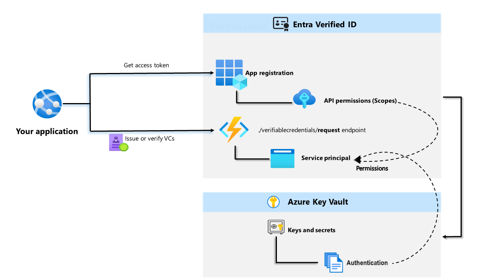
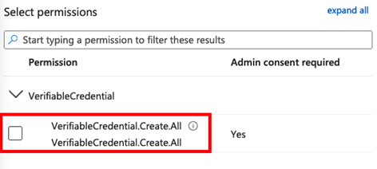
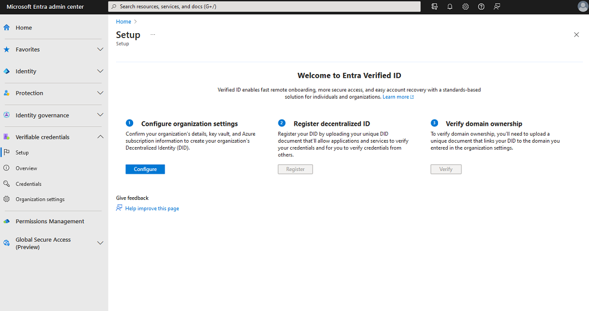

# Configure your tenant for Azure AD Verifiable Credentials (preview)

Azure Active Directory (Azure AD) Verifiable Credentials safeguards your organization with an identity solution that's seamless and decentralized. The service allows you to issue and verify credentials. For issuers, Azure AD provides a service that they can customize and use to issue their own verifiable credentials. For verifiers, the service provides a free REST API that makes it easy to request and accept verifiable credentials in your apps and services.

In this tutorial, you learn how to configure your Azure AD tenant so it can use this credentials service.

Specifically, you learn how to:

> [!div class="checklist"]
>
> - Set up a service principal
> - Create a key vault in Azure Key Vault
> - Register an application in Azure AD
> - Set up the Verifiable Credentials service

The following diagram illustrates the Azure AD Verifiable Credentials architecture and the component you configure.



See a [video walkthrough](https://www.youtube.com/watch?v=8jqjHjQo-3c) of setting up the Azure AD Verifiable Credential service, including all prerequisites, like Azure AD and an Azure subscription.

## Prerequisites

- If you don't have Azure subscription, [create one for free](https://azure.microsoft.com/free/?WT.mc_id=A261C142F).
- Sign up for [Azure Active Directory Premium editions](../../active-directory/fundamentals/active-directory-get-started-premium.md)
subscription in your tenant.
- Ensure that you have the [global administrator](../../active-directory/roles/permissions-reference.md#global-administrator) permission for the directory you want to configure.
- Ensure that you have [PowerShell](/powershell/scripting/install/installing-powershell) 7.0.6 LTS-x64, PowerShell 7.1.3-x64, or later installed.

## Set up a service principal

Create a service principal for the Request Service API. The service API is the Microsoft service that you use to issue or verify Azure AD Verifiable Credentials.

To create the service principal:

1. Run the following PowerShell commands. These commands install and import the `AzureAD` module. For more information, see [Install the Azure Az PowerShell module](/powershell/azure/install-az-ps#installation).

    ```powershell
    if ((Get-Module -ListAvailable -Name "AzureAD") -eq $null) {  Install-Module "AzureAD" -Scope CurrentUser }  Import-Module AzureAD
    ```

1. Run the following PowerShell command to connect to your Azure AD tenant. Replace \<*your-tenant-ID*> with your [Azure AD tenant ID](../../active-directory/fundamentals/active-directory-how-to-find-tenant.md).

    ```powershell
    Connect-AzureAD -TenantId <your-tenant-ID>
    ```

1. Run the following command in the same PowerShell session. The `AppId` `bbb94529-53a3-4be5-a069-7eaf2712b826` refers to the Verifiable Credentials Microsoft service.

    ```powershell
    New-AzureADServicePrincipal -AppId "bbb94529-53a3-4be5-a069-7eaf2712b826" -DisplayName "Verifiable Credential Request Service" 
    ```

## Create a key vault

[Azure Key Vault](../../key-vault/general/basic-concepts.md) is a cloud service that enables the secure storage and access of secrets and keys. Your Verifiable
Credentials service stores public and private keys in Azure Key Vault. These keys are used to sign and verify credentials.

If you don't have an instance of Azure Key Vault, follow these steps to create a key vault by using the Azure portal.

>[!NOTE]
>By default, the account that creates the key vault is the only one with access. The Verifiable Credentials service needs access to the key vault. You must configure the key vault with an access policy that allows the account used during configuration to create and delete keys. The account used during configuration also requires permission to sign to create the domain binding for Verifiable Credentials. If you use the same account while testing, modify the default policy to grant the account sign permission, in addition to the default permissions granted to vault creators.

### Set access policies for the key vault

After you create your key vault, Verifiable Credentials generates a set of keys used to provide message security. These keys are stored in Key Vault. You use a key set for signing, updating, and recovering verifiable credentials.

A Key Vault [access policy](../../key-vault/general/assign-access-policy.md) defines whether a specified security principal can perform operations on Key Vault secrets and keys. Set access policies in your key vault for both the administrator account of the Azure AD Verifiable Credentials service, and for the Request Service API principal that you created.

1. In the [Azure portal](https://portal.azure.com/), go to the key vault you use for this tutorial.

1. Under **Settings**, select **Access policies**.

1. In **Add access policies**, under **USER**, select the account you use to follow this tutorial.

1. For **Key permissions**, verify that the following permissions are selected: **Create**, **Delete**, and **Sign**. By default, **Create** and **Delete** are already enabled. **Sign** should be the only key permission you need to update.

    

1. To save the changes, select **Save**.

1. Select **+ Add Access Policy** to add permission to the service principal of the **Verifiable Credential Request Service**.

1. In **Add access policy**:

    1. For **Key permissions**, select **Get** and **Sign**.

    1. For **Secret permissions**, select **Get**.

    1. For **Select principal**, select **Verifiable Credential Request Service**.

    1. Select **Add**.  
        
       

1. Select **Save** to save the new policy you created.

## Register an application in Azure AD

Azure AD Verifiable Credentials Request Service needs to be able to get access tokens to issue and verify. To get access tokens, register a web application and grant API permission for the API Verifiable Credential Request Service that you set up in the previous step.

1. Sign in to the [Azure portal](https://portal.azure.com/) with your administrative account.

1. If you have access to multiple tenants, select the **Directory + subscription** :::image type="icon" source="media/verifiable-credentials-configure-tenant/portal-directory-subscription-filter.png" border="false"::: icon. Then, search for and select your **Azure Active Directory**.

1. Under **Manage**, select **App registrations** > **New registration**.  

   

1. Enter a display name for your application. For example: *verifiable-credentials-app*.

1. For **Supported account types**, select **Accounts in this organizational directory only (Default Directory only - Single tenant)**.

1. Select **Register** to create the application.

   

### Grant permissions to get access tokens

In this step, you grant permissions to the Verifiable Credential Request Service principal created in [step 1](#set-up-a-service-principal).

To add the required permissions, follow these steps:

1. Stay in the **verifiable-credentials-app** application details page. Select **API permissions** > **Add a permission**.
    
    

1. Select **APIs my organization uses**.

1. Search for the service principal that you created earlier, **Verifiable Credential Request Service**, and select it.
    
    

1. Choose **Application Permission**, and expand **VerifiableCredential.Create.All**.

    

1. Select **Add permissions**.

1. Select **Grant admin consent for \<your tenant name\>**.

## Set up Verifiable Credentials 

To set up Azure AD Verifiable Credentials, follow these steps:

1. In the [Azure portal](https://portal.azure.com/), search for *verifiable credentials*. Then, select **Verifiable Credentials (Preview)**.

1. From the left menu, select **Getting started**.

1. Set up your organization by providing the following information:

    1. **Organization name**: Enter a name to reference your business within Verifiable Credentials. Your customers don't see this name.

    1. **Domain**: Enter a domain that's added to a service endpoint in your decentralized identity (DID) document. The domain is what binds your DID to something tangible that the user might know about your business. Microsoft Authenticator and other digital wallets use this information to validate that your DID is linked to your domain. If the wallet can verify the DID, it displays a verified symbol. If the wallet can't verify the DID, it informs the user that the credential was issued by an organization it couldn't validate.   
            
        >[!IMPORTANT]
        > The domain can't be a redirect. Otherwise, the DID and domain can't be linked. Make sure to use HTTPS for the domain. For example: `https://contoso.com`.

    1. **Key vault**: Enter the name of the key vault that you created earlier.

1. Select **Save and create credential**.  
    
    

## Next steps

- [Learn how to issue Azure AD Verifiable Credentials from a web application](verifiable-credentials-configure-issuer.md).
- [Learn how to verify Azure AD Verifiable Credentials](verifiable-credentials-configure-verifier.md).
